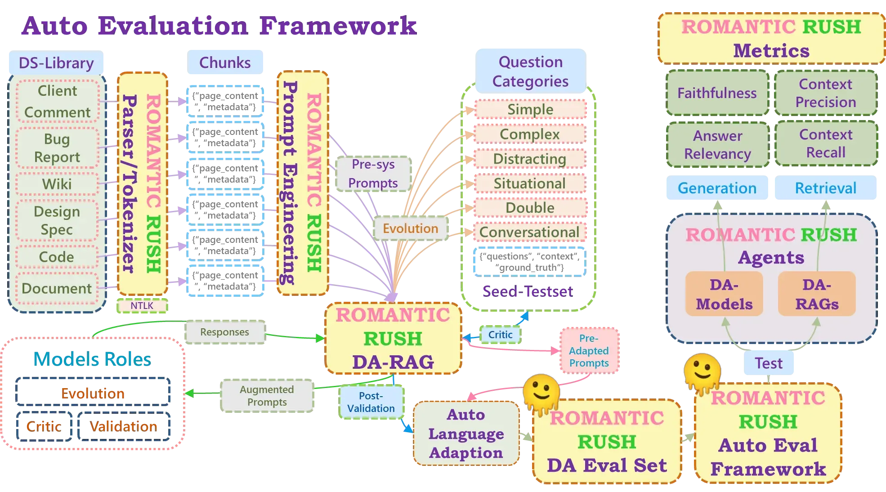
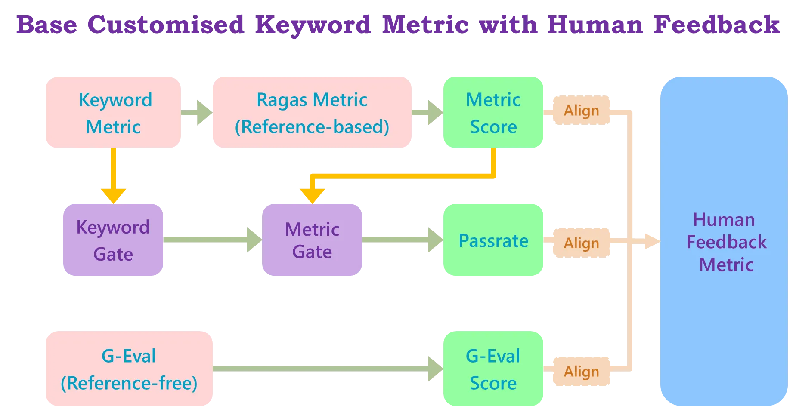
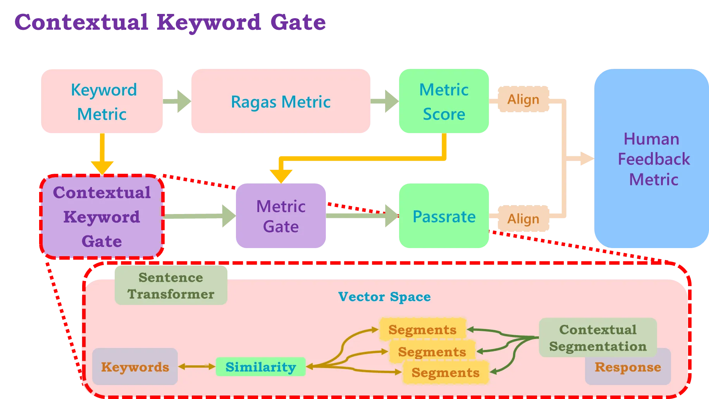
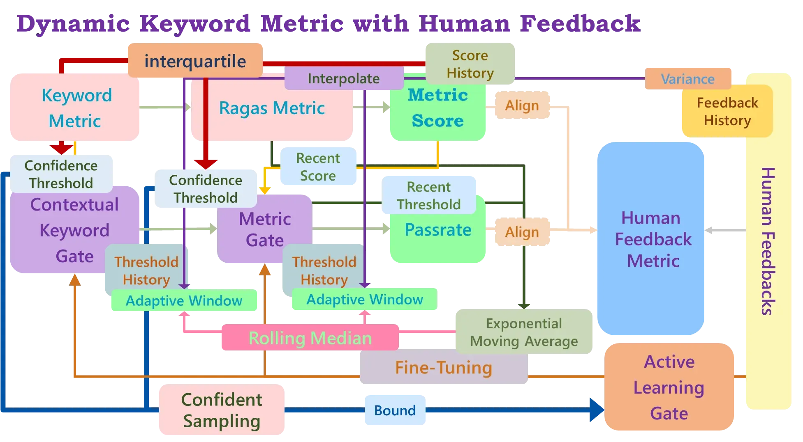
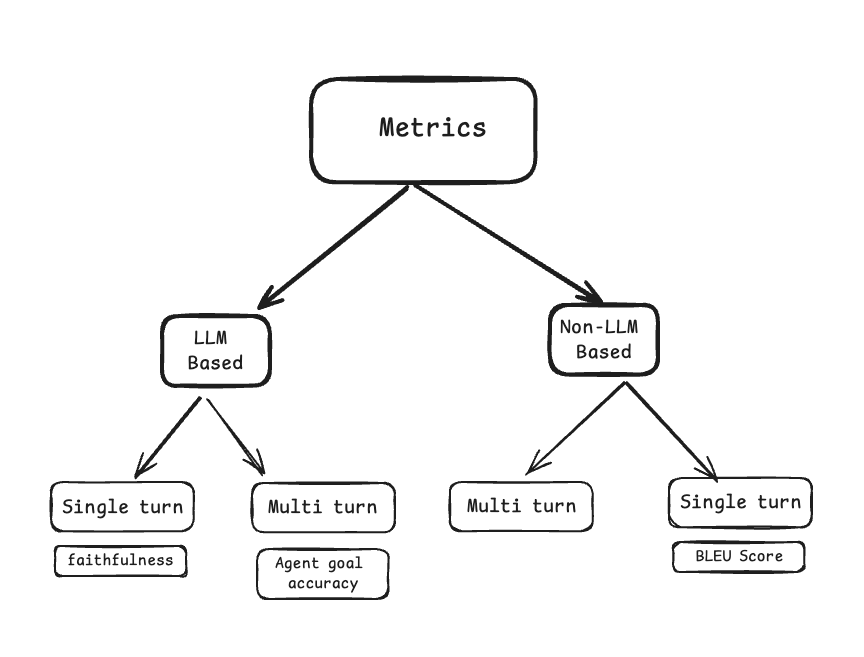

# domain-specific-llm-eval
Domain-Specific LLM Agents Evaluation Dynamic Keyword Metric with Human Feedback

# Intro

This metric is part of my auto-eval framework Romantic-Rush:

This project aims to deal with the real domain-specific LLM agents' response evaluation problem, which cannot be solely solved by the LLM-based Multi-turn metrics (see Fig1). I design customized metrics for domain-specific LLM agent evaluation combining independent contextual keyword & metric gates, reference-based method scoring & reference-free metric alignment; the dynamic approach uses human feedback to fine-tune each gate & their confidence threshold, applying the active learning method using uncertainty sampling compliance.

My metric structure goes as follows:

This project is still updating.

To know more about my projects, see: ([Jason YY Lin](https://a-one-and-a-two.notion.site/Jason-YY-Lin-9c867799194b4c0abf124d55209a5f1e?pvs=4))

###### Fig1 (by RAGAS doc)

[RAGAS doc](https://docs.ragas.io/en/latest/concepts/metrics/overview/)
