<div align="center">

# Domain-Specific RAG Evaluation & MLOps Platform

### v1.1.0 — *Beyond Cosine Similarity*

> **Standard RAG evaluation stops at text similarity. This platform measures the topology of knowledge itself.**

[](#testing)
[](#backend-services)
[](#devops)
[](#quickstart)
[](LICENSE)

*Built by **[Jason YY Lin](https://a-one-and-a-two.notion.site/Jason-YY-Lin-9c867799194b4c0abf124d55209a5f1e?pvs=4)** as part of the Romantic-Rush auto-eval framework.*

</div>

---

## The Problem with Standard Evaluation

Tools like vanilla RAGAS measure **cosine similarity between embeddings**. That tells you how similar *words look* — not whether the *retrieved context is structurally coherent* for answering a domain-specific question.

In manufacturing, medical, legal, or financial domains, a fragmented retrieval of loosely-connected facts can score high on cosine similarity yet still produce hallucinated answers. **The shape of the retrieved knowledge graph matters as much as its content.**

---

## Our Solution: Graph Context Relevance (GCR)

The headline innovation of this platform is the **GCR evaluator** — a 100% offline, deterministic metric that measures the *topology* of retrieved context, not just its surface-level similarity:

$$\mathrm{GCR} = \mathrm{clip}\!\left(\;0.4 \cdot S_e \;+\; 0.4 \cdot S_c \;-\; 0.2 \cdot P_h,\; 0,\; 1\right)$$

| Symbol | Component | Definition | Why It Matters |
|--------|-----------|------------|----------------|
| $S_e$ | **Entity Overlap** | Jaccard similarity between Q&A token sets and KG keyphrases | Measures semantic relevance of retrieved nodes |
| $S_c$ | **Structural Connectivity** | Largest-connected-component ratio: $\|V_{LCC}\| / \|V_R\|$ | Penalises fragmented, incoherent retrieval sets |
| $P_h$ | **Hub Noise Penalty** | Fraction of retrieved nodes with degree $> \mu + 2\sigma$ | Discourages over-general "hub" nodes that dilute context |

**O(N + E) complexity · Zero model calls · Zero network I/O · Fully configurable weights**

---

## Key Innovations

|   | Innovation | Impact |
|---|-----------|--------|
| 🧠 | **Graph-Topological GCR Metric** — novel $S_c / S_e / P_h$ composite score | First offline, graph-theory RAG metric; catches fragmentation that cosine similarity misses |
| 🏗️ | **11-Service Docker Compose Stack** — end-to-end MLOps platform | One command from raw CSV to evaluated KPIs, HTML/PDF reports, and drift alerts |
| 📊 | **Statistical Drift Detection** — Welch Z-test per metric with Slack alerting | Production-grade SRE-style monitoring applied to AI evaluation quality |
| 🤖 | **LLM Auto-Insights Engine** — structured-prompt narrative health reports | Zero-config AI analysis; pluggable with GPT-4o-mini, Ollama, vLLM, or Azure OpenAI |
| 🔍 | **Interactive QA Debugger** — inline entity-highlighted failure analysis | Instantly see *why* a retrieval failed — not just *that* it did |
| 📈 | **Cytoscape KG Visualiser** — force-directed graph explorer in the Insights Portal | Interactively inspect knowledge graph structure and edge weights in-browser |
| 🧪 | **733-Test Parallel Suite** — `pytest-xdist` with deterministic offline fallbacks | AI evaluation proven with the same rigour as traditional software engineering |
| 🔒 | **Zero Host Dependency DevOps** — Docker-native toolchain + OWASP hardening | Run every developer operation — tests, tools, CI — without installing Python locally |

---

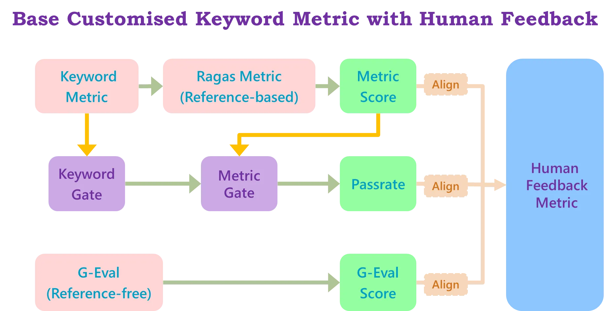

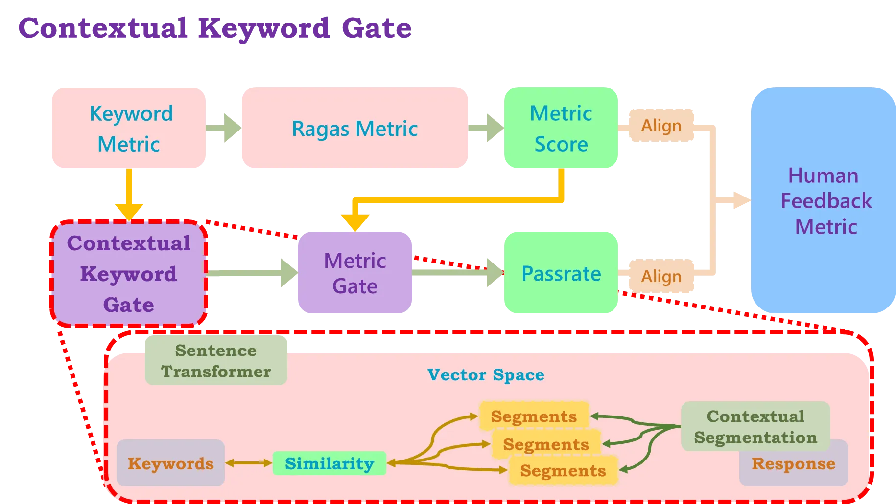

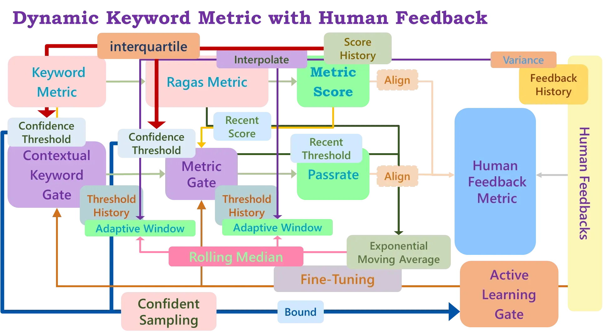

---

## Auto-Eval Framework Context

This platform is the core evaluation engine of the **Romantic-Rush** auto-eval framework:

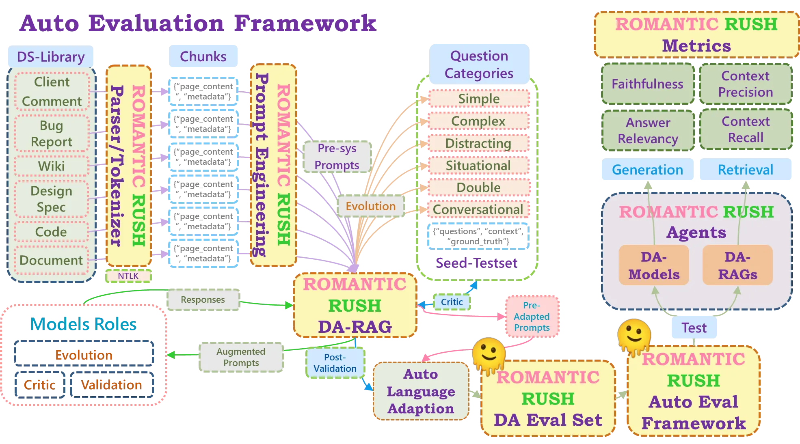

## System Architecture & MLOps Feedback Loop

The diagram below shows how data flows from raw CSV documents through the evaluation pipeline and back into the operational monitoring layer.

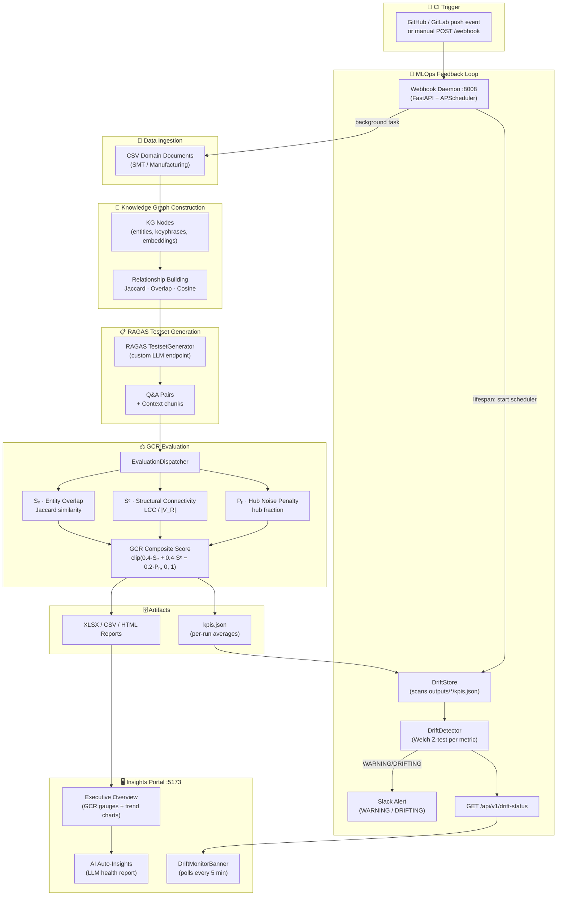
```mermaid
flowchart TD
    subgraph Input ["📄 Data Ingestion"]
        CSV["CSV Domain Documents\n(SMT / Manufacturing)"]
    end

    subgraph KG ["🧠 Knowledge Graph Construction"]
        Nodes["KG Nodes\n(entities, keyphrases, embeddings)"]
        Edges["Relationship Building\nJaccard · Overlap · Cosine"]
        CSV --> Nodes --> Edges
    end

    subgraph Testset ["📋 RAGAS Testset Generation"]
        RAGAS["RAGAS TestsetGenerator\n(custom LLM endpoint)"]
        Questions["Q&A Pairs\n+ Context chunks"]
        Edges --> RAGAS --> Questions
    end

    subgraph Eval ["⚖️ GCR Evaluation"]
        Dispatcher["EvaluationDispatcher"]
        Se["Sₑ · Entity Overlap\nJaccard similarity"]
        Sc["Sᶜ · Structural Connectivity\nLCC / |V_R|"]
        Ph["Pₕ · Hub Noise Penalty\nhub fraction"]
        GCR["GCR Composite Score\nclip(0.4·Sₑ + 0.4·Sᶜ − 0.2·Pₕ, 0, 1)"]
        Questions --> Dispatcher --> Se & Sc & Ph --> GCR
    end

    subgraph Artifacts ["🗄️ Artifacts"]
        KPIS["kpis.json\n(per-run averages)"]
        Reports["XLSX / CSV / HTML Reports"]
        GCR --> KPIS & Reports
    end

    subgraph Portal ["🖥️ Insights Portal  :5173"]
        Dashboard["Executive Overview\n(GCR gauges + trend charts)"]
        AiCard["AI Auto-Insights\n(LLM health report)"]
        DriftBanner["DriftMonitorBanner\n(polls every 5 min)"]
        Reports --> Dashboard
        Dashboard --> AiCard
    end

    subgraph MLOps ["🔄 MLOps Feedback Loop"]
        Webhook["Webhook Daemon  :8008\n(FastAPI + APScheduler)"]
        DriftStore["DriftStore\n(scans outputs/*/kpis.json)"]
        DriftDetector["DriftDetector\n(Welch Z-test per metric)"]
        SlackAlert["Slack Alert\n(WARNING / DRIFTING)"]
        DriftStatus["GET /api/v1/drift-status"]
        KPIS --> DriftStore --> DriftDetector
        DriftDetector -- WARNING/DRIFTING --> SlackAlert
        DriftDetector --> DriftStatus --> DriftBanner
        Webhook -- "lifespan: start scheduler" --> DriftStore
    end

    subgraph CI ["🔁 CI Trigger"]
        CIEvent["GitHub / GitLab push event\nor manual POST /webhook"]
        CIEvent --> Webhook
        Webhook -- "background task" --> CSV
    end
```

---


This repository currently has two practical entry points:

1. `eval-pipeline/`
    Use this when you want to generate testsets from CSV data and run offline evaluation with RAGAS.
2. `services/`
    Use this when you want the microservice-style API surface, reporting layer, KG endpoints, metrics, compose deployment, and governance checks.

If you only want the fastest path to value, start with `eval-pipeline/`. If you want something closer to a deployable platform, use the service layer plus compose/Helm.

## What You Can Get From It

- Generate domain-specific evaluation datasets from CSV or curated document inputs.
- Run RAGAS-based evaluation against your own LLM or RAG endpoint.
- Produce structured outputs such as evaluation items, KPI summaries, HTML reports, PDF reports, and KG summaries.
- Validate governance controls: schema checks, telemetry taxonomy checks, policy checks, secrets scans, SBOM/provenance generation, and parity validation.
- Run a local service stack for ingestion, processing, testset generation, evaluation, reporting, adapter, and KG APIs.

## Quick Start

### Path A: Batch Evaluation Pipeline

Use this if your goal is testset generation and evaluation rather than service deployment.

```bash
cd eval-pipeline
python3 -m pip install -r requirements.minimal.txt
python3 test_ragas_integration.py
python3 run_pipeline.py --stage testset-generation
python3 run_pipeline.py --stage evaluation
```

Use this path when you already have CSV inputs and a target LLM or RAG endpoint and want to benefit from the repo quickly.

`eval-pipeline/requirements.minimal.txt` now installs the local `ragas/` submodule as an editable dependency, so the batch path uses the patched in-repo RAGAS implementation rather than a mismatched PyPI package.

By default, `python3 run_pipeline.py --stage testset-generation` uses `config/simple_config.yaml`, and `python3 run_pipeline.py --stage evaluation` uses `config/evaluation_smoke_config.yaml` with the latest generated testset plus a built-in mock RAG endpoint. Pass `--config` explicitly whenever you want a real external endpoint instead.

### Path B: Service Layer Smoke Validation

Use this if you want to verify the current service architecture and artifact chain locally.

```bash
python3 e2e_smoke.py
bash scripts/e2e_smoke.sh
```

Use `python3 e2e_smoke.py` when you want the fastest in-process integration check.

Use `bash scripts/e2e_smoke.sh` when you want the real compose-backed path. It starts MinIO plus the service containers, submits work over HTTP, and then advances the queued jobs inside the deployed containers so the smoke still reflects the current submission-oriented API design.

## Local Development

### Prerequisites

- Python 3.11 is the expected runtime for the containerized stack.
- Docker and Docker Compose are required for the service deployment path.
- Node.js 18.18+ / 20.x LTS is required for `insights-portal/` builds and tests.
- `requirements.txt` contains the Python dependencies used by the service layer.
- `eval-pipeline/requirements.minimal.txt` contains the additional packages required by the batch pipeline path.
- Both dependency files install the local `ragas/` submodule from this repository.

Install local dependencies:

```bash
python3 -m venv .venv
source .venv/bin/activate
pip install -r requirements.txt
```

If you also want the batch evaluation pipeline in the same environment:

```bash
pip install -r eval-pipeline/requirements.minimal.txt
```

### Important Runtime Configuration

The microservice layer expects object storage configuration. Before running the real service stack, provide these environment variables through `.env`, a compose env file, or exported shell variables:

- `OBJECT_STORE_ENDPOINT`
- `OBJECT_STORE_ACCESS_KEY`
- `OBJECT_STORE_SECRET_KEY`
- `OBJECT_STORE_BUCKET`
- `OBJECT_STORE_USE_SSL`

For local MinIO-style deployments, an HTTP endpoint plus a development bucket is sufficient.

Minimal example:

```dotenv
PYTHONPATH=/app
LOG_LEVEL=INFO
OBJECT_STORE_ENDPOINT=http://minio:9000
OBJECT_STORE_REGION=us-east-1
OBJECT_STORE_ACCESS_KEY=minioadmin
OBJECT_STORE_SECRET_KEY=minioadmin123
OBJECT_STORE_BUCKET=rag-eval-dev
OBJECT_STORE_USE_SSL=false
MINIO_ROOT_USER=minioadmin
MINIO_ROOT_PASSWORD=minioadmin123
MINIO_BUCKET=rag-eval-dev
```

`.env.compose` now includes a working local MinIO-based default profile for development.

## Deploy The Service Stack

### Compose

Baseline multi-service startup:

```bash
make compose
```

This path now expects either:

- network access to install Python dependencies during the Docker build, or
- prebuilt service images from a connected CI/build environment, or
- an internal package mirror that the Docker build can reach.

Mirror/prebuilt knobs:

- set `PIP_INDEX_URL`, `PIP_EXTRA_INDEX_URL`, and `PIP_TRUSTED_HOST` in your compose env file to route Docker builds through an internal PyPI mirror;
- or set `SERVICE_IMAGE_NAME`, `SERVICE_IMAGE_TAG`, and `SMOKE_USE_PREBUILT_IMAGE=1` to skip local image builds and reuse a prebuilt image.

For a complete prebuilt-image flow, including GHCR login, tag selection, `.env.prebuilt` setup, `--no-build` compose startup, and smoke-test reuse, see [docs/prebuilt_image_workflow.md](docs/prebuilt_image_workflow.md). The smoke script now accepts either `COMPOSE_ENV_FILE=.env.prebuilt` or `SMOKE_ENV_FILE=.env.prebuilt` and loads that file before starting the stack.

Hot-reload development mode:

```bash
make dev
```

Service ports:

- `8001` ingestion
- `8002` processing
- `8003` testset
- `8004` eval
- `8005` reporting
- `8006` adapter
- `8007` kg
- `8008` webhook daemon (CI trigger + drift monitor)
- `5173` insights-portal (React dashboard)
- `9000/9001` MinIO (API / console)

Validate the compose definition before starting:

```bash
make validate-compose
```

### First Successful Deployment

For the first real local deployment, use this sequence:

```bash
cp .env.compose .env.local
$EDITOR .env.local
COMPOSE_ENV_FILE=.env.local docker compose --env-file .env.local -f docker-compose.services.yml up -d --build
curl http://localhost:8001/health
curl http://localhost:8005/health
bash scripts/e2e_smoke.sh
```

What success looks like:

- MinIO is reachable on `9000` and its console on `9001`
- service health endpoints on `8001` through `8007` return `{"status": ...}`
- `bash scripts/e2e_smoke.sh` prints the submitted ingestion, processing, testset, eval, and reporting IDs

If the compose build fails because PyPI is unreachable, the Dockerfile now exits immediately with `PyPI unreachable during image build`. Add your internal mirror via `PIP_INDEX_URL` / `PIP_EXTRA_INDEX_URL` / `PIP_TRUSTED_HOST`, or pull a prebuilt image and rerun with `SMOKE_USE_PREBUILT_IMAGE=1`.

You can bootstrap the prebuilt path with `.env.prebuilt.example`.

### Image Build And Tagging

```bash
make build
make build-tag
DRY_RUN=1 make tag
```

This produces `dev`, semantic version, and `git-<sha>` tags using the repository `VERSION` file.

### Helm / Kubernetes

The repo includes Helm manifests under `deploy/helm/` for the service stack. Start with a dry run:

```bash
helm template rag-eval deploy/helm
```

Use Helm when you want toggles for services such as KG and GPU-related runtime wiring for `processing` and `kg`.

## Recommended Workflow

If you are evaluating a domain model or RAG system for the first time:

1. Start in `eval-pipeline/` and confirm the RAGAS integration works with your LLM endpoint.
2. Generate a small testset and run evaluation end-to-end.
3. Use the service layer only after you need API endpoints, observability, report delivery, or deployment packaging.
4. Before CI or deployment, run the validators and smoke flow locally.

Suggested validation commands:

```bash
python3 scripts/validate_event_schemas.py
python3 scripts/validate_telemetry_taxonomy.py
python3 scripts/validate_dev_parity.py --skip-installed-packages
bash scripts/validate_policies.sh
bash scripts/e2e_smoke.sh
```

`scripts/validate_policies.sh` no longer requires a host-installed `opa` binary. If `opa` is missing, it falls back to `docker run openpolicyagent/opa` automatically.

`scripts/validate_dev_parity.py` treats host Python drift as a local warning by default and remains a hard failure in CI when invoked with `--python-drift-severity error`.

## Where To Read Next

- `eval-pipeline/RAGAS_IMPLEMENTATION_GUIDE.md`: detailed RAGAS setup and pipeline usage.
- `docs/deployment_guide.md`: compose, image, GPU, parity, and deployment notes.
- `docs/runbooks/compose_e2e_operator_checklist.md`: GHCR login, mirror setup, Node runtime, and compose-backed smoke checklist.
- `docs/security.md`: secrets scan, SBOM, signing, and provenance flow.
- `eval-pipeline/docs/tasks/tasks.md`: implementation and governance status.

## 🤖 v1.1.0 — Enterprise MLOps Expansion

Version 1.1.0 adds a production-grade MLOps feedback loop on top of the v1.0 GCR evaluation core.

### Webhook Daemon & CI Integration

A FastAPI **webhook daemon** (`rag-eval-webhook`, port 8008) listens for GitHub/GitLab push events and spawns the RAGAS evaluation pipeline as a background task:

```bash
# Trigger a pipeline run from any CI step or manually:
curl -X POST http://localhost:8008/webhook \
  -H "Content-Type: application/json" \
  -d '{"event_type": "manual", "ref": "refs/heads/main", "docs": 10, "samples": 50}'
```

### Data Drift Monitoring (AIOps)

The webhook daemon runs an **APScheduler** background job (every 6 hours by default) that:

1. Scans `outputs/*/kpis.json` for historical GCR metric averages.
2. Applies a **Welch Z-test** to detect statistical drift in $S_e$, $S_c$, and $P_h$.
3. Exposes the result via `GET http://localhost:8008/api/v1/drift-status`.
4. Posts a **Slack alert** when status is `WARNING` or `DRIFTING`.

The `DriftMonitorBanner` React component in the insights-portal polls this endpoint every 5 minutes and auto-expands with an amber/red banner when drift is detected.

### AI Auto-Insights

The **reporting service** (`port 8005`) now exposes `POST /api/v1/insights/generate` which forwards KPI summaries to an LLM (GPT-4o-mini by default, configurable) and returns a human-readable **System Health Report** rendered inline in the dashboard.

Set `OPENAI_API_KEY` in `.env` to enable. Compatible with Azure OpenAI, Ollama, and any OpenAI-compatible proxy.

### QA Debugger & Graph-Based Evaluators

- **Graph Context Relevance (GCR)** suite: $S_e$ (entity overlap), $S_c$ (structural connectivity), $P_h$ (hub-noise penalty) — routed through the `EvaluationDispatcher`.
- **Graph-based QA debugger**: interactive trace of which KG nodes contributed to each evaluation score.

---

## 🎯 Key Features

### **✅ RAGAS Integration (NEW)**
- **Complete RAGAS Library Integration**: Uses actual RAGAS `TestsetGenerator` and evaluation metrics
- **Custom LLM Support**: Integrate your own LLM API endpoints (tested with `gpt-4o` via custom proxy)
- **CSV-to-RAGAS Conversion**: Transform your CSV data into sophisticated Q&A testsets
- **Professional Evaluation**: `context_precision`, `context_recall`, `faithfulness`, `answer_relevancy`

### **✅ Advanced Dynamic Metrics**
- **Independent Gates**: Keyword & reference-based metrics with no key information loss
- **Contextual Keyword Gate**: Decoupled "keyword extraction evaluation" & "response keyword coverage"
- **Human Feedback Integration**: Dynamic threshold adjustment using active learning
- **Uncertainty Sampling**: Intelligent selection of cases requiring human review

## 📋 Quick Start with RAGAS

### **Option 1: RAGAS with Custom LLM (Recommended)**
```bash
cd eval-pipeline
python test_ragas_integration.py  # Test your setup
python run_pipeline.py --stage testset-generation  # Generate testsets
python run_pipeline.py --stage evaluation  # Run evaluation
```

### **Option 2: Traditional Pipeline**
```bash
cd eval-pipeline
python run_pipeline.py --config config.yaml
```

**📚 Complete Guide**: See [`eval-pipeline/RAGAS_IMPLEMENTATION_GUIDE.md`](eval-pipeline/RAGAS_IMPLEMENTATION_GUIDE.md) for detailed setup and usage instructions.

## �️ Object Storage Client (New)

The microservice layer now ships with a reusable S3/MinIO client that adds exponential backoff, checksum validation, and consistent error envelopes. Configure it via environment variables (pydantic automatically maps snake_case fields to upper-case env vars):

- `OBJECT_STORE_ENDPOINT` – Optional custom endpoint (e.g., MinIO).
- `OBJECT_STORE_REGION` – Defaults to `us-east-1`.
- `OBJECT_STORE_ACCESS_KEY` / `OBJECT_STORE_SECRET_KEY` – Credentials used when non-anonymous access is required.
- `OBJECT_STORE_BUCKET` – Default bucket used by ingestion/processing services.
- `OBJECT_STORE_USE_SSL` – Set to `false` for plain HTTP endpoints.
- `OBJECT_STORE_MAX_ATTEMPTS` and `OBJECT_STORE_BACKOFF_SECONDS` – Tune retry behaviour.

Usage highlights:

```python
from services.common.storage.object_store import ObjectStoreClient

client = ObjectStoreClient()
client.upload_bytes(bucket=None, key="documents/doc.json", payload=b"{}")
data = client.download_bytes(bucket=None, key="documents/doc.json")
```

Checksum mismatches raise a `ChecksumMismatchError` with trace-aware error envelopes, ensuring downstream services fail fast when corrupted artifacts surface.

To validate the integration, run the dedicated unit tests:

```bash
pytest tests/services/common/test_object_store.py
```

## �🚀 Core Capabilities

This project addresses specific bottlenecks in domain-specific LLM evaluation:

1. **LLM-based metrics neglect keyword correctness** - Even high scores may miss critical domain terms
2. **Standard metrics lack dynamic adjustment** - No adaptation based on human feedback
3. **Limited custom LLM integration** - Most frameworks require specific API providers

**Our Solution:**
- **RAGAS + Custom LLM**: Professional testset generation with your own models
- **Dynamic Keyword Gates**: Context-aware keyword evaluation with semantic understanding
- **Human-in-the-Loop**: Active learning for continuous improvement
- **Privacy-Friendly**: Complete control over your data and models

# Design

## Contextual Keyword Gate

Instead of requiring strict keyword matches, this approach checks if keywords are meaningfully incorporated within the answer. To assess keyword relevance within the context of an answer, we can leverage a language model, such as a pre-trained transformer (e.g., BERT or GPT), to measure the similarity between keywords and answer contexts. This approach adds a layer of semantic understanding to keyword presence.


report format:

```
...
Total Contextual Score for index 49: 0.79
Mandatory Keyword Score for index 49: 0.59
Optional Keyword Score for index 49: 0.20
Contextual Keyword Gate Pass for index 49: True

Mean Total Score: 0.66
Mean Mandatory Score: 0.46
Mean Optional Score: 0.20
Mean Pass Rate: 58.00%
```


## Human Feedback Integration

Human feedback is used to fine-tune the gate, ensuring it reflects subjective quality judgments accurately. 
Adding a **human feedback loop** can help adjust the thresholds dynamically. This feedback could be collected from a test group, who manually evaluate a subset of answers. Their feedback can then update the threshold, e.g., using an exponential moving average (EMA) or another statistical method.

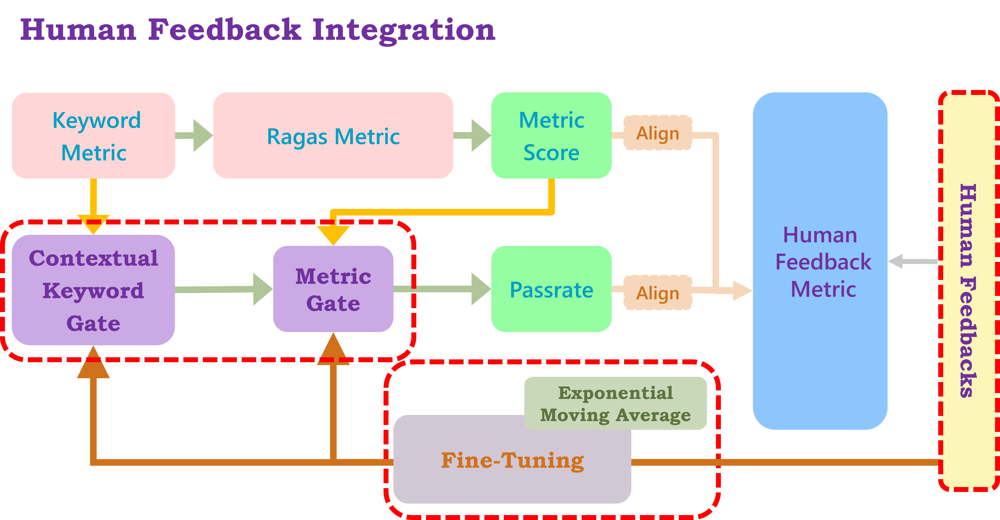

- **Threshold Adjustment with EMA**: This uses a feedback-driven moving average to adjust the RAGAS threshold over time. A high alpha increases sensitivity to feedback, while a low alpha makes adjustments slower and steadier.

## Smoothing for Threshold Sensitivity

To reduce fluctuations in the threshold, we’ll use a **rolling average** or **median filtering** to smooth the threshold adjustments. The goal is to apply a steady adjustment based on recent feedback data, which reduces the influence of outliers.

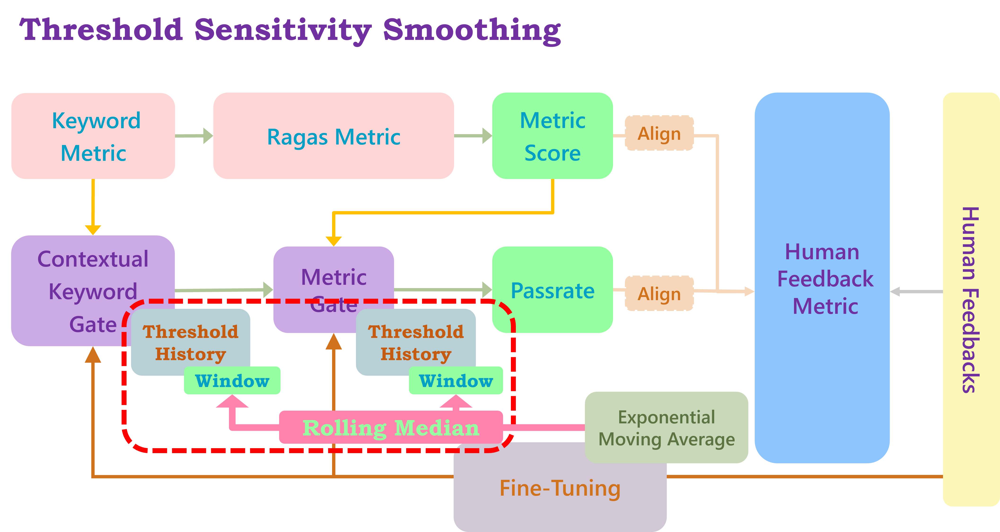


- **Threshold Smoothing**: The function calculates the median of the last `window_size` threshold values to dampen sharp changes.
- **Rolling Median**: The median is generally less sensitive to outliers than the average, which helps stabilize the threshold when feedback is inconsistent.

## Active Learning for Human Feedback Collection

Active learning targets cases where the model is uncertain, which is often where human feedback can be most valuable.

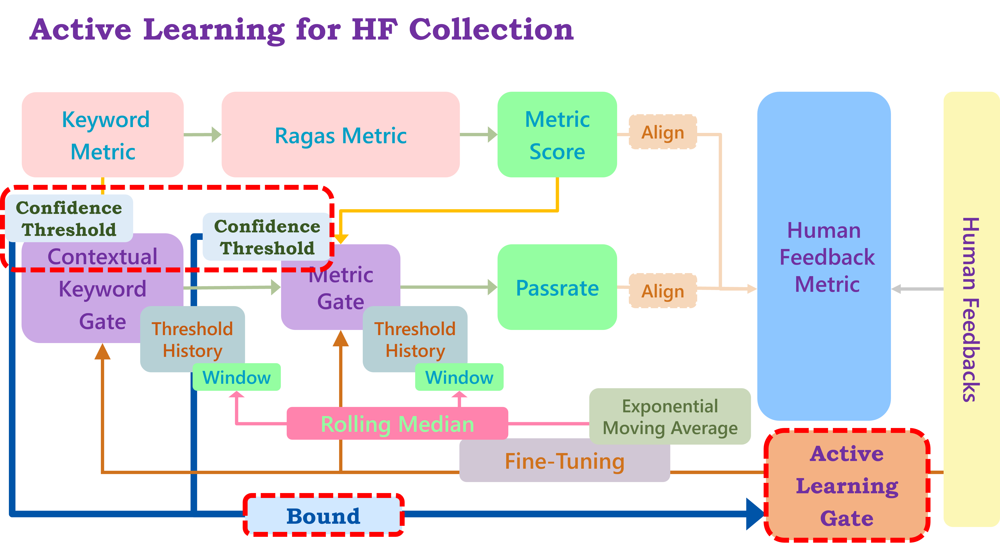


- **Set a confidence threshold**: Define a range of RAGAS scores that represents uncertainty.
- **Flag uncertain cases**: Only request human feedback on answers that fall within this uncertainty range.

## Adaptive and Exponential Smoothing

Adaptive smoothing adjusts the window size based on feedback consistency. Exponential smoothing allows faster response to recent changes by giving more weight to newer feedback while gradually reducing the influence of older feedback.

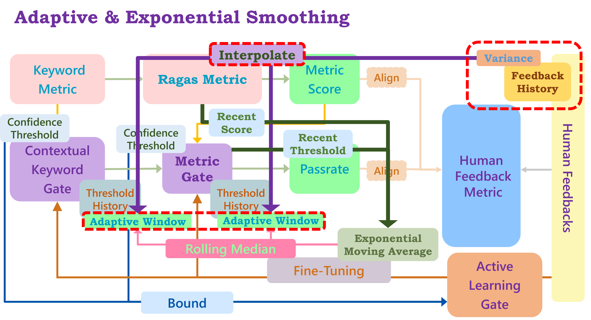


## Dynamic Uncertainty Adjustment with Diverse Feedback Sampling

Dynamic uncertainty adjustment recalibrates the **uncertainty range** periodically based on **recent performance**, while diverse feedback sampling **randomly** selects some **confident answers** for **feedback** to maintain a balanced evaluation. In a nutshell, these 2 dynamic rules provide a **dynamically active learning gate** by all *uncertainty* ragas score & some *certain* ragas score.

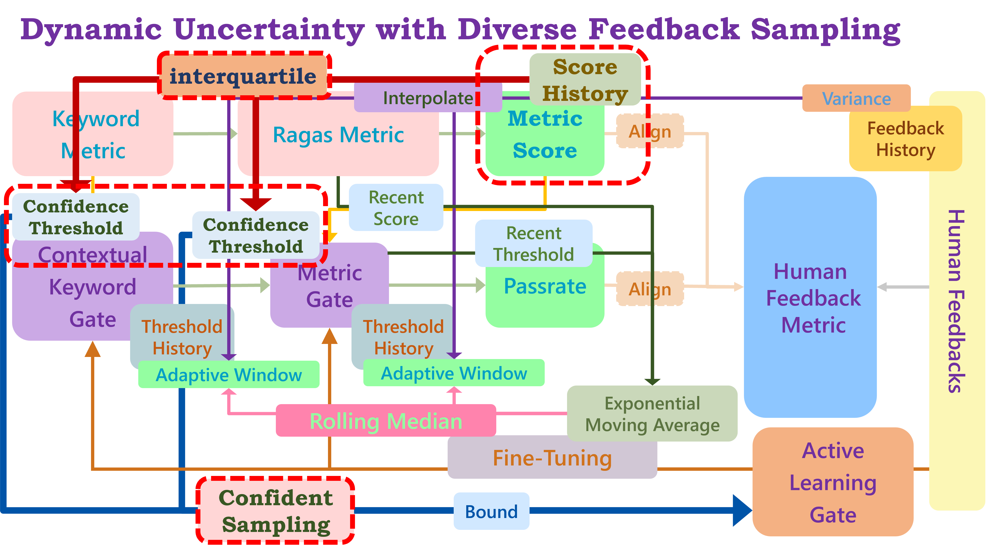

- **Dynamic Uncertainty Adjustment**: Periodically recalculates the uncertainty range based on the **interquartile range (IQR)** of recent scores, widening or narrowing as needed.
- **Diverse Sampling of Confident Answers**: Introduces a small probability (`diverse_sample_rate`) of sampling feedback for confident answers, maintaining a broad assessment range. This sampling is controlled by `diverse_sample_rate`, which represents the probability of selecting a confident answer for feedback. Using `random.random() < diverse_sample_rate` adds **randomness** to ensure that **not all** confident answers are selected, balancing feedback coverage. By occasionally reviewing confident answers, the function collects feedback across a **wider range** of scores, which helps monitor and validate the model’s confident responses.


report format:

```
Total Feedback Needed: 12
Dynamic Uncertainty Range: 0.85 - 0.90
Final Adjusted RAGAS Threshold: 0.98
```

iteration line graph:

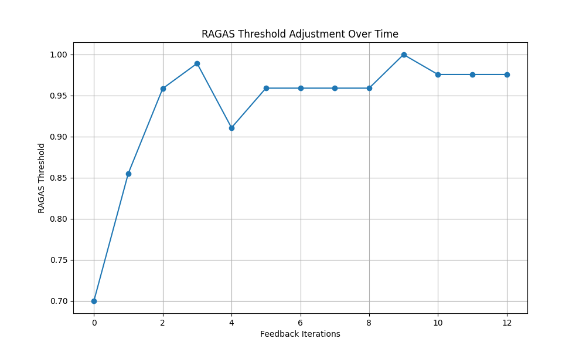

## G-Eval Integration: in the example criteria of Coherence, Consistency, Fluency, and Relevance

| **Metric**         | **Description**                                                                                                                                                                   | **Alignment with G-Eval Criteria**                                                                                                            |
| ------------------ | --------------------------------------------------------------------------------------------------------------------------------------------------------------------------------- | --------------------------------------------------------------------------------------------------------------------------------------------- |
| **RAGAS Score**    | Measures the response accuracy and completeness compared to a reference answer, incorporating relevance and factual accuracy.                                                     | Completeness compared to a reference answer, incorporating relevance and factual accuracy. Aligns with Coherence, Consistency, and Relevance. |
| **Pass Rate**      | Represents the percentage of responses meeting keyword and RAGAS gate thresholds. Tracks how well responses match expected keyword-based criteria for precise answers.            | Focuses on Relevance and Consistency (ensures essential content is present).                                                                  |
| **G-Eval Score**   | Analyzes the response’s linguistic and logical quality using coherence, fluency, consistency, and relevance criteria. Provides an overall quality score independent of reference. | Directly measures Coherence, Consistency, Fluency, and Relevance.                                                                             |
| **Human Feedback** | Aggregates human evaluative feedback, validating the response accuracy and quality. Initially binary (0 or 1) but adapted dynamically.                                            | Adds human verification of Coherence, Relevance, Fluency, and Consistency.                                                                    |

## Limitations

Progress note:
See [LIMITATIONS_PROGRESS_20260317.md](/data/yy/domain-specific-llm-eval/LIMITATIONS_PROGRESS_20260317.md) for the latest status of these limitations, the improvements now implemented in code, and the remaining gaps that still need engineering work.

1. **Binary Keyword Presence Check**: Currently, keywords are only checked for presence, not relevance or contextual fit. Improvements could include:
    - **Keyword Context Matching:** Adding a semantic similarity check to ensure keywords fit contextually.
    - **Partial Matching:** Weigh partial keyword matches or use synonyms.
2. **RAGAS Dependency on References**: RAGAS is reference-based, so a response may pass the RAGAS gate without satisfying keyword relevance. Possible improvements:
    - **Contextual Keyword Gate:** Use a language model to measure how relevant the keywords are in the context of the answer.
    - improvements:
        
        **Language Model Dependency**: Using a model for contextual keyword relevance adds computation time and complexity, especially with large datasets. Improvement options:
        
        - **Efficient Models**: Use a lightweight model (`MiniLM` or `DistilBERT`) for faster computations.
        - **Approximate Matching**: Apply clustering techniques to group semantically similar keywords and reduce the number of checks.
    - **Human Feedback Integration:** A feedback loop could refine the gate thresholds based on human evaluative input.
    - improvements:
        
        **Threshold Sensitivity**: The EMA-based human feedback integration may still lead to fluctuating thresholds if human feedback varies significantly. Possible improvement:
        
        - **Smoothing Techniques**: Apply rolling averages or median filtering to stabilize threshold adjustments.
            - **Window Size Sensitivity**: Choosing an optimal window size for smoothing can be challenging and may need tuning based on dataset variability.
                - **Adaptive Smoothing**: Adjust the window size dynamically based on recent feedback consistency.
                    - If feedback variance fluctuates significantly, the adaptive window size may change frequently, potentially making the threshold less stable.
                        
                        → Apply a smoothing function (e.g., rolling average) to the variance itself before calculating the window size. ***(not yet implemented)***
                        
                    - The `feedback_consistency_threshold` is manually set, which may require tuning for different datasets.
                        
                        → Use an adaptive threshold based on a percentage of the historical average variance, allowing the threshold to evolve with feedback trends. ***(not yet implemented)***
                        
                - **Exponential Smoothing**: For faster response to trend changes, consider using an exponential smoothing factor that decreases weighting for older feedback
                    - **Sensitivity to Initial Settings**: Alpha values for exponential smoothing and consistency thresholds for adaptive window size may need manual tuning and periodic recalibration.
                    → **Automated Parameter Optimization**: Use hyperparameter optimization (e.g., Bayesian optimization) to dynamically set `alpha` and consistency thresholds based on feedback data. ***(not yet implemented)***
                - → **Hybrid Smoothing**: Combine rolling median with exponential smoothing for cases where extreme score fluctuations could benefit from both methods. ***(not yet implemented)***
        
        **Human Feedback Collection**: Manual feedback can be costly and time-consuming. Improvement options:
        
        - **Active Learning**: Use active learning to select only the most uncertain cases for human review, reducing feedback volume while maximising threshold accuracy.
            - Fixed Uncertainty Range
                - **Dynamic Uncertainty Adjustment**: Periodically recalibrate the uncertainty range based on recent performance trends or adapt it to case-specific thresholds.
                    - **Inefficiency with Small Sample Sizes**: Adjustments based on IQR can be inaccurate with a small sample of recent scores, leading to ineffective uncertainty range recalibration.
                        - **Adaptive IQR Calculation**: Set a minimum sample size requirement for recalculating the uncertainty range to avoid premature adjustments. ***(not yet implemented)***
                    - **Over-Adjustment for Model Improvements**: As the model improves, the uncertainty range may continually narrow, limiting active learning cases.
                        - **Dynamic Recalibration Frequency**: Adjust the recalibration interval based on recent feedback volume, reducing unnecessary recalculations as model performance stabilizes. ***(not yet implemented)***
            - **Feedback Diversity**: Focusing only on uncertain cases might overlook reinforcing feedback for confidently correct answers.
                - **Diverse Feedback Sampling**: Occasionally sample confident predictions as well to ensure feedback spans all answer quality levels, balancing the emphasis on uncertainty.
3. **Threshold Adjustments**: The gate thresholds (e.g., for the RAGAS score) may need to be fine-tuned based on empirical data.

**This project is still updating.**

# Reference

###### Fig1 (by RAGAS doc)

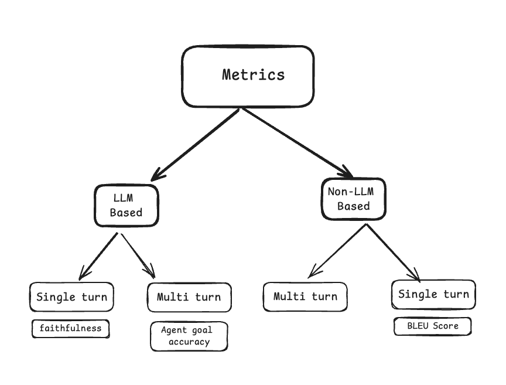
- [RAGAS doc](https://docs.ragas.io/en/latest/concepts/metrics/overview/)
- [IBM](https://github.com/ibm-ecosystem-engineering/SuperKnowa/tree/main?tab=readme-ov-file)
- [G-Eval](https://arxiv.org/abs/2303.16634?ref=blog.langchain.dev)
- [Adaptive Dynamic Threshold Stategy](https://medium.com/@FMZQuant/adaptive-dynamic-threshold-strategy-based-on-time-series-data-df0f93b01d60)
