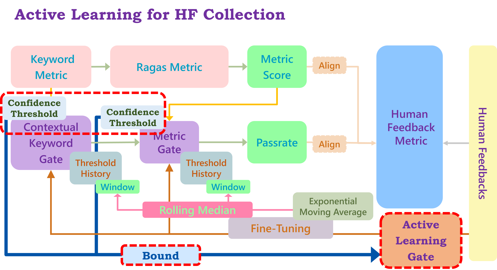

** This is the stable version, find my latest version in branch: `202508-rc1`! **

** To know more about my projects: **[Jason YY Lin Website](https://a-one-and-a-two.notion.site/Jason-YY-Lin-9c867799194b4c0abf124d55209a5f1e?pvs=4)** **

# Domain-Specific LLM Agents Evaluation Dynamic Keyword Metric with Human Feedback


# Intro

This metric is part of my auto-eval framework Romantic-Rush:


This project aims to deal with the real domain-specific LLM agents' response evaluation problem, which cannot be solely solved by the LLM-based Multi-turn metrics (see Ref. Fig1) like RAGAS Metrics. There are 2 main designs to address the specific bottleneck:

1. LLM-based metrics tend to neglect keyword correctness which means even if the score is high enough, the response is still unbearable.
2. Multi-turn metrics like RAGAS though tend to use pre-sys prompts for LLM agents for multiple rounds of evaluation, which do not allow dynamic adjustments through human feedback.

I design customized metrics for domain-specific LLM agent evaluation combining independent contextual keyword & metric gates, reference-based method scoring & reference-free metric alignment; the dynamic approach uses human feedback to fine-tune each gate & their confidence threshold, applying the active learning method using uncertainty sampling compliance. 

The goal is to:

1. Independent gates for keyword & reference-based metrics, which do not allow key information loss.
2. Contextual keyword gate decoupled "keyword extraction evaluation" & "response keyword coverage".
3. Dynamically adjust the gates using human feedback both ensure a stable iteration.

# Design

## Contextual Keyword Gate

Instead of requiring strict keyword matches, this approach checks if keywords are meaningfully incorporated within the answer. To assess keyword relevance within the context of an answer, we can leverage a language model, such as a pre-trained transformer (e.g., BERT or GPT), to measure the similarity between keywords and answer contexts. This approach adds a layer of semantic understanding to keyword presence.


report format:

```
...
Total Contextual Score for index 49: 0.79
Mandatory Keyword Score for index 49: 0.59
Optional Keyword Score for index 49: 0.20
Contextual Keyword Gate Pass for index 49: True

Mean Total Score: 0.66
Mean Mandatory Score: 0.46
Mean Optional Score: 0.20
Mean Pass Rate: 58.00%
```


## Human Feedback Integration

Human feedback is used to fine-tune the gate, ensuring it reflects subjective quality judgments accurately. 
Adding a **human feedback loop** can help adjust the thresholds dynamically. This feedback could be collected from a test group, who manually evaluate a subset of answers. Their feedback can then update the threshold, e.g., using an exponential moving average (EMA) or another statistical method.


- **Threshold Adjustment with EMA**: This uses a feedback-driven moving average to adjust the RAGAS threshold over time. A high alpha increases sensitivity to feedback, while a low alpha makes adjustments slower and steadier.

## Smoothing for Threshold Sensitivity

To reduce fluctuations in the threshold, we’ll use a **rolling average** or **median filtering** to smooth the threshold adjustments. The goal is to apply a steady adjustment based on recent feedback data, which reduces the influence of outliers.


- **Threshold Smoothing**: The function calculates the median of the last `window_size` threshold values to dampen sharp changes.
- **Rolling Median**: The median is generally less sensitive to outliers than the average, which helps stabilize the threshold when feedback is inconsistent.

## Active Learning for Human Feedback Collection

Active learning targets cases where the model is uncertain, which is often where human feedback can be most valuable.




- **Set a confidence threshold**: Define a range of RAGAS scores that represents uncertainty.
- **Flag uncertain cases**: Only request human feedback on answers that fall within this uncertainty range.

## Adaptive and Exponential Smoothing

Adaptive smoothing adjusts the window size based on feedback consistency. Exponential smoothing allows faster response to recent changes by giving more weight to newer feedback while gradually reducing the influence of older feedback.


## Dynamic Uncertainty Adjustment with Diverse Feedback Sampling

Dynamic uncertainty adjustment recalibrates the **uncertainty range** periodically based on **recent performance**, while diverse feedback sampling **randomly** selects some **confident answers** for **feedback** to maintain a balanced evaluation. In a nutshell, these 2 dynamic rules provide a **dynamically active learning gate** by all *uncertainty* ragas score & some *certain* ragas score.


- **Dynamic Uncertainty Adjustment**: Periodically recalculates the uncertainty range based on the **interquartile range (IQR)** of recent scores, widening or narrowing as needed.
- **Diverse Sampling of Confident Answers**: Introduces a small probability (`diverse_sample_rate`) of sampling feedback for confident answers, maintaining a broad assessment range. This sampling is controlled by `diverse_sample_rate`, which represents the probability of selecting a confident answer for feedback. Using `random.random() < diverse_sample_rate` adds **randomness** to ensure that **not all** confident answers are selected, balancing feedback coverage. By occasionally reviewing confident answers, the function collects feedback across a **wider range** of scores, which helps monitor and validate the model’s confident responses.


report format:

```
Total Feedback Needed: 12
Dynamic Uncertainty Range: 0.85 - 0.90
Final Adjusted RAGAS Threshold: 0.98
```

iteration line graph:


## G-Eval Integration: in the example criteria of Coherence, Consistency, Fluency, and Relevance

| **Metric**         | **Description**                                                                                                                                                                   | **Alignment with G-Eval Criteria**                                                                                                            |
| ------------------ | --------------------------------------------------------------------------------------------------------------------------------------------------------------------------------- | --------------------------------------------------------------------------------------------------------------------------------------------- |
| **RAGAS Score**    | Measures the response accuracy and completeness compared to a reference answer, incorporating relevance and factual accuracy.                                                     | Completeness compared to a reference answer, incorporating relevance and factual accuracy. Aligns with Coherence, Consistency, and Relevance. |
| **Pass Rate**      | Represents the percentage of responses meeting keyword and RAGAS gate thresholds. Tracks how well responses match expected keyword-based criteria for precise answers.            | Focuses on Relevance and Consistency (ensures essential content is present).                                                                  |
| **G-Eval Score**   | Analyzes the response’s linguistic and logical quality using coherence, fluency, consistency, and relevance criteria. Provides an overall quality score independent of reference. | Directly measures Coherence, Consistency, Fluency, and Relevance.                                                                             |
| **Human Feedback** | Aggregates human evaluative feedback, validating the response accuracy and quality. Initially binary (0 or 1) but adapted dynamically.                                            | Adds human verification of Coherence, Relevance, Fluency, and Consistency.                                                                    |

# Limitations

1. **Binary Keyword Presence Check**: Currently, keywords are only checked for presence, not relevance or contextual fit. Improvements could include:
    - **Keyword Context Matching:** Adding a semantic similarity check to ensure keywords fit contextually.
    - **Partial Matching:** Weigh partial keyword matches or use synonyms.
2. **RAGAS Dependency on References**: RAGAS is reference-based, so a response may pass the RAGAS gate without satisfying keyword relevance. Possible improvements:
    - **Contextual Keyword Gate:** Use a language model to measure how relevant the keywords are in the context of the answer.
    - improvements:
        
        **Language Model Dependency**: Using a model for contextual keyword relevance adds computation time and complexity, especially with large datasets. Improvement options:
        
        - **Efficient Models**: Use a lightweight model (`MiniLM` or `DistilBERT`) for faster computations.
        - **Approximate Matching**: Apply clustering techniques to group semantically similar keywords and reduce the number of checks.
    - **Human Feedback Integration:** A feedback loop could refine the gate thresholds based on human evaluative input.
    - improvements:
        
        **Threshold Sensitivity**: The EMA-based human feedback integration may still lead to fluctuating thresholds if human feedback varies significantly. Possible improvement:
        
        - **Smoothing Techniques**: Apply rolling averages or median filtering to stabilize threshold adjustments.
            - **Window Size Sensitivity**: Choosing an optimal window size for smoothing can be challenging and may need tuning based on dataset variability.
                - **Adaptive Smoothing**: Adjust the window size dynamically based on recent feedback consistency.
                    - If feedback variance fluctuates significantly, the adaptive window size may change frequently, potentially making the threshold less stable.
                        
                        → Apply a smoothing function (e.g., rolling average) to the variance itself before calculating the window size. ***(not yet implemented)***
                        
                    - The `feedback_consistency_threshold` is manually set, which may require tuning for different datasets.
                        
                        → Use an adaptive threshold based on a percentage of the historical average variance, allowing the threshold to evolve with feedback trends. ***(not yet implemented)***
                        
                - **Exponential Smoothing**: For faster response to trend changes, consider using an exponential smoothing factor that decreases weighting for older feedback
                    - **Sensitivity to Initial Settings**: Alpha values for exponential smoothing and consistency thresholds for adaptive window size may need manual tuning and periodic recalibration.
                    → **Automated Parameter Optimization**: Use hyperparameter optimization (e.g., Bayesian optimization) to dynamically set `alpha` and consistency thresholds based on feedback data. ***(not yet implemented)***
                - → **Hybrid Smoothing**: Combine rolling median with exponential smoothing for cases where extreme score fluctuations could benefit from both methods. ***(not yet implemented)***
        
        **Human Feedback Collection**: Manual feedback can be costly and time-consuming. Improvement options:
        
        - **Active Learning**: Use active learning to select only the most uncertain cases for human review, reducing feedback volume while maximising threshold accuracy.
            - Fixed Uncertainty Range
                - **Dynamic Uncertainty Adjustment**: Periodically recalibrate the uncertainty range based on recent performance trends or adapt it to case-specific thresholds.
                    - **Inefficiency with Small Sample Sizes**: Adjustments based on IQR can be inaccurate with a small sample of recent scores, leading to ineffective uncertainty range recalibration.
                        - **Adaptive IQR Calculation**: Set a minimum sample size requirement for recalculating the uncertainty range to avoid premature adjustments. ***(not yet implemented)***
                    - **Over-Adjustment for Model Improvements**: As the model improves, the uncertainty range may continually narrow, limiting active learning cases.
                        - **Dynamic Recalibration Frequency**: Adjust the recalibration interval based on recent feedback volume, reducing unnecessary recalculations as model performance stabilizes. ***(not yet implemented)***
            - **Feedback Diversity**: Focusing only on uncertain cases might overlook reinforcing feedback for confidently correct answers.
                - **Diverse Feedback Sampling**: Occasionally sample confident predictions as well to ensure feedback spans all answer quality levels, balancing the emphasis on uncertainty.
3. **Threshold Adjustments**: The gate thresholds (e.g., for the RAGAS score) may need to be fine-tuned based on empirical data.

**This project is still updating.**

# Reference

###### Fig1 (by RAGAS doc)


- [RAGAS doc](https://docs.ragas.io/en/latest/concepts/metrics/overview/)
- [IBM](https://github.com/ibm-ecosystem-engineering/SuperKnowa/tree/main?tab=readme-ov-file)
- [G-Eval](https://arxiv.org/abs/2303.16634?ref=blog.langchain.dev)
- [Adaptive Dynamic Threshold Stategy](https://medium.com/@FMZQuant/adaptive-dynamic-threshold-strategy-based-on-time-series-data-df0f93b01d60)
