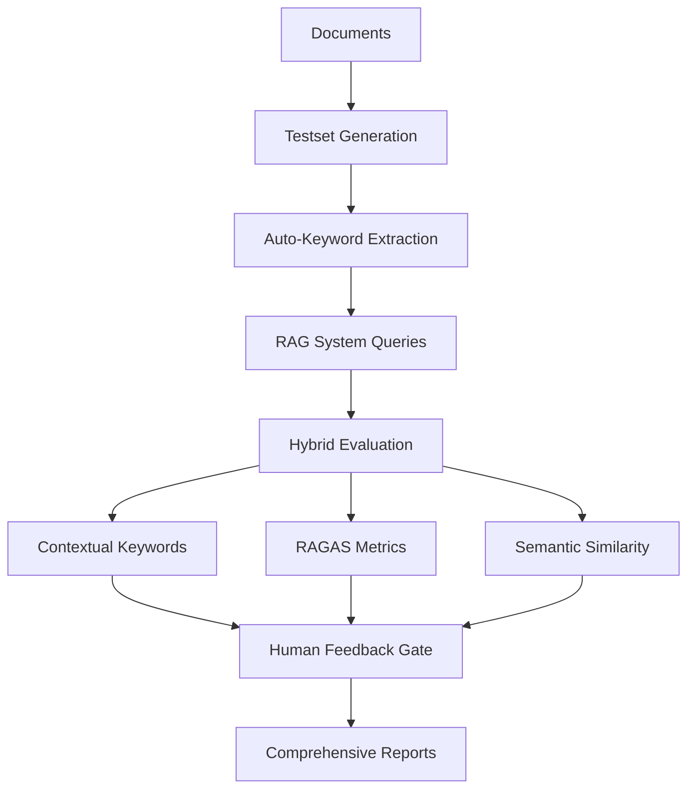

# Domain-Specific RAG Evaluation Pipeline

A comprehensive hybrid evaluation framework for Retrieval-Augmented Generation (RAG) systems that addresses both **user perspective** and **developer perspective** evaluation needs with advanced contextual keyword matching, RAGAS metrics, and dynamic human feedback integration.

## 🎯 **Overview**

This pipeline evaluates RAG systems through multiple evaluation gates:

### **Phase 1: User Perspective Evaluation** ✅
- **Objective Evaluation**: Automated Q&A generation from user documents with contextual keyword extraction
- **Subjective Evaluation**: User-provided Q&A pairs with human feedback integration  
- **Black-box Testing**: End-to-end RAG system evaluation without internal component access

### **Phase 2: Developer Perspective Evaluation** (Future)
- Component-level evaluation (embedding models, similarity search, document chunking)
- Text coverage analysis between retrieved and original blocks
- Multilingual embedding model assessment

## 🏗️ **Architecture**

```
📁 eval-pipeline/
├── 🚀 run_pipeline.py          # Main entry point
├── ⚙️ setup.py                 # Complete setup and installation
├── 📋 requirements.txt         # All dependencies
├── 📁 config/
│   └── pipeline_config.yaml    # Comprehensive configuration
├── 📁 src/
│   ├── 📁 data/                # Document processing and testset generation
│   ├── 📁 evaluation/          # Hybrid evaluation system
│   ├── 📁 interfaces/          # RAG system interfaces
│   ├── 📁 pipeline/            # Pipeline orchestration
│   └── 📁 reports/             # Report generation
├── 📁 outputs/                 # All generated outputs
│   ├── testsets/              # Generated Q&A datasets
│   ├── evaluations/           # Evaluation results  
│   ├── reports/               # HTML/PDF reports
│   └── visualizations/        # Charts and graphs
└── 📁 docs/                   # Documentation
```

## 🔧 **Local RAGAS Development**

This pipeline supports local RAGAS development through a git submodule system, allowing you to customize and extend RAGAS functionality.

### **Quick Start with Local RAGAS**

```bash
# Initialize RAGAS submodule
./manage-ragas.sh --init

# Build Docker image with local RAGAS
./build-with-proxy.sh

# Test installation
./local-ragas-dev.sh --test
```

### **Development Workflow**

```bash
# Full development setup
./local-ragas-dev.sh --setup --build --test

# Start development container with live RAGAS mounting
./local-ragas-dev.sh --run-dev

# Show complete workflow guide
./local-ragas-dev.sh --workflow
```

### **Key Features**
- 🔄 **Git Submodule Integration**: RAGAS as a manageable submodule
- 🐳 **Docker Multi-stage Build**: Optimized builds with local RAGAS
- 🌐 **Proxy Support**: Works behind corporate firewalls
- 🔧 **Development Mode**: Live code mounting for real-time changes
- 🧪 **Automated Testing**: Comprehensive validation of local builds
- 📱 **Cross-platform**: Linux, macOS, and Windows support

📖 **Detailed Guide**: See [LOCAL_RAGAS_BUILD.md](LOCAL_RAGAS_BUILD.md) for comprehensive documentation.

## 🚀 **Quick Start**

### **1. Setup Environment**

```bash
# Clone or navigate to the pipeline directory
cd eval-pipeline

# Run complete setup (installs dependencies, downloads models)
python setup.py

# Optional: Run quick test to verify installation
python setup.py --quick-test
```

### **2. Configure Your Evaluation**

Edit `config/pipeline_config.yaml`:

```yaml
# Essential settings to customize
data_sources:
  documents:
    primary_docs:
      - "../../documents/your_document.pdf"  # Your document path

rag_system:
  api_endpoint: "http://your-rag-system:8000/api/query"  # Your RAG API

testset_generation:
  method: "hybrid"                 # configurable, ragas, or hybrid (RECOMMENDED)
  samples_per_document: 100        # Adjust based on document size
  
evaluation:
  thresholds:
    contextual_threshold: 0.6  # Contextual keyword matching threshold
    ragas_threshold: 0.7       # RAGAS metrics threshold
```

### **3. Run Complete Evaluation**

```bash
# Full pipeline with default config
python run_pipeline.py

# Custom configuration
python run_pipeline.py --config config/my_config.yaml

# Dry run to validate setup
python run_pipeline.py --mode dry-run

# Generate testset only
python run_pipeline.py --stage testset-generation
```

### **4. Review Results**

Check the `outputs/` directory for:
- 📊 **Executive Summary** (`reports/executive_summary.html`)
- 🔧 **Technical Analysis** (`reports/technical_analysis.html`) 
- 📈 **Detailed Results** (`evaluations/detailed_results.xlsx`)
- 📉 **Visualizations** (`visualizations/*.png`)

## 🔧 **Key Features**

### **🎯 Advanced Contextual Keyword Evaluation**
- **Auto-keyword extraction** from documents using KeyBERT, YAKE, and spaCy
- **Semantic similarity matching** using sentence transformers
- **Contextual segmentation** with NLP-based analysis
- **Weighted scoring** for mandatory vs optional keywords

### **📊 RAGAS Integration**
- **Faithfulness**: How grounded the answer is in the context
- **Answer Relevancy**: How relevant the answer is to the question  
- **Context Precision/Recall**: Quality of retrieved contexts
- **Answer Similarity/Correctness**: Comparison with ground truth

### **🧠 Dynamic Human Feedback**
- **Adaptive threshold adjustment** using exponential smoothing
- **Uncertainty-based sampling** for efficient feedback collection
- **Active learning** to minimize annotation effort
- **Feedback consistency tracking** for reliability assessment

### **📈 Comprehensive Reporting**
- **Executive summaries** for stakeholders
- **Technical analysis** for developers
- **Interactive visualizations** for data exploration
- **Actionable recommendations** for system improvement

## 📊 **Evaluation Workflow**



## 🎮 **Usage Examples**

### **Example 1: Redfish API Documentation RAG**

```yaml
# config/redfish_config.yaml
data_sources:
  documents:
    primary_docs:
      - "documents/DSP0266_1.22.0.pdf"

testset_generation:
  samples_per_document: 200
  keyword_extraction:
    domain_keywords:
      enabled: true
      terms: ["redfish", "bmc", "chassis", "system", "manager"]

rag_system:
  api_endpoint: "http://localhost:8000/redfish/query"
```

```bash
python run_pipeline.py --config config/redfish_config.yaml
```

### **Example 2: Medical Literature RAG**

```yaml
# config/medical_config.yaml  
data_sources:
  documents:
    primary_docs:
      - "documents/medical_guidelines.pdf"
      - "documents/research_papers/*.pdf"

evaluation:
  thresholds:
    contextual_threshold: 0.8  # Higher threshold for medical accuracy
    ragas_threshold: 0.8
```

### **Example 3: Batch Processing Multiple Documents**

```yaml
data_sources:
  documents:
    batch_processing:
      enabled: true
      source_directories:
        - "documents/legal"
        - "documents/technical"
      file_patterns: ["*.pdf", "*.docx"]

testset_generation:
  samples_per_document: 50
  max_total_samples: 2000
```

## 📈 **Output Formats**

### **1. Testsets**
- **Excel format** with metadata: `testsets/testset_{source}_{timestamp}.xlsx`
- Columns: `question`, `answer`, `auto_keywords`, `source_file`, `question_type`
- Organized by source document with configurable samples per file

### **2. Evaluation Results** 
- **Detailed results**: `evaluations/detailed_results.xlsx`
- **Summary statistics**: `evaluations/summary_statistics.csv`
- **Metadata**: `metadata/evaluation_metadata.json`

### **3. Reports**
- **Executive Summary**: `reports/executive_summary.html`
- **Technical Analysis**: `reports/technical_analysis.html`
- **Visualizations**: `visualizations/score_distributions.png`, etc.

### **4. Metadata and Logs**
- **Pipeline logs**: `logs/pipeline_{timestamp}.log`
- **Setup report**: `setup_report.json`
- **Configuration snapshots**: `metadata/config_snapshot.yaml`

## ⚙️ **Configuration Guide**

### **Essential Configuration Sections**

#### **Document Sources**
```yaml
data_sources:
  documents:
    primary_docs:
      - "path/to/document.pdf"
    additional_dirs:
      - "path/to/directory/"
    file_types: ["pdf", "docx", "txt"]
```

#### **Testset Generation**
```yaml
testset_generation:
  method: "hybrid"               # configurable, ragas, or hybrid
  samples_per_document: 100
  max_total_samples: 1000
  question_types:
    simple: 0.3
    multi_context: 0.3
    reasoning: 0.4
  keyword_extraction:
    methods: ["keybert", "yake", "spacy_entities"]
    
  # Optional: RAGAS configuration for advanced testset generation
  ragas_config:
    use_custom_llm: false        # Set to true for custom LLM endpoint
    use_openai: false           # Set to true for OpenAI API
    embeddings_model: "sentence-transformers/all-MiniLM-L6-v2"
    
    # Custom LLM configuration (when use_custom_llm: true)
    custom_llm:
      endpoint: "http://localhost:8000/v1/chat/completions"
      api_key_file: "config/secrets.yaml"
      api_key_path: "your_llm.api_key"
      model: "your-model-name"
      temperature: 0.3
      max_tokens: 1000
```

#### **RAG System Interface**
```yaml
rag_system:
  api_endpoint: "http://localhost:8000/query"
  request_format:
    question_key: "query"
    response_key: "answer"
    contexts_key: "sources"
  timeout: 30
```

#### **Evaluation Thresholds**
```yaml
evaluation:
  thresholds:
    contextual_threshold: 0.6    # 0-1, contextual keyword matching
    ragas_threshold: 0.7         # 0-1, RAGAS composite score
    semantic_threshold: 0.6      # 0-1, semantic similarity
  pass_criteria: "majority"      # all, majority, any
```

## 🔧 **Development and Debugging**

### **Debug Mode**
```bash
# Enable debug logging
python run_pipeline.py --log-level DEBUG

# Save intermediate results
python run_pipeline.py --config config_with_debug.yaml
```

### **Testing Components**
```bash
# Test document processing
python -m pytest tests/test_document_processor.py

# Test evaluation components  
python -m pytest tests/test_hybrid_evaluator.py

# Run integration tests
python -m pytest tests/integration/
```

### **Custom Extensions**
```python
# src/custom/my_evaluator.py
from src.evaluation.hybrid_evaluator import HybridEvaluator

class CustomEvaluator(HybridEvaluator):
    def custom_evaluation_metric(self, response, expected):
        # Your custom evaluation logic
        return score
```

## 📚 **API Reference**

### **Main Pipeline Classes**

#### **PipelineOrchestrator**
```python
from src.pipeline.orchestrator import PipelineOrchestrator

orchestrator = PipelineOrchestrator(
    config=config_dict,
    run_id="my_evaluation",
    output_dirs=output_directories
)

results = orchestrator.run(stage="all")  # or "testset-generation", "evaluation", "reporting"
```

#### **HybridEvaluator** 
```python
from src.evaluation.hybrid_evaluator import HybridEvaluator

evaluator = HybridEvaluator(config)
result = evaluator.evaluate_rag_response(
    question="What is a Redfish manager?",
    rag_answer="A Redfish manager is...", 
    expected_answer="According to the spec...",
    auto_keywords=["redfish", "manager", "bmc"],
    contexts=["Context from document..."]
)
```

#### **ReportGenerator**
```python
from src.reports.report_generator import ReportGenerator

generator = ReportGenerator(config)
report_files = generator.generate_comprehensive_report(
    evaluation_results=results_df,
    evaluation_summary=summary_dict,
    output_dir=output_path
)
```

## 🚨 **Troubleshooting**

### **Common Issues**

#### **Setup Issues**
```bash
# Python version compatibility
python --version  # Requires 3.8+

# Missing dependencies
pip install -r requirements.txt

# Model download failures
python -m spacy download en_core_web_sm
python -c "import nltk; nltk.download('punkt')"
```

#### **Document Processing Issues**
```bash
# PDF processing errors (Linux)
sudo apt-get install poppler-utils

# PDF processing errors (macOS)
brew install poppler

# PDF processing errors (Windows)
# Install poppler for Windows
```

#### **Memory Issues**
```yaml
# Reduce batch sizes in config
performance:
  max_workers: 2
  batch_processing: true
  max_memory_usage: "1GB"

testset_generation:
  samples_per_document: 20
  max_total_samples: 200
```

#### **RAG System Connection Issues**
```yaml
rag_system:
  timeout: 60        # Increase timeout
  retry_attempts: 5  # More retries
  
  # Test endpoint manually
  # curl -X POST http://localhost:8000/query -d '{"question":"test"}'
```

### **Performance Optimization**

#### **For Large Documents**
```yaml
document_processing:
  chunk_size: 2000      # Larger chunks
  chunk_overlap: 100    # Smaller overlap

testset_generation:
  samples_per_document: 50  # Fewer samples per doc
  
performance:
  max_workers: 8        # More parallelization
  use_multiprocessing: true
```

#### **For Large Testsets**
```yaml
evaluation:
  batch_size: 20        # Larger evaluation batches

output:
  formats:
    testsets: "csv"     # Faster than Excel for large datasets
```

## 🤝 **Contributing**

### **Development Setup**
```bash
# Install development dependencies
pip install -r requirements.txt
pip install -r requirements-dev.txt

# Install pre-commit hooks
pre-commit install

# Run tests
pytest tests/
```

### **Adding New Evaluation Metrics**
1. Create new metric class in `src/evaluation/metrics/`
2. Integrate with `HybridEvaluator`
3. Add configuration options
4. Update documentation

### **Adding New Document Types**
1. Extend `DocumentProcessor` in `src/data/document_processor.py`
2. Add MIME type detection
3. Test with sample documents

## 📄 **License**

This project is licensed under the MIT License - see the [LICENSE](LICENSE) file for details.

## 📞 **Support**

- **Documentation**: Check `docs/` directory for detailed guides
- **Issues**: Create GitHub issues for bugs and feature requests  
- **Discussions**: Use GitHub Discussions for questions and ideas

## 🎯 **Roadmap**

### **Version 1.1** (Next Release)
- [ ] Phase 2: Developer perspective evaluation
- [ ] Component-level RAG evaluation (embeddings, retrieval, chunking)
- [ ] Advanced visualization dashboard
- [ ] Multi-language support

### **Version 1.2** (Future)
- [ ] Real-time evaluation APIs
- [ ] Integration with popular RAG frameworks
- [ ] Advanced human feedback UI
- [ ] Automated threshold optimization

---

## 📊 **Example Output**

After running the pipeline, you'll get comprehensive evaluation results:

```
🎯 RAG System Evaluation Results
================================
📊 Overall Performance: 78.5%
🔍 Contextual Keywords: 85.2% pass rate
📈 RAGAS Composite: 74.1% pass rate  
🧠 Semantic Similarity: 76.8% pass rate
👥 Human Feedback Needed: 12.3% of samples

📁 Generated Files:
✅ Executive Summary: outputs/reports/executive_summary.html
✅ Technical Analysis: outputs/reports/technical_analysis.html
✅ Detailed Results: outputs/evaluations/detailed_results.xlsx
✅ Visualizations: outputs/visualizations/
```

Ready to evaluate your RAG system? Start with `python setup.py` and then `python run_pipeline.py`! 🚀

## 🔧 **Custom LLM Integration**

The pipeline supports integration with custom or private LLM endpoints for enhanced testset generation:

### **Configure Custom LLM**

Edit `config/pipeline_config.yaml`:

```yaml
testset_generation:
  ragas_config:
    use_custom_llm: true
    custom_llm:
      endpoint: "http://your-llm-endpoint/v1/chat/completions"
      api_key_file: "config/secrets.yaml"
      api_key_path: "your_llm.api_key"
      model: "your-model-name"
      temperature: 0.3
      max_tokens: 1000
```

### **Set Up API Keys Securely**

```bash
# Copy secrets template
cp config/secrets.yaml.template config/secrets.yaml

# Edit with your API keys (file is automatically gitignored)
# your_llm:
#   api_key: "your_actual_api_key_here"
```

### **Test Custom LLM Integration**

```bash
python test_custom_llm_integration.py
```

See [Custom LLM Integration Guide](docs/custom_llm_integration.md) for detailed configuration options.

## 🔧 **Testset Generation Modes**

The pipeline supports three testset generation modes to accommodate different evaluation needs:

### **1. Configurable Mode** (`method: "configurable"`)
- Uses your existing domain-adaptive testset generator
- Auto-keyword extraction with KeyBERT, YAKE, and spaCy
- Excellent for domain-specific terminology validation
- Runs completely on-premise without external API calls

### **2. RAGAS Mode** (`method: "ragas"`)
- Uses the RAGAS TestsetGenerator for sophisticated question types
- Supports simple, reasoning, multi-context, and conditional questions
- Can use OpenAI API or custom LLM endpoints
- Provides standardized RAG evaluation benchmarks

### **3. Hybrid Mode** (`method: "hybrid"`) **[RECOMMENDED]**
- Combines both configurable and RAGAS approaches
- Provides comprehensive coverage of domain-specific and general quality aspects
- Balances on-premise processing with advanced question generation
- Optimal for production RAG system evaluation

```yaml
# Example configuration for each mode
testset_generation:
  method: "hybrid"              # Choose: configurable, ragas, or hybrid
  samples_per_document: 100
  
  # Only used when method includes 'ragas'
  ragas_config:
    use_custom_llm: true        # For on-premise operation
    custom_llm:
      endpoint: "http://your-llm-server:8000/v1/chat/completions"
      api_key_file: "config/secrets.yaml"
      api_key_path: "llm.api_key"
```

## 🔐 **Secure API Key Management**

For secure API key management, the pipeline supports external secrets files:

### **Setup Secrets File**
```bash
# Create secrets file
cp config/secrets.yaml.template config/secrets.yaml

# Edit with your actual API keys
nano config/secrets.yaml
```

### **Example secrets.yaml**
```yaml
# config/secrets.yaml
openai:
  api_key: "sk-your-openai-key-here"

your_llm:
  api_key: "your-custom-llm-api-key-here"
  
other_service:
  api_key: "another-service-key"
```

### **Reference in Configuration**
```yaml
# config/pipeline_config.yaml
testset_generation:
  ragas_config:
    use_custom_llm: true
    custom_llm:
      endpoint: "http://localhost:8000/v1/chat/completions"
      api_key_file: "config/secrets.yaml"      # Path to secrets file
      api_key_path: "your_llm.api_key"         # Dot notation path to key
      model: "llama2-7b-chat"
```

**Security Notes:**
- Add `config/secrets.yaml` to your `.gitignore`
- Use environment variables for production deployments
- Restrict file permissions: `chmod 600 config/secrets.yaml`
