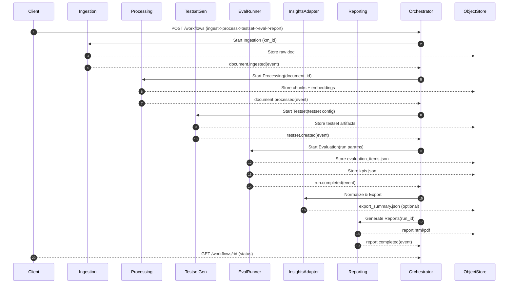
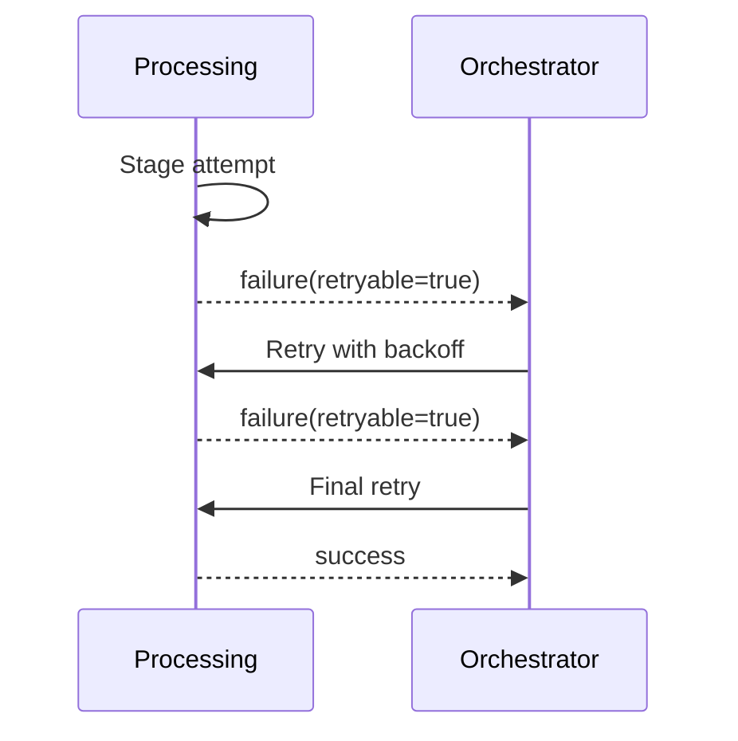
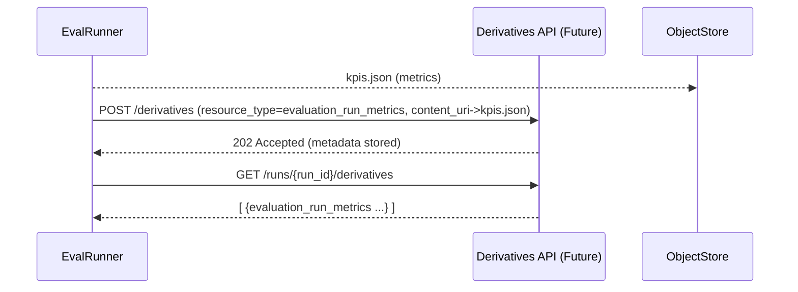

# RAG Evaluation Platform – Technical Design (Draft)

Version: 0.1  
Status: Draft for review  
Date: 2025-09-09  
Owner: Platform Engineering  

---
## 1. Purpose & Scope
This document translates the EARS requirements (requirements.md) into a concrete technical architecture and implementation blueprint. It covers component responsibilities, runtime topology, data & control flows, interface contracts, data models, scaling strategies, reliability mechanisms, observability, security, testing strategy, migration approach, and deferred derivative resource handling.

Non-goals: Final UI design, detailed KM API contract (placeholder), exhaustive OpenAPI specs (skeleton only), detailed RBAC policy (Phase 2).

## 2. Architectural Overview
UI Integration Note: The operational UI layer (see `../requirements/requirements.ui.md` & Chinese counterpart) is an extension module of the existing Insights Portal rather than a standalone SPA. No separate backend is introduced; it consumes the same normalized artifacts and augments them with lifecycle control panels referencing the service APIs defined in this design. Feature flags (KG visualization, multi-run compare, experimental metric visualizers) map to UI-FR optional requirements and are surfaced via a shared configuration endpoint.
### 2.1 Conceptual View
```
+-------------+      +-------------+      +--------------+      +----------------+      +----------------+      +--------------+
| KM System   | ---> | Ingestion   | ---> | Processing   | ---> | Testset Gen    | ---> | Eval Runner    | ---> | Insights     |
| (REST)      |      | Service     |      | Service      |      | Service        |      | Service        |      | Adapter      |
+-------------+      +-------------+      +--------------+      +----------------+      +----------------+      +--------------+
                                                              |                 |                            +--------------+
                                                              |                 +--> (Optional) KG Builder ->| Reporting    |
                                                              |                                           |   | Service      |
                                                              |                                           |   +--------------+
                                                              v                                           v
                                                         +----------------------------+          +------------------+
                                                         | Orchestrator / Workflow    |<-------->| AuthZ (Phase 2)  |
                                                         +----------------------------+          +------------------+
                                                                   |
                                                                   v
                                                         +----------------------------+
                                                         | Object Store / DB / Vector |
                                                         +----------------------------+
```

### 2.2 Deployment Topology (Kubernetes Reference)
- Namespace: `rag-eval` (prod), `rag-eval-dev` (dev)
- Pods per service (initial): 2 replicas stateless services; 1 replica for stateful (DB) managed externally
- External dependencies: Object Storage (S3 compatible), Vector Store (pgvector / FAISS), Graph DB (optional), Metrics & Tracing Stack (Prometheus + Tempo / OTEL Collector)

### 2.3 Technology Choices (Initial Recommendations)
| Concern                  | Choice                                               | Rationale                                          |
|--------------------------|------------------------------------------------------|----------------------------------------------------|
| API Framework            | FastAPI (Python)                                     | Async, OpenAPI 3.1 generation, ecosystem alignment |
| Task Queue (interim)     | Celery / Redis                                       | Quick adoption before full workflow engine         |
| Workflow Engine (future) | Temporal (preferred) or Argo Workflows               | Durable state, retries, visibility                 |
| Vector Store             | pgvector (Postgres extension)                        | Operational simplicity + SQL joins                 |
| Graph Representation     | JSON + similarity indices initially                  | Defer full graph DB until complexity warrants      |
| Object Storage           | MinIO (dev) / S3 (prod)                              | Standard artifact persistence                      |
| Embeddings               | sentence-transformers                                | Existing integration; reproducibility              |
| Metrics                  | Prometheus + Grafana                                 | Standard stack                                     |
| Tracing                  | OpenTelemetry (OTLP exporter)                        | Vendor-agnostic                                    |
| Logging                  | Structured JSON via standard library + uvicorn hooks | Lightweight                                        |
| Auth (Phase 2)           | OAuth2 tokens + internal service JWT                 | Common pattern                                     |
| PDF Rendering            | Playwright headless chromium                         | Reliable PDF output                                |

## 3. Component Responsibilities & Internal Design
### 3.1 Ingestion Service
- Accepts document references (km_id, version)
- Fetch content stream from KM API
- Compute checksum, deduplicate (document table unique (km_id, version, checksum))
- Store raw bytes in object store path: `documents/<km_id>/<version>/raw` (optionally compressed)
- Emit event: `document.ingested` with payload {document_id, km_id, size_bytes, checksum}
- Failure Strategy: Exponential backoff (3 attempts) then mark RECORD status=error

### 3.2 Processing Service
Pipeline Stages: (1) Load raw → (2) Extract text (PDF -> text) → (3) Normalize (whitespace, unicode) → (4) Language detect → (5) Chunk (token-based) → (6) Embedding generation → (7) Persist metadata
- Chunk ID generation: UUIDv4; maintain order index
- Embedding asynchronous batch calls; configurable batch_size
- Idempotency: process-jobs table keyed by (document_id, profile_hash)
- Output artifact: `chunks/<document_id>/chunks.jsonl`
- Emits: `document.processed` (document_id, chunk_count, embedding_profile)

### 3.3 Knowledge Graph Builder (Optional Phase 2)
- Input: Set of chunk IDs or document IDs
- Extract entities & keyphrases (hybrid: spaCy NER + KeyBERT; fallback morphological splitting)
- Node representation: {node_id, chunk_ids[], entities[], keyphrases[], embedding?, summary_embedding?}
- Relationship builders: Jaccard, Overlap, Cosine, SummaryCosine (if embeddings)
- Artifact: `kg/<kg_id>/graph.json` (nodes + relationships)
- Emits: `kg.built` (kg_id, node_count, relationship_count)

### 3.4 Testset Generation Service
Strategies: `configurable`, `ragas`, `hybrid`
- Configuration hashed to ensure reproducibility (seed)
- Avoid duplicate questions via in-memory set + optional approximate similarity (MinHash) for near-duplicates
- Persona & Scenario objects stored at `testsets/<testset_id>/personas.json` and `scenarios.json`
- Validation: Enforce max_total_samples after generation burst but before persist
- Emits: `testset.created` (testset_id, sample_count, method)

### 3.5 Evaluation Runner Service
- Internal pipeline per sample: (1) Form query → (2) Call RAG target → (3) Collect contexts + answer → (4) Compute metrics (RAGAS + contextual keywords + similarity) → (5) Flag uncertain samples
- Metrics plugin registry: entrypoints group `rag_eval.metrics` to load additional metrics dynamically
- Streaming: WebSocket channel `/eval-runs/{id}/stream` publishes item-level partial results for portal preview
- Final artifacts: `runs/<run_id>/evaluation_items.json`, `runs/<run_id>/kpis.json`, optional `thresholds.json`
- Emits: `run.completed` (run_id, counts.total, metrics_version)

### 3.6 Insights Adapter Service
- Consumes evaluation artifacts; normalizes IDs (stable mapping) to portal schema
- Optionally produce `export_summary.json` if feature flags enabled
- Reconciles latency metrics & aggregates distribution snapshots (p50/p90/p99)

### 3.7 Reporting Service
- Generates HTML executive & technical pages (Jinja2 + precomputed metrics)
- PDF via Playwright; store at `runs/<run_id>/report.html` + `report.pdf`
- Updates run_meta.json (append report links) atomically (read-modify-write with ETag)

### 3.8 Orchestrator Service
- Minimal Phase 1: Simple state machine persisted in `workflows` table
- Future: Temporal migration; map states to Temporal activities
- Generic stage definition: {name, type, input_refs[], retry{max_attempts, backoff_strategy}}
- Emits: `workflow.completed` (workflow_id, status, duration_ms)

### 3.9 Derivatives (Deferred)
- Use derivative draft schema (requirements Section 8.8)
- Prototype: Only `kg_summary` & `evaluation_run_metrics` read listing; create stores metadata + points to existing artifacts (no duplication)

## 4. Data & Control Flow
### 4.1 Primary Run (Mermaid Sequence)


### 4.2 Error & Retry Flow (Excerpt)


### 4.3 Derivative Prototype Flow


  ### 4.4 Data Flow Perspective (Artifact Lineage)
  This section provides an end-to-end data-centric view, orthogonal to the control sequence, emphasizing inputs, transformations, outputs, events, and lineage continuity.

  #### 4.4.1 Stage Summary
  | Stage                  | Primary Input(s)                                | Core Transformations                                          | Output Artifacts / Data                                                   | Emitted Event           | Direct Consumers                                |
  |------------------------|-------------------------------------------------|---------------------------------------------------------------|---------------------------------------------------------------------------|-------------------------|-------------------------------------------------|
  | Ingestion              | KM API (km_id, version)                         | Stream download, checksum, dedupe                             | Raw object: `documents/<km_id>/<version>/raw` + DB row                    | `document.ingested`     | Processing, Orchestrator                        |
  | Processing             | Raw document_id                                 | Text extraction, normalization, language detect, chunk, embed | `chunks/<document_id>/chunks.jsonl`, embeddings (vector store)            | `document.processed`    | Testset Gen, KG, Orchestrator                   |
  | KG Builder (opt)       | Chunks (subset / all)                           | Entity & keyphrase extraction, relationship scoring           | `kg/<kg_id>/graph.json`                                                   | `kg.built`              | Testset Gen (if graph-aware), KM Export Summary |
  | Testset Generation     | Chunks (+optional KG/personas cfg)              | Question, answer, scenario generation, deduplication, capping | `testsets/<testset_id>/samples.jsonl`, personas.json, scenarios.json      | `testset.created`       | Evaluation Runner, KM Export Summary            |
  | Evaluation Runner      | Testset samples, RAG target profile             | Query RAG, collect contexts, compute metrics, flag uncertain  | `runs/<run_id>/evaluation_items.json`, `kpis.json`, thresholds.json (opt) | `run.completed`         | Insights Adapter, Reporting                     |
  | Insights Adapter       | Evaluation items + KPIs (+personas)             | Normalization, summarization, aggregation                     | `runs/<run_id>/export_summary.json` (opt)                                 | (none – internal)       | Portal, Reporting (secondary)                   |
  | Reporting              | All run artifacts (kpis, items, export summary) | Templating, HTML rendering, PDF generation                    | `report.html`, `report.pdf`, updated run_meta.json                        | `report.completed`      | Portal (links), Stakeholders                    |
  | KM Export (Phase 1.5)  | testset.created / kg.built events               | Summarize counts, strip sensitive fields                      | `km_exports/<date>/<resource>/<id>.json`                                  | (reuse original events) | KM System                                       |
  | Derivatives (Deferred) | Existing artifacts                              | Metadata wrapping, pointer registration                       | `derivatives/<id>.json` (meta only)                                       | (future)                | External consumers (future)                     |

  #### 4.4.2 Lineage Chain
  `document (km_id,version)` → `raw` → `chunks` → (`kg graph` optional) → `test samples` → `evaluation items` → `KPIs / export summary` → `reports` → (future derivatives / KM summaries reference earlier IDs)

  All downstream artifacts retain at least one upstream foreign key or hash reference enabling reverse traversal for traceability (objective ≥95%).

  #### 4.4.3 Idempotency & Determinism Notes
  - Ingestion: (km_id, version, checksum) uniqueness prevents duplicate raw storage.
  - Processing: (document_id, profile_hash) avoids reprocessing identical configs.
  - Testset: generation parameters + seed hash ensure reproducible sample ordering.
  - Evaluation: (testset_id, rag_profile_hash) enables run result comparison/regression.

  #### 4.4.4 Data Minimization for KM (FR-041/042)
  KM receives only summarized counts (no question text, answers, chunk bodies, embeddings). This reduces exposure risk and payload volume (<2KB typical) while still enabling coverage dashboards on KM side.

  #### 4.4.5 Integrity & Future Enhancements
  - Planned MANIFEST.sha256 per run will list artifact names + checksums to assure completeness.
  - Derivative API will unify additional exports (evaluation_run_metrics, chunk_index) once governance (DR-001/DR-002) is finalized.
  - Potential chunk_hash introduction (content fingerprint) allows cross-system drift detection without content replication.

  #### 4.5 Unified Artifact & Event Matrix (Cross-Cutting)
  Consolidates stage outputs, storage paths, emitted events, and downstream UI/consumer mapping to align with UI design Section 28 and ensure traceability objective (SMART #4 ≥95% linkage) remains enforceable.

  | Stage            | Artifact(s) (Primary)                        | Storage Path Pattern              | Event(s)                 | Direct UI Panel / Consumer     | Idempotency Anchor              |
  |------------------|----------------------------------------------|-----------------------------------|--------------------------|--------------------------------|---------------------------------|
  | Ingestion        | Raw Document                                 | documents/<km_id>/<version>/raw   | document.ingested        | Documents / Processing kickoff | (km_id,version,checksum)        |
  | Processing       | chunks.jsonl + embeddings                    | chunks/<document_id>/chunks.jsonl | document.processed       | Processing, Testset, KG        | (document_id, profile_hash)     |
  | KG Build (opt)   | graph.json, summary.json                     | kg/<kg_id>/graph.json             | kg.built                 | KG, Testset (strat)            | (kg_build_config hash)          |
  | Testset Gen      | samples.jsonl, personas.json, scenarios.json | testsets/<testset_id>/            | testset.created          | Testsets, Evaluation           | (seed + config hash [+kg_id])   |
  | Evaluation       | evaluation_items.json, kpis.json             | runs/<run_id>/                    | run.completed            | Evaluations, Reports, Insights | (testset_id + rag_profile_hash) |
  | Insights Adapter | export_summary.json (optional)               | runs/<run_id>/export_summary.json | (none)                   | Insights, Reports              | (run_id, summary_version)       |
  | Reporting        | report.html/pdf, run_meta.json               | runs/<run_id>/report.*            | report.completed         | Reports, KM Export             | (run_id, template_version)      |
  | KM Export        | testset_summary_v0 / kg_summary_v0           | km_exports/<date>/                | (reuse prior)            | KM Summaries UI                | (resource_type + source_run_id) |
  | Subgraph (draft) | ephemeral subgraph JSON                      | (none – response only)            | (future) subgraph.served | KG Visualization               | (kg_id + param hash)            |

  Notes:
  - Idempotency anchors act as cache keys and de-duplication guards; any future cache tier must derive keys from these normalized hashes.
  - Subgraph responses are intentionally excluded from persistence to avoid state divergence; determinism via parameter hashing yields repeatable slices.
  - KM Export artifacts intentionally omit PII and raw question/answer content per FR-041/042.
  - run_meta.json SHOULD (future change) include direct references to testset_id and kg_id to shorten lineage traversal (mirrors suggestion in UI Section 28.16).

  Alignment References: requirements.md (FR-013~022, FR-037~042), requirements.ui.md (UI-FR-016~035, 049~055), design.ui.md (§28 Phase overview & lineage tables).


## 5. Storage & Schema Mapping
### 5.1 Lifecycle Console Data Access Specification (UI Integration)
This subsection defines the read-only aggregation endpoints and polling / push patterns the UI lifecycle console will rely on (spec phase – no implementation yet).

Data Domains & Minimal Contracts:
1. Documents (Ingestion)
  - Endpoint: GET /ui/documents?limit=50&status=active|error|processing
  - Response (subset): [{document_id, km_id, version, size_bytes, checksum, status, ingested_at}]
  - Refresh: Poll 10s while any status in {queued,processing}; else manual refresh.
2. Processing Jobs
  - Endpoint: GET /ui/process-jobs?document_id=... (list recent if no filter)
  - Response: [{job_id, document_id, profile_hash, status, progress_pct, chunk_count, embedding_count, updated_at}]
  - Push (optional Phase 2): WS /ws/process-jobs/{job_id} → {progress_pct}.
3. Knowledge Graph Builds
  - Endpoint: GET /ui/kg?limit=20
  - Response: [{kg_id, node_count, relationship_count, status, build_profile_hash, created_at}]
  - Feature Flag: kgVisualization ⇒ if true the UI can request summary: GET /ui/kg/{kg_id}/summary (degree_histogram, top_entities[10]).
4. Testset Generation
  - Endpoint: GET /ui/testsets?limit=20
  - Response: [{testset_id, method, sample_count, persona_count, scenario_count, status, config_hash, created_at}]
  - Determinism: config_hash = sha256(sorted(config excluding volatile fields)).
5. Evaluation Runs
  - Endpoint: GET /ui/eval-runs?limit=50
  - Response: [{run_id, testset_id, metrics_version, progress_pct, status, total_samples, needs_human, created_at}]
  - Streaming: WS /ws/eval-runs/{run_id} events {type:progress|item, progress_pct, item_id?}.
6. Reports
  - Endpoint: GET /ui/reports?limit=20
  - Response: [{report_id, run_id, has_pdf, created_at, status}]
7. KM Summaries
  - Endpoint: GET /ui/km-summaries?limit=20
  - Response: [{resource_type:testset|kg, ref_id, schema_version, created_at, delta:{prev_node_count?, prev_sample_count?}}]
8. Feature Flags (Shared)
  - Endpoint: GET /config/feature-flags
  - Response: { kgVisualization:boolean, multiRunCompare:boolean, experimentalMetricViz:boolean, lifecycleConsole:boolean }

Error Model (uniform): { error_code:string, message:string, trace_id?:string }

Latency Targets (UI-FR alignment): P95 < 400ms for list endpoints (limit≤50). Larger data sets rely on pagination token (?cursor=...).

Security (Phase 2): All /ui/* endpoints require read scope; mutation continues through core service endpoints (POST /documents etc.).

Open Question Resolution: KG visualization library decision will define payload shape of /ui/kg/{kg_id}/summary (see Section 20 once added).

| Artifact           | Path Pattern                        | Retention (Initial) | Notes                   |
|--------------------|-------------------------------------|---------------------|-------------------------|
| Raw Document       | documents/<km_id>/<version>/raw     | 90d (configurable)  | Checksum-based dedupe   |
| Chunks             | chunks/<document_id>/chunks.jsonl   | 90d                 | Contains token counts   |
| Embeddings         | vector store rows                   | 90d                 | Indexed by chunk_id     |
| KG Graph           | kg/<kg_id>/graph.json               | 90d                 | Deferred if KG disabled |
| Testset Samples    | testsets/<testset_id>/samples.jsonl | 90d                 | Deterministic order     |
| Personas/Scenarios | testsets/<testset_id>/personas.json | 90d                 | Optional                |
| Evaluation Items   | runs/<run_id>/evaluation_items.json | 180d                | Heavier access          |
| KPI Aggregation    | runs/<run_id>/kpis.json             | 180d                | Summaries               |
| Run Meta           | runs/<run_id>/run_meta.json         | 180d                | Updated for reports     |
| Export Summary     | runs/<run_id>/export_summary.json   | 180d                | Optional                |
| Reports | runs/<run_id>/report.(html|pdf) | 365d | Larger retention |
| Derivatives (meta) | derivatives/<derivative_id>.json | TBD | Deferred |

## 6. Interface Sketches (OpenAPI Fragments)
## 20. KG Visualization Library Evaluation (Spec)
Goal: Select a graph visualization approach for UI-FR-016..018 (KG dashboard & optional visualization) balancing performance, customization, and bundle impact.

| Criterion               | Cytoscape.js                                                       | D3 (custom force layout)                       | Notes                            |
|-------------------------|--------------------------------------------------------------------|------------------------------------------------|----------------------------------|
| Feature Completeness    | Built-in graph layout algorithms (cose, concentric, dagre via ext) | Requires assembling force, zoom, drag manually | Cytoscape faster to MVP          |
| Performance (mid graph) | Stable up to ~10k nodes with WebGL ext                             | Needs careful optimization; raw SVG slows >2k  | WebGL plugin advantage           |
| Bundle Size (approx)    | ~470 KB min+gzip base                                              | Incremental (d3-selection/force/zoom ~70 KB)   | D3 smaller if minimal            |
| Custom Styling          | Style selectors (css-like)                                         | Full control via custom code                   | D3 more granular                 |
| Interaction (pan/zoom)  | Built-in                                                           | Manual wiring                                  | Cytoscape lower effort           |
| Extensibility Plugins   | Rich ecosystem                                                     | N/A (roll your own)                            | Advantage Cytoscape              |
| Learning Curve          | Moderate DSL                                                       | Low-level imperative                           | D3 more effort for same features |
| License                 | MIT                                                                | BSD-3 (MIT-like)                               | Both acceptable                  |

Decision: Adopt Cytoscape.js (with deferred WebGL enablement) for Phase 1 visualization toggle.
Rationale:
1. Faster time-to-value (out-of-box layouts + interaction primitives).
2. Aligns with need for quick optional feature flag demonstration (UI-FR-018).
3. Adequate performance for expected initial scale (<5k nodes / <20k edges) with potential WebGL plugin.
4. Reduces custom layout maintenance burden.

Mitigations for Bundle Size:
- Lazy load module only when `kgVisualization` flag true.
- Dynamic import (`import('cytoscape')`) + code splitting ensures baseline bundle unaffected.

Data Contract Impact:
- /ui/kg/{kg_id}/summary expanded to include:
```
{
  "node_count": 1234,
  "relationship_count": 5678,
  "degree_histogram": [[1,120],[2,340],[3,210],...],
  "top_entities": [{"label":"EntityA","degree":34},{"label":"EntityB","degree":31}],
  "sample_subgraph": {
    "nodes": [{"id":"n1","label":"EntityA","degree":34}],
    "edges": [{"id":"e1","source":"n1","target":"n2","weight":0.78}]
  }
}
```
- `sample_subgraph` limited to ≤200 nodes (heuristic: top central nodes) for client rendering.

Open Question Closure:
- “KG visualization library selection” – RESOLVED (Cytoscape.js). Update requirements Section 14 note.

Future Considerations:
- Evaluate graph pruning (community detection) for large KGs.
- Consider WebGL renderer swap if node_count consistently >10k.

```yaml
# Ingestion
POST /documents
  requestBody: { km_id: string, version?: string }
  responses: { 202: { document_id } }
GET /documents/{id}
  responses: { 200: { id, km_id, version, checksum, status } }

# Processing
POST /process-jobs { document_id, profile } -> 202 { job_id }
GET /process-jobs/{id} -> 200 { status, progress, chunk_count }

# Testset
POST /testset-jobs { method, params } -> 202 { testset_id }
GET /testset-jobs/{id}

# Evaluation
POST /eval-runs { testset_id, rag_profile } -> 202 { run_id }
GET /eval-runs/{id} -> { status, metrics_version, progress }
WS  /eval-runs/{id}/stream

# Reporting
POST /reports { run_id, pdf?: bool } -> 202 { report_job_id }
GET /reports/{id}

# Workflows
POST /workflows { stages[] } -> 202 { workflow_id }
GET /workflows/{id}

# Derivatives (Deferred)
GET /runs/{run_id}/derivatives -> 200 [DerivativeResource]
```

## 7. Error Handling & Status Model
### 7.1 Standard Error Envelope
```
{
  "error_code": "RESOURCE_NOT_FOUND|VALIDATION_ERROR|RETRY_LATER|INTERNAL_ERROR",
  "message": "human readable",
  "retryable": true|false,
  "trace_id": "..."
}
```
### 7.2 Job Status States
`queued -> running -> (completed | failed | cancelled)`  
Progress: 0..100 based on completed sub-steps (weighted).  
Retry count tracked; last_error snapshot.

### 7.3 Idempotency
- POST endpoints returning 202 should accept Idempotency-Key header (Phase 2) or deterministic composite keys now.

## 8. Performance & Scalability
| Aspect             | Strategy                                                                                 |
|--------------------|------------------------------------------------------------------------------------------|
| Chunking           | Streaming parsers; memory bounded by page buffer                                         |
| Embeddings         | Batch size autotune; GPU optional                                                        |
| Metric Computation | Parallel pool per run; isolate heavy LLM calls                                           |
| Backpressure       | Queue length & in-flight gauge metrics; orchestrator throttling                          |
| Caching            | Reuse embeddings & RAG query responses keyed by (question_hash, top_k, rag_profile_hash) |
| Pagination         | Large artifact listing endpoints require cursor pagination                               |

Target: ≥10 samples/sec simple; scale linearly ±25% as replicas increase under load tests.

## 9. Reliability & Resilience
- Retries: Exponential with jitter for transient (HTTP 5xx, network timeouts)
- Circuit Breaker: Optional library wrapper for RAG target (half-open probing)
- Poison Messages: Jobs exceeding retry threshold moved to `dead_letter` table
- Checkpointing: Intermediate artifacts written atomically (write temp + rename)
- Consistency: Eventual; orchestrator queries status rather than assuming success after dispatch

## 10. Observability
| Signal          | Implementation                                                                |
|-----------------|-------------------------------------------------------------------------------|
| Logs            | JSON lines; include trace_id, job_id, stage, svc                              |
| Metrics         | Prometheus counters/histograms (request_total, latency, job_duration_seconds) |
| Traces          | OTEL instrumentation wrappers for HTTP + async tasks                          |
| Profiling (opt) | py-spy / eBPF sampling in staging                                             |
| Dashboards      | Unified run pipeline overview + per-service latency panel                     |

## 11. Security & Compliance
- Transport: TLS termination at ingress; optional mTLS for internal later
- Auth (Phase 2): OAuth2 client credentials for external; signed JWT for inter-service
- Secrets: Mounted via K8s Secret or Vault; rotated automatically
- PII: Regex + optional model classifier; mask before log emission
- Data at Rest: Server-side encryption (S3 SSE) + Postgres TDE (if available)
- Least Privilege: Separate IAM roles for artifacts vs metadata

## 12. Testing Strategy
| Layer       | Approach                                                                        | Tooling             |
|-------------|---------------------------------------------------------------------------------|---------------------|
| Unit        | Pure functions (chunking, metric math)                                          | pytest + coverage   |
| Contract    | Schemas validated vs JSON Schema using pydantic models                          | pytest              |
| Integration | Service pairs (ingestion->processing, eval-runner->adapter) with docker-compose | pytest + compose    |
| End-to-End  | Full workflow via orchestrator hitting all services                             | smoke suite nightly |
| Performance | Locust / k6 for eval-runner & ingestion throughput                              | k6 scripts          |
| Chaos       | Induce network faults (toxiproxy) to test retries                               | custom harness      |
| Security    | Static analysis (bandit), dependency scan                                       | CI steps            |

### 12.1 Test Data Management
- Synthetic small corpus + golden outputs for metrics regression
- Seeds pinned in testset generation to achieve determinism

### 12.2 Coverage Targets
- Critical modules ≥80%; metrics plugin interfaces mocked

## 13. Migration Plan Alignment
Mapping requirement phases to concrete infra actions (see Milestones table in requirements):
- Phase 1: Deploy ingestion, processing, eval-runner, minimal orchestrator; share Postgres cluster
- Phase 2: Add testset-gen, kg-builder, insights-adapter; introduce feature flags
- Phase 3: Add reporting + gateway; enable partial auth (API tokens)
- Phase 3.5: Deploy read-only derivatives listing
- Phase 4+: Optimize; optionally migrate orchestrator to Temporal

## 14. Derivative Resource Detailed Design (Deferred)
### 14.1 Storage Model
- Metadata: `derivatives` table (derivative_id PK, source_run_id FK, resource_type, hash, created_at, pii_classification, status, content_uri, size_bytes, version)
- Index: (source_run_id), (resource_type, created_at DESC), unique (resource_type, source_run_id, hash)

### 14.2 Access Patterns
| Use Case                 | Query                                            |
|--------------------------|--------------------------------------------------|
| List derivatives for run | WHERE source_run_id = ? ORDER BY created_at DESC |
| Fetch by id              | PK lookup                                        |
| Filter by type           | WHERE source_run_id=? AND resource_type=?        |

### 14.3 Lifecycle
States: `available -> expired -> tombstoned`  
- Expiry job marks records expired (content may remain briefly)  
- Tombstone removes content_uri pointer & denies download

### 14.4 Security Hooks
- Download requires authorization scope `derivatives:read`
- PII classification != none triggers audit log entry

### 14.5 Future Enhancements
- Integrity attestation (signed checksum manifest)
- Cross-run lineage tracking (derived_from array)

## 15. Risks & Mitigations (Design Focus)
| Risk                           | Impact                   | Mitigation                                |
|--------------------------------|--------------------------|-------------------------------------------|
| Over-abstraction early         | Slower delivery          | Implement minimal orchestrator first      |
| Graph DB premature adoption    | Operational overhead     | Start with lightweight JSON graph         |
| Metric plugin instability      | Runtime failures         | Versioned plugin API + contract tests     |
| Large PDF generation memory    | Pod OOM                  | Stream to disk + resource limits          |
| Eventual consistency confusion | Client misinterpretation | Clear status endpoints + polling guidance |

## 16. Open Decisions
| Decision              | Options                       | Target Phase | Notes                         |
|-----------------------|-------------------------------|--------------|-------------------------------|
| Workflow engine       | Stay custom / Temporal / Argo | 3 → 4        | Evaluate after Phase 2 load   |
| Vector store scaling  | pgvector vs dedicated Milvus  | 2            | Benchmark size & recall       |
| Graph persistence     | Keep JSON vs Neo4j            | 2            | Reassess relationship density |
| Derivatives retention | Time-based vs access-based    | 3.5          | Needs compliance input        |
| AuthZ model           | RBAC only vs ABAC             | 3            | Complexity trade-off          |

## 16.1 Architecture Decision Records (ADR) Reference
The following ADRs formalize key design choices referenced across sections (§4 Data Flow, §10 Observability, §18 KM Storage Strategy). Each ADR is stored under `docs/adr/` with English & Chinese variants where available.

| ADR ID  | Title (English)                                         | Status | Design Cross-Refs | Summary Impact                                       |
|---------|---------------------------------------------------------|--------|-------------------|------------------------------------------------------|
| ADR-001 | Microservices Structure                                 | Draft  | §2, §3            | Confirms service decomposition & isolation rationale |
| ADR-002 | Knowledge Graph Visualization Technology (Cytoscape.js) | Draft  | §3.3, §20         | Justifies KG visualization selection & lazy loading  |
| ADR-003 | Subgraph Sampling Strategy                              | Draft  | §3.3, §20, §27    | Defines deterministic bounded subgraph responses     |
| ADR-004 | Manifest Integrity & Artifact Traceability              | Draft  | §4.4.5, §17       | Establishes integrity manifest & future caching hook |
| ADR-005 | Telemetry Taxonomy & Naming Conventions                 | Draft  | §10               | Standardizes event/metric naming for observability   |
| ADR-006 | Event Schema Versioning Strategy                        | Draft  | §4.5, §10, §17    | Introduces per-event semantic version + registry     |

Planned future ADRs will be appended here and linked from originating sections; acceptance status transitions require updating this table and corresponding bilingual ADR file.

## 17. Recommendations Beyond Requirements
1. Introduce semantic versioning for artifact schemas (schema_version in run_meta)
2. Provide lightweight Python SDK + CLI shim simultaneously (avoid dual maintenance later)
3. Implement metrics sampling (reduce cardinality) for high-churn labels
4. Add provenance header `X-Workflow-ID` to all artifact metadata for lineage
5. Pre-compute common aggregations (top failing personas) to accelerate portal load
6. Adopt OpenFeature for dynamic metric enablement
7. Include checksum manifest per run (MANIFEST.sha256) for integrity
8. Evaluate Parquet for large evaluation_items (compression + selective read)

## 18. KM Storage Strategy (Initial Scope)
Status: Introduced to satisfy FR-041 & FR-042. Narrow export scope (Phase 1.5) intentionally excludes full test samples, evaluation metrics, chunk indices until derivative governance (DR-001 / DR-002) resolved.

### 18.1 Objectives
- Provide lightweight summaries to KM so upstream knowledge systems can index evaluation coverage without exposing full question/answer content.
- Enable early cross-system lineage (testset_id, kg_id) while deferring high-volume artifact synchronization.

### 18.2 Export Events
| Event Source    | Trigger Condition                  | Payload Fields (v0)                                                                                     | Exclusions                           |
|-----------------|------------------------------------|---------------------------------------------------------------------------------------------------------|--------------------------------------|
| testset-gen-svc | testset.created (status=completed) | testset_id, sample_count, persona_count, scenario_count, generation_method, schema_version (testset_v0) | No sample texts / answers            |
| kg-builder-svc  | kg.built (relationships finalized) | kg_id, node_count, relationship_count, source_document_ids[], build_profile_hash                        | No node property detail / embeddings |

### 18.3 Transport & Delivery
- Mode: Internal event bus → lightweight KM export adapter (Phase 1.5 may be a cron/sidecar writing JSON to shared location consumed by KM ingestor).
- Reliability: At-least-once; payloads carry `export_version` + deterministic idempotency key: `<resource_type>:<id>:<schema_version>`.
- Retry: Exponential (max 6 attempts) then DLQ table `km_export_dead_letter`.

### 18.4 Payload Draft Schemas
Testset Summary (testset_summary_v0):
```
{
  "schema_version": "testset_summary_v0",
  "testset_id": "uuid",
  "sample_count": 123,
  "persona_count": 5,
  "scenario_count": 12,
  "generation_method": "ragas|configurable|hybrid",
  "created_at": "ISO8601"
}
```
KG Summary (kg_summary_v0):
```
{
  "schema_version": "kg_summary_v0",
  "kg_id": "uuid",
  "node_count": 420,
  "relationship_count": 1337,
  "source_document_ids": ["uuid", "uuid"],
  "build_profile_hash": "sha256",
  "created_at": "ISO8601"
}
```

### 18.5 Storage & Handoff
- Internal persistence: `km_exports` table for audit (export_id PK, resource_type, resource_id, schema_version, payload_json, delivered_at, retry_count, status).
- External handoff: Phase 1.5 as object store JSON (`km_exports/<date>/<resource_type>/<resource_id>.json`) or direct POST (if KM endpoint ready).
- Size Expectation: < 2 KB per export.

### 18.6 Security & Privacy
- No PII fields included.
- Downstream KM consumer must not attempt to dereference non-exported details (contract enforced by schema).

### 18.7 Future Expansion (Out of Scope Now)
- Full evaluation metric aggregates (kpis.json distilled form)
- Question/answer redacted variants
- Chunk-level lineage map
- Derivative normalization into unified Derivatives API

### 18.8 Risks & Mitigations
| Risk              | Impact                | Mitigation                                                    |
|-------------------|-----------------------|---------------------------------------------------------------|
| KM endpoint delay | Blocks push model     | Use pull via object store until ready                         |
| Schema drift      | Consumer parse errors | Versioned schema_version + JSON Schema validation pre-publish |
| Duplicate exports | Confusing metrics     | Idempotency key constraint in km_exports                      |

---
## 19. Glossary (Design Additions)
### 17.1 Additional Future Improvements
- Event Bus Abstraction Layer: Wrap publisher to allow swapping (NATS <-> Kafka) without code churn.
- Schema Registry (lightweight): Maintain JSON Schema versions for artifacts; auto-validate on write.
- Adaptive Sampling for Expensive Metrics: Dynamically reduce computation for high-confidence segments.
- Multi-tenant Partition Keys: Early namespace patterns if future multi-tenant demand arises.
- Cold Storage Tier: Migrate old evaluation_items to cheaper storage after retention threshold.


## 18. Glossary (Design Additions)
- Manifest: File enumerating artifact names + checksums for integrity verification
- Tombstone: Marker state indicating metadata retained, content removed
- Backoff Strategy: Algorithm controlling retry intervals (exponential w/ jitter)

---
## 21. Linux Containerization & Multi-Service Deployment Enhancements (Supplement)
### 21.1 Goals
Provide Linux-focused, production-ready refinements extending earlier deployment topology (§2.2) and tasks (§5.12, TASK-120..129). Emphasis: reproducibility, minimal rebuild time, security hardening, and extensibility.

### 21.2 Multi-Service Compose Strategy
A new file `docker-compose.services.yml` defines discrete services:
- ingestion-svc
- processing-svc
- testset-svc
- eval-svc
- reporting-svc
- kg-svc (feature-flag driven)
- ws-gateway

Shared anchors:
```
x-common-env: &common-env
  LOG_LEVEL: INFO
  PYTHONUNBUFFERED: "1"
  EVENT_MODE: poll          # future: bus
  OBJECT_STORE_ENDPOINT: ${OBJECT_STORE_ENDPOINT}
  FEATURE_FLAGS: ${FEATURE_FLAGS:-{"kgVisualization":false}}
```
Network: single `app-net`; object store & (optional) redis/queue sidecars may join.

Principles:
1. Least Inter-Dependencies: Only depend_on external infra (db, object-store), not peer services.
2. Replaceable Runtime: Each svc image built from a shared base (see §21.5) to reduce duplicated layers.
3. Graceful Shutdown: SIGTERM → uvicorn timeout 15s; compose uses `stop_grace_period: 30s`.

### 21.3 Development Override (Linux)
`docker-compose.dev.override.yml`:
- Binds local source: `.:/app` (read-only except writable dirs: /app/logs, /app/outputs)
- Overrides command: `uvicorn services.<svc>.main:app --host 0.0.0.0 --port XXXX --reload`
- Adds volume for pip cache: `${HOME}/.cache/pip:/home/pipeline/.cache/pip` (speeds iterative rebuilds)
- File change detection: rely on inotify (Linux native, no polling) – warn if bind FS is networked (NFS) since inotify may be unreliable.

### 21.4 Plugin / Extension Mount Pattern
Directory: `/app/extensions/` (bind-mount from host). Loader order:
1. Enumerate `*.py` (non-underscore) files.
2. Import module; search for `def register(registry):`.
3. Call register with metric / relationship registries.
Failure Modes:
- Strict Mode (ENV `EXTENSIONS_STRICT=true`): any import error aborts startup.
- Permissive Mode: log warning with structured field `{component:"plugin_loader",error:"<msg>"}`.
Security:
- Reject files >128KB (guard against large payload injection) unless `ALLOW_LARGE_EXTENSIONS=true`.
- Optional hash allowlist: `EXTENSION_SHA256_ALLOWLIST` (comma-delimited) – if set, unknown hashes skipped.

### 21.5 Base Image Hardening (Linux Focus)
Multi-stage Dockerfile adjustments:
1. Base Stage: `FROM python:3.10-slim` + `apt-get install --no-install-recommends build-essential curl git tini` then purge apt lists.
2. Create user: `useradd -m -u 1000 pipeline` and switch to non-root in final stage.
3. Use `pip install --no-cache-dir -r requirements.txt`.
4. Copy only necessary artifacts (use `.dockerignore` aggressively to exclude tests, docs, .git, large media).
5. Entrypoint: `tini --` to ensure signal handling.
6. Set `HOME=/home/pipeline`, `WORKDIR /app`.
7. Layer Minimization: group related RUN commands; perform `rm -rf /var/lib/apt/lists/*`.
8. SBOM (future TASK-130): `syft packages /app -o json > /sbom/sbom.json` (optional stage) – artefact published in CI.

### 21.6 GPU Optional Acceleration
Conditionally enable embeddings acceleration:
- Build ARG `ENABLE_GPU=false`; when true, base image switches to `nvidia/cuda:12.1.1-runtime-ubuntu22.04` with matching Python installation layer.
- Runtime detection: if `/dev/nvidia0` present, set metric `gpu_enabled{service="processing"} 1` else 0.
- Compose profile: `--profile gpu` adds `deploy.resources.reservations.devices` (K8s analog: node selector + toleration in Helm chart values `gpu.enabled`).

### 21.7 Health & Readiness Probes
Standard endpoints per service:
- `/healthz` (fast, returns static OK + build version)
- `/readyz` (checks DB/queue connectivity + model load status)
- Startup probe (Processing/Eval only): confirm embedding model loaded (< configured timeout) to avoid early traffic.

Compose Example Snippet:
```
healthcheck:
  test: ["CMD", "curl", "-f", "http://localhost:8000/healthz"]
  interval: 30s
  timeout: 5s
  retries: 3
```
Helm values excerpt:
```
health:
  readinessPath: /readyz
  livenessPath: /healthz
  startup:
    enabled: true
    failureThreshold: 30
    periodSeconds: 5
```

### 21.8 File Permissions & UID Consistency
Host bind mounts (data, outputs, logs) must be writable by UID 1000. Guidance:
- Recommend `chown -R $USER:$USER outputs logs data` before first run.
- Compose: set `user: "1000:1000"`.
- K8s: `securityContext: { runAsUser: 1000, runAsGroup: 1000, fsGroup: 1000, readOnlyRootFilesystem: true }` (root fs read-only once write dirs mounted).

### 21.9 Image Tagging & Promotion Flow
Tag set per build: `:vX.Y.Z`, `:git-<shortsha>`, `:latest`. Promotion:
1. PR merge to main → build & push `git-<sha>` + update SBOM.
2. Release tag push (vX.Y.Z) → retag previously built digest; sign (future cosign) and push provenance attestations.
3. Deployment automation consumes immutable digest (not moving tag) in Helm values.

### 21.10 Supply Chain & Security Scanning
Pipeline steps (CI):
1. Lint & unit tests
2. Governance validators (event schemas, telemetry taxonomy)
3. Build image + export SBOM
4. Trivy scan (fail on HIGH/CRITICAL)
5. Sign (future) and push
6. Store SBOM + scan report artifacts

### 21.11 Horizontal Scaling & Metrics Hooks
Expose base metrics:
- `service_requests_total{service="ingestion"}`
- `active_jobs{service="processing"}` (gauge)
- `evaluation_items_processed_total`
HPA Policy Examples:
- Processing: scale on CPU >70% OR `active_jobs` > N per pod
- Eval: scale on `evaluation_items_processed_total` rate + queue depth gauge

### 21.12 Deterministic Dev-Parity Validation
Script (`scripts/validate_dev_parity.py`) compares:
- Image Python version vs local `python3 --version`
- Requirements resolved versions vs lock file
- Extension hash differences between container and host
Local runs may warn on Python major.minor drift while CI keeps `--python-drift-severity error` to fail on version mismatch. Dependency and extension drift remain reportable for pre-commit or CI jobs.

### 21.13 Risk Summary Addendum
| Risk | Added Mitigation |
|------|------------------|
| Privilege Escalation | Non-root user + read-only root fs |
| Plugin Supply Chain | Hash allowlist + size limit |
| Drift Between Dev/CI | Parity validation script |
| Orphaned GPU Layers  | ARG gate ensures CPU-only default |

### 21.14 Future Enhancements (Post TASK-129)
- Cosign signature & Rekor transparency log (TASK-131 forward)
- Multi-arch images (linux/amd64 + linux/arm64) via buildx
- Layer caching registry (GHCR cache) to cut CI times
- eBPF-based syscall profile (baseline → anomaly detection)

---
End of document.
