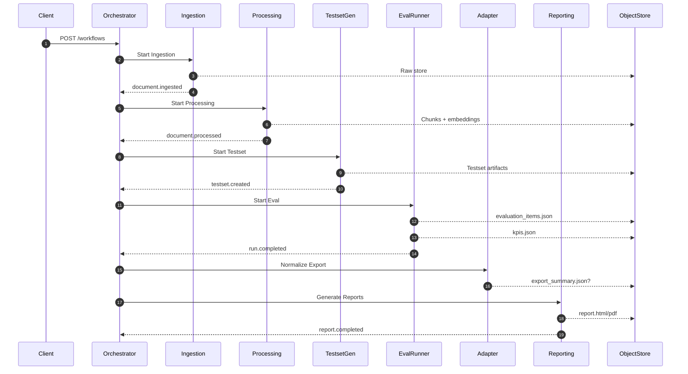
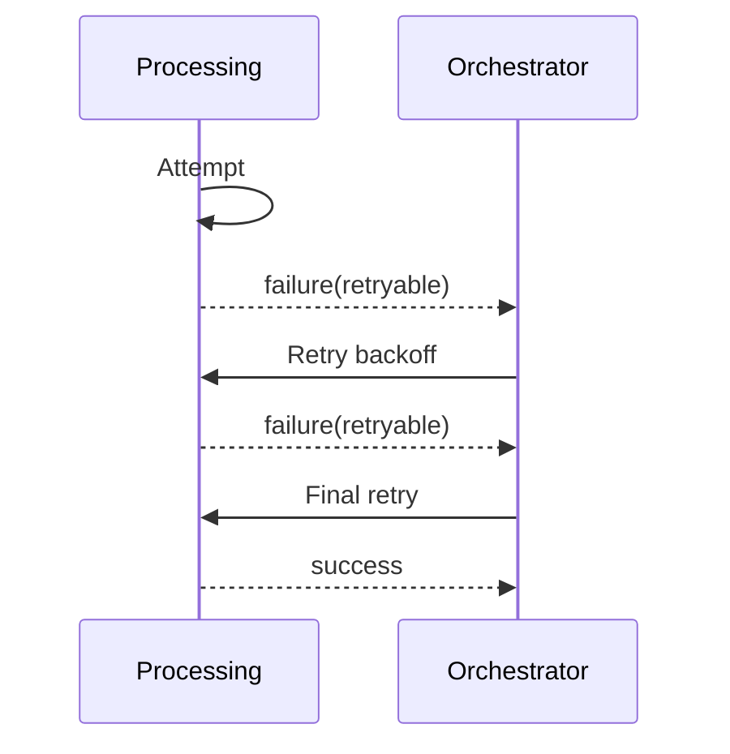
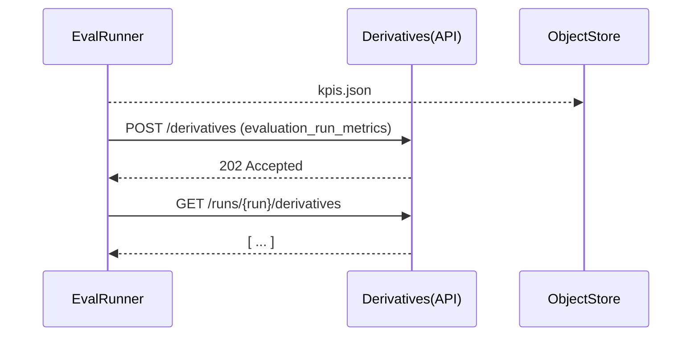

# RAG 評估平台 – 技術設計（草稿）

版本：0.1  
狀態：徵求審閱  
日期：2025-09-09  
負責：平台工程組  

---
## 1. 目的與範圍
本文件將需求說明（requirements.zh.md / 英文對應檔）轉化為可執行之技術架構與實作藍圖。涵蓋：元件職責、部署拓樸、資料與控制流程、介面草稿、資料模型、擴充與效能策略、可靠與錯誤處理、可觀測性、安全、測試策略、遷移對應，以及延後的衍生資源（Derivative）設計細節。

非目標：最終前端 UI 設計、KM API 詳細契約（暫用佔位）、完整 OpenAPI（僅骨架）、RBAC 細節（Phase 2 之後）。

## 2. 架構總覽
UI 整合說明：操作型 UI（參見 `../requirements/requirements.ui.zh.md` 及英文對應）以擴充既有 Insights Portal 模組方式實作，而非獨立 SPA；重用既有指標與元件，新增生命週期控制面板（Documents / Processing / KG / Testsets / Evaluations / Insights / Reports）並透過本設計定義之服務 API 操作。功能旗標（KG 視覺化、多執行比較、實驗視覺化）對應 UI-FR 之可選需求，透過共享設定端點曝光。
### 2.1 概念視圖
```
+-------------+      +-------------+      +--------------+      +----------------+      +----------------+      +--------------+
| KM System   | ---> | Ingestion   | ---> | Processing   | ---> | Testset Gen    | ---> | Eval Runner    | ---> | Insights     |
| (REST)      |      | Service     |      | Service      |      | Service        |      | Service        |      | Adapter      |
+-------------+      +-------------+      +--------------+      +----------------+      +----------------+      +--------------+
                                                              |                 |                            +--------------+
                                                              |                 +--> (Optional) KG Builder ->| Reporting    |
                                                              |                                           |   | Service      |
                                                              |                                           |   +--------------+
                                                              v                                           v
                                                         +----------------------------+          +------------------+
                                                         | Orchestrator / Workflow    |<-------->| AuthZ (Phase 2)  |
                                                         +----------------------------+          +------------------+
                                                                   |
                                                                   v
                                                         +----------------------------+
                                                         | Object Store / DB / Vector |
                                                         +----------------------------+
```

### 2.2 部署拓樸（Kubernetes 參考）
- Namespace：`rag-eval`（prod）、`rag-eval-dev`（dev）
- 初始副本：無狀態服務 2 副本；資料庫等狀態服務由受管服務提供
- 外部依賴：物件儲存（MinIO/S3）、向量儲存（pgvector / FAISS）、（選）圖存、監控/追蹤（Prometheus + OTEL Collector）

### 2.3 技術選擇（初步建議）
| 面向             | 選擇                         | 理由                          |
|------------------|------------------------------|-------------------------------|
| API Framework    | FastAPI                      | Async + OpenAPI 3.1，自動文件  |
| 任務隊列（過渡）   | Celery / Redis               | 快速採用，未來可替換           |
| 工作流引擎（未來） | Temporal（偏好）或 Argo        | 穩健重試、可視化、Durable state |
| 向量庫           | pgvector                     | 與 SQL 整合、操作簡單          |
| 圖表示           | JSON + 相似度索引            | 降低初期複雜度                |
| 物件儲存         | MinIO(dev)/S3(prod)          | 標準化 artifact 儲存          |
| Embeddings       | sentence-transformers        | 既有整合、可重現               |
| Metrics          | Prometheus + Grafana         | 主流堆疊                      |
| Tracing          | OpenTelemetry                | Vendor 中立                   |
| Logging          | JSON 結構化                  | 可機器解析                    |
| Auth (Phase 2)   | OAuth2 + 服務 JWT            | 常見模式                      |
| PDF              | Playwright headless chromium | 穩定輸出                      |

## 3. 元件職責與內部設計
### 3.1 Ingestion Service
- 接收 km_id + version 引用，串流抓取內容
- 計算 checksum 去重（(km_id, version, checksum) 唯一）
- 原始檔存：`documents/<km_id>/<version>/raw`
- 發佈事件：`document.ingested`
- 失敗：3 次退避後標記 error

### 3.2 Processing Service
階段：(1) 讀取 → (2) 文字抽取 → (3) 正規化 → (4) 語言偵測 → (5) 切片 → (6) Embedding → (7) 持久化
- 冪等：process-jobs 以 (document_id, profile_hash) 唯一
- 輸出：`chunks/<document_id>/chunks.jsonl`
- 事件：`document.processed`

### 3.3 知識圖譜（選）
- 抽取實體/關鍵詞（spaCy + KeyBERT）
- 關係：Jaccard / Overlap / Cosine / SummaryCosine
- Artifact：`kg/<kg_id>/graph.json`
- 事件：`kg.built`

### 3.4 Testset Generation
- 策略：configurable / ragas / hybrid
- 問題去重：集合 + 近似 (MinHash)（選）
- Artifact：personas.json, scenarios.json
- 事件：`testset.created`

### 3.5 Evaluation Runner
- 流程：Query → RAG 回應 → 指標計算 → 旗標 → 輸出
- 動態指標外掛：entrypoints `rag_eval.metrics`
- WebSocket 即時推送
- artifacts：evaluation_items.json, kpis.json
- 事件：`run.completed`

### 3.6 Insights Adapter
- 對齊 Portal schema，輸出 export_summary.json（可選）

### 3.7 Reporting
- Jinja2 產出 HTML；Playwright 轉 PDF
- 原子更新 run_meta.json（ETag）

### 3.8 Orchestrator
- Phase1：簡單狀態機；後續可遷移 Temporal
- Stage 定義包含重試策略

### 3.9 Derivatives（延後）
- 僅存 metadata 指向既有檔案避免重複
- Prototype：`kg_summary` 與 `evaluation_run_metrics`

## 4. 資料與控制流程
### 4.1 主要流程（Mermaid）


### 4.2 錯誤與重試（節錄）


### 4.3 衍生資源原型


### 4.4 資料流視角（Artifact 血緣）
此節以資料為中心（輸入 → 轉換 → 輸出 → 事件 → 消費）剖析全流程，輔助與控制序列圖分離檢視。

#### 4.4.1 各階段摘要
| 階段               | 主要輸入                      | 核心轉換                          | 產出 Artifact / 資料                                      | 事件                 | 直接消費者                    |
|--------------------|-------------------------------|-----------------------------------|-----------------------------------------------------------|----------------------|-------------------------------|
| Ingestion          | KM (km_id, version)           | 串流、checksum、去重                | `documents/<km_id>/<version>/raw` + DB 紀錄               | `document.ingested`  | Processing, Orchestrator      |
| Processing         | Raw document_id               | 抽取、正規化、語言、切片、Embedding   | `chunks/<document_id>/chunks.jsonl` + 向量庫              | `document.processed` | Testset Gen, KG, Orchestrator |
| KG Builder (選)    | Chunks                        | 實體/關鍵詞抽取、關係打分          | `kg/<kg_id>/graph.json`                                   | `kg.built`           | Testset Gen(圖感知), KM 摘要  |
| Testset Gen        | Chunks (+KG/Persona 配置)     | 問題/答案/情境生成、去重、上限裁剪  | `samples.jsonl`, personas.json, scenarios.json            | `testset.created`    | Evaluation Runner, KM 摘要    |
| Evaluation Runner  | Test samples, RAG profile     | RAG 查詢、上下文整理、指標計算、旗標 | `evaluation_items.json`, `kpis.json`, thresholds.json(選) | `run.completed`      | Insights Adapter, Reporting   |
| Insights Adapter   | Eval items + KPIs (+personas) | 正規化、彙總、可選摘要              | `export_summary.json`(選)                                 | (內部)               | Portal, Reporting(輔)         |
| Reporting          | Run 全部 artifacts            | 模板渲染、HTML→PDF                 | `report.html`, `report.pdf`, 更新 run_meta.json           | `report.completed`   | Reports, KM 匯出               |
| KM 匯出 (Phase1.5) | testset.created / kg.built    | 萃取計數、移除敏感欄位             | `km_exports/.../<id>.json`                                | (沿用原事件)         | KM 系統                       |
| Derivatives (延後) | 既有 artifacts                | 中繼封裝、指標化                   | `derivatives/<id>.json`(meta)                             | (未來)               | 外部/內部延伸                 |

#### 4.4.2 血緣鏈
`document` → `raw` → `chunks` → (`kg graph` 選) → `test samples` → `evaluation items` → `KPIs / export summary` → `reports` → （未來 derivatives / KM 摘要）

各階段保留上游外鍵或雜湊以支援反向追溯（符合 ≥95% 追溯目標）。

#### 4.4.3 冪等與決定性
- Ingestion： (km_id, version, checksum) 唯一。  
- Processing： (document_id, profile_hash) 避免重複處理。  
- Testset：策略 + seed hash 確保樣本順序可重現。  
- Evaluation： (testset_id, rag_profile_hash) 支援回歸比較。  

#### 4.4.4 KM 資料最小化（FR-041/042）
僅傳統計與 ID，不含問題文本、答案、chunks 內容、embedding；典型 payload <2KB，降低外洩與解析成本。

#### 4.4.5 完整性與未來擴充
- 將導入 MANIFEST.sha256（列出 artifact + checksum）。  
- Derivative API 將統一 evaluation_run_metrics、chunk_index 等（待 DR-001/DR-002）。  
- 可加入 chunk_hash 指紋以跨系統偵測內容漂移。  

#### 4.5 統一 Artifact & 事件矩陣（跨切面）
彙整階段產出、儲存路徑、事件與 UI / 消費者對應，對齊 UI 設計文件第 28 節並支撐追溯 SMART 目標（≥95%）。

| 階段             | 主要 Artifact                      | 儲存路徑樣板                      | 事件                   | 直接 UI / 消費者               | 冪等錨點                        |
|------------------|------------------------------------|-----------------------------------|------------------------|--------------------------------|---------------------------------|
| Ingestion        | Raw Document                       | documents/<km_id>/<version>/raw   | document.ingested      | Documents / Processing         | (km_id,version,checksum)        |
| Processing       | chunks.jsonl + embeddings          | chunks/<document_id>/chunks.jsonl | document.processed     | Processing, Testset, KG        | (document_id, profile_hash)     |
| KG Build (選)    | graph.json, summary.json           | kg/<kg_id>/graph.json             | kg.built               | KG, Testset 策略               | (kg_build_config hash)          |
| Testset Gen      | samples.jsonl 等                   | testsets/<testset_id>/            | testset.created        | Testsets, Evaluation           | (seed + config hash [+kg_id])   |
| Evaluation       | evaluation_items.json, kpis.json   | runs/<run_id>/                    | run.completed          | Evaluations, Reports, Insights | (testset_id + rag_profile_hash) |
| Insights Adapter | export_summary.json(選)            | runs/<run_id>/export_summary.json | (無)                   | Insights, Reports              | (run_id, summary_version)       |
| Reporting        | report.html/pdf, run_meta.json     | runs/<run_id>/report.*            | report.completed       | Reports, KM 匯出               | (run_id, template_version)      |
| KM 匯出          | testset_summary_v0 / kg_summary_v0 | km_exports/<date>/                | (沿用上游)             | KM Summaries UI                | (resource_type + source_run_id) |
| Subgraph (草稿)  | 子圖 JSON（即時）                    | (無持久)                          | (未來) subgraph.served | KG 視覺化                      | (kg_id + 參數 hash)             |

說明：
- 冪等錨點為快取 / 去重密鑰基礎；未來快取層需沿用同構成。
- Subgraph 僅即時回應不持久，透過參數決定性哈希確保重現性。
- KM 匯出遵循 FR-041/042 去除 PII 與問題/答案原文。
- 建議未來於 run_meta.json 增補 testset_id, kg_id 直接欄位（縮短血緣查詢）。

對齊引用：requirements.zh.md (FR-013~022, FR-037~042)、requirements.ui.zh.md (UI-FR-016~035, 049~055)、design.ui.zh.md (§28 階段/血緣表)。


## 5. 儲存與路徑
### 5.1 生命週期控制台資料存取規格（僅規格階段）
界面僅讀聚合端點與輪詢 / 推播模式（尚未實作）：
1. Documents：GET /ui/documents?limit=50&status=active|error|processing → [{document_id, km_id, version, size_bytes, checksum, status, ingested_at}]，處理中每 10 秒輪詢。
2. Processing Jobs：GET /ui/process-jobs?document_id=... → [{job_id, document_id, profile_hash, status, progress_pct, chunk_count, embedding_count, updated_at}]；（選）WS /ws/process-jobs/{job_id} 推播進度。
3. KG Builds：GET /ui/kg?limit=20 → [{kg_id, node_count, relationship_count, status, build_profile_hash, created_at}]；kgVisualization 旗標啟用時可 GET /ui/kg/{kg_id}/summary（degree_histogram, top_entities[10]）。
4. Testsets：GET /ui/testsets?limit=20 → [{testset_id, method, sample_count, persona_count, scenario_count, status, config_hash, created_at}]。
5. Evaluation Runs：GET /ui/eval-runs?limit=50；WS /ws/eval-runs/{run_id} 事件 {type:progress|item, progress_pct, item_id?}。
6. Reports：GET /ui/reports?limit=20 → [{report_id, run_id, has_pdf, created_at, status}]。
7. KM 摘要：GET /ui/km-summaries?limit=20 → [{resource_type, ref_id, schema_version, created_at, delta{...}}]。
8. Feature Flags：GET /config/feature-flags → { kgVisualization, multiRunCompare, experimentalMetricViz, lifecycleConsole }。

統一錯誤模型：{ error_code, message, trace_id? }
效能：列表端點（limit≤50）P95 < 400ms。
安全（Phase 2）：/ui/* 需 read scope；建立/變更仍用核心服務端點。
開放問題：KG 視覺化套件決策將決定 /ui/kg/{kg_id}/summary 結構（後續節更新）。

| Artifact       | 路徑                                | 留存 | 備註           |
|----------------|-------------------------------------|------|----------------|
| Raw            | documents/<km_id>/<version>/raw     | 90d  | Checksum 去重  |
| Chunks         | chunks/<document_id>/chunks.jsonl   | 90d  | 含 token_count |
| Embeddings     | 向量庫                              | 90d  | chunk_id 索引  |
| KG             | kg/<kg_id>/graph.json               | 90d  | 選用           |
| Testset        | testsets/<testset_id>/samples.jsonl | 90d  | 決定性順序     |
| Personas       | testsets/<testset_id>/personas.json | 90d  | 選用           |
| Eval Items     | runs/<run_id>/evaluation_items.json | 180d | 較常存取       |
| KPIs           | runs/<run_id>/kpis.json             | 180d | 彙總           |
| Run Meta       | runs/<run_id>/run_meta.json         | 180d | 報告連結       |
| Export Summary | runs/<run_id>/export_summary.json   | 180d | 選用           |
| Reports | runs/<run_id>/report.(html|pdf) | 365d | 長期 |
| Derivatives Meta | derivatives/<derivative_id>.json | TBD | 延後 |

## 6. 介面骨架（OpenAPI 節選）
## 20. KG 視覺化套件比較與決策（規格）
目標：針對 UI-FR-016..018（KG 儀表與可選視覺化）選定圖形呈現方案，平衡效能、開發速度與 bundle 影響。

| 評估項目        | Cytoscape.js                        | D3（自訂 force layout）            | 備註             |
|-----------------|-------------------------------------|----------------------------------|------------------|
| 功能完整度      | 內建多種版面（cose/concentric/dagre） | 需自行組裝力導向/縮放/拖曳       | Cytoscape MVP 快 |
| 效能（中型圖）    | WebGL 外掛可 ~10k nodes 穩定        | SVG >2k 需優化/Canvas 改寫       | WebGL 優勢       |
| Bundle 大小     | ~470 KB min+gzip 基底               | d3-selection/force/zoom 約 70 KB | D3 較小          |
| 客製化樣式      | 選擇器式樣式 DSL                    | 完全自訂 (程式碼)                | D3 更細緻        |
| 互動（縮放/平移） | 內建                                | 需自行串接                       | Cytoscape 較省時 |
| 外掛生態        | 豐富                                | 無（自行擴充）                     | Cytoscape 優勢   |
| 學習曲線        | 中等（DSL）                           | 低階命令式，複雜度累積            | 功能越多越費時   |
| 授權            | MIT                                 | BSD-3                            | 皆可接受         |

決策：採用 Cytoscape.js（Phase 1 啟用旗標後）
理由：
1. 快速交付（內建版面與互動）符合最小可行展示。
2. 與 UI-FR-018 旗標化釋出策略相容（lazy load）。
3. 預期初始節點 <5k / 邊 <20k，效能足夠；必要時可啟用 WebGL。
4. 降低自行維護力導向演算法與互動細節負擔。

Bundle 風險緩解：
- 僅在 `kgVisualization` 為 true 時動態載入 (`import('cytoscape')`) 分割 Chunk。

資料契約影響：新增 /ui/kg/{kg_id}/summary 欄位：
```
{
    "node_count": 1234,
    "relationship_count": 5678,
    "degree_histogram": [[1,120],[2,340],[3,210],...],
    "top_entities": [{"label":"EntityA","degree":34}],
    "sample_subgraph": {
        "nodes": [{"id":"n1","label":"EntityA","degree":34}],
        "edges": [{"id":"e1","source":"n1","target":"n2","weight":0.78}]
    }
}
```
`sample_subgraph` 上限 200 nodes（中心性啟發式）。

開放問題關閉：KG 視覺化套件選擇 → 已解決（Cytoscape.js）。

後續：
- 大圖（>10k nodes）評估社群檢測裁剪策略。
- 可能評估 WebGL renderer 替換門檻。

```yaml
POST /documents
GET  /documents/{id}
POST /process-jobs
GET  /process-jobs/{id}
POST /testset-jobs
GET  /testset-jobs/{id}
POST /eval-runs
GET  /eval-runs/{id}
WS   /eval-runs/{id}/stream
POST /reports
GET  /reports/{id}
POST /workflows
GET  /workflows/{id}
GET  /runs/{run_id}/derivatives  # 延後
```

## 7. 錯誤處理與狀態模型
### 7.1 標準錯誤包裝
```
{ "error_code":"RESOURCE_NOT_FOUND|VALIDATION_ERROR|RETRY_LATER|INTERNAL_ERROR", "message":"...", "retryable":false, "trace_id":"..." }
```
### 7.2 狀態
`queued -> running -> (completed|failed|cancelled)`，progress 0..100，保留 last_error。
### 7.3 冪等
- POST 202 允許未來使用 Idempotency-Key；現階段靠組合鍵。

## 8. 效能與擴充
| 面向       | 策略                                     |
|------------|------------------------------------------|
| 切片       | 串流解析，限制記憶體                      |
| Embeddings | 批次 + GPU（選）                           |
| 指標計算   | 平行批處理隔離 LLM 呼叫                  |
| 回壓       | 佇列長度 + orchestrator 節流             |
| 快取       | (question_hash, top_k, rag_profile_hash) |
| 分頁       | 大型列表使用 cursor                      |

## 9. 可靠性
- 重試：指數退避 + 抖動
- 斷路器：RAG 目標包裝（選）
- 毒性工作：超限移至 dead_letter
- 原子寫入：臨時檔後 rename
- 最終一致：透過查詢狀態確認

## 10. 可觀測性
| 訊號      | 作法                           |
|-----------|--------------------------------|
| 日誌      | JSON：trace_id, job_id, stage   |
| 指標      | Prometheus counters/histograms |
| Trace     | OTEL HTTP + 任務包裝           |
| Profiling | staging 採樣（選）               |
| Dashboard | 端到端吞吐 + 錯誤率            |

## 11. 安全與合規
- TLS Ingress；內部 mTLS（未來）
- Auth Phase2：OAuth2 Client Credentials + 服務 JWT
- Secrets：K8s Secret / Vault
- PII：regex / 模型，遮罩後再寫日誌
- 靜態加密：S3 SSE, Postgres 加密（若可）
- 權限最小化：artifact 與 metadata 分離 IAM

## 12. 測試策略
| 層級   | 方法                            | 工具             |
|--------|---------------------------------|------------------|
| 單元   | 純函式（切片、指標）               | pytest           |
| 契約   | Schema 驗證 pydantic            | pytest           |
| 整合   | 服務對（ingestion→processing 等） | pytest + compose |
| 端到端 | 全工作流程 Smoke                | 夜間排程         |
| 效能   | Locust / k6                     | k6 腳本          |
| 混沌   | toxiproxy 網路故障              | 自訂 harness     |
| 安全   | bandit / dep scan               | CI               |

### 12.1 測試資料
- 小型合成語料 + 指標黃金值
- 產生種子固定化

### 12.2 覆蓋率
- 關鍵模組 ≥80%

## 13. 遷移對應
- Phase1：部署 ingestion / processing / eval-runner + 簡易 orchestrator
- Phase2：加入 testset-gen / kg-builder / insights-adapter
- Phase3：報告 + gateway + 初步 auth
- Phase3.5：衍生資源唯讀試行
- Phase4+：效能優化 + Temporal 評估

## 14. 衍生資源設計（延後）
### 14.1 儲存模型
- 表：derivatives (derivative_id PK, source_run_id FK, resource_type, hash, created_at, pii_classification, status, content_uri, size_bytes, version)
- 索引： (source_run_id), (resource_type, created_at DESC), unique(resource_type, source_run_id, hash)

### 14.2 存取樣式
| 使用情境 | 查詢                                           |
|----------|------------------------------------------------|
| 列表     | WHERE source_run_id=? ORDER BY created_at DESC |
| 指定 ID  | PK 查詢                                        |
| 篩選     | WHERE source_run_id=? AND resource_type=?      |

### 14.3 生命週期
`available -> expired -> tombstoned`；tombstoned 移除 content_uri。

### 14.4 安全
- 下載需 scope `derivatives:read`
- 非 none 的 PII 分級產生稽核紀錄

### 14.5 未來強化
- 完整性簽章 Manifest
- 跨 run 衍生 lineage

## 15. 設計風險
| 風險           | 影響         | 緩解                  |
|----------------|--------------|-----------------------|
| 過早抽象       | 交付延遲     | 先行最小 orchestrator |
| 圖庫過早導入   | 維運成本     | 先 JSON 儲存          |
| 指標外掛不穩   | 執行錯誤     | 版本化 API + 契約測試 |
| PDF 記憶體尖峰 | OOM          | 串流寫檔 + 資源限制   |
| 最終一致困惑   | 用戶誤判狀態 | 清楚狀態端點/輪詢指導 |

## 16. 待決策
| 決策          | 選項                   | 目標 Phase | 備註              |
|---------------|------------------------|------------|-------------------|
| Workflow 引擎 | 自製 / Temporal / Argo | 3→4        | Phase2 載量後評估 |
| Vector 擴充   | pgvector / Milvus      | 2          | 測基準            |
| 圖持久化      | JSON / Neo4j           | 2          | 關係密度再判斷    |
| 衍生留存      | 時間 / 存取導向        | 3.5        | 需合規參與        |
| AuthZ         | RBAC / ABAC            | 3          | 複雜度取捨        |

### 16.1 架構決策紀錄（ADR）總覽
下表列出已建立的 ADR（`docs/adr/`），雙語版本（英文 / 中文）可對照，並標示其與本設計章節關聯。狀態更新（Draft→Accepted）時需同步調整此表。

| ADR ID  | 標題 (中文近似)                  | 狀態  | 相關章節 (本文件) | 摘要影響                         |
|---------|----------------------------------|-------|-------------------|----------------------------------|
| ADR-001 | 微服務結構選擇                   | Draft | §2, §3            | 確立服務拆分與隔離策略           |
| ADR-002 | 知識圖譜視覺化技術（Cytoscape.js） | Draft | §3.3, §20         | 視覺化庫與 lazy 載入決策         |
| ADR-003 | Subgraph 採樣策略                | Draft | §3.3, §20, §27*   | 決定性與大小上限，穩定前端快取    |
| ADR-004 | Manifest 完整性與 Artifact 追溯  | Draft | §4.4.5, §17       | 建立完整性校驗與快取雜湊基礎     |
| ADR-005 | Telemetry 分類與命名規範         | Draft | §10               | 統一事件與指標命名空間           |
| ADR-006 | 事件 Schema 版本策略             | Draft | §4.5, §10, §17    | 每事件語義版控與 Schema 漂移防護 |

（* §27 為英文 UI 設計文件中的 Subgraph API 草案；此處引用其策略面。）

## 17. 額外建議
1. Artifact schema 增加 `schema_version`
2. 同步推出 Python SDK + CLI shim
3. 指標標籤抽樣降低 label cardinality
4. 每個 artifact 加入 `X-Workflow-ID`
5. 預先計算 persona 失敗 TopN 以加速 Portal
6. 使用 OpenFeature 控制新指標
7. 每次 run 產生 MANIFEST.sha256
8. 大型 evaluation_items 考慮 Parquet

### 17.1 進一步改進構想
- 事件匯流抽象層：封裝發佈介面，允許 NATS 與 Kafka 無痛切換。
- 輕量 Schema Registry：版本化 artifact JSON Schema，寫入即驗證。
- 自適應昂貴指標抽樣：高信心樣本降頻計算節省成本。
- 多租戶命名隔離預留：若未來多租戶，及早規劃前綴策略。
- 冷存層：過期 evaluation_items 轉移至低成本儲存。


## 18. 術語補充
- Manifest：列舉 artifact + checksum 的檔案
- Tombstone：僅保留中繼資料的刪除狀態
- Backoff Strategy：重試時間演算法（指數 + 抖動）

## 19. KM 儲存策略（初始範圍）
狀態：對應 FR-041 與 FR-042；刻意縮小匯出範圍（Phase 1.5）僅提供摘要，不同步完整題目、答案、指標或 chunk 索引，待 DR-001 / DR-002 治理決策。

### 19.1 目標
- 向 KM 系統提供輕量摘要，便於建立測試覆蓋索引與圖譜生成可見度。
- 早期建立 testset 與 kg lineage，不暴露高容量與敏感內容。

### 19.2 匯出事件
| 來源服務        | 觸發條件             | Payload 欄位 (v0)                                                                          | 排除內容               |
|-----------------|----------------------|--------------------------------------------------------------------------------------------|------------------------|
| testset-gen-svc | testset.created 完成 | testset_id, sample_count, persona_count, scenario_count, generation_method, schema_version | 不含問題文本/答案      |
| kg-builder-svc  | kg.built（關係已生成） | kg_id, node_count, relationship_count, source_document_ids[], build_profile_hash           | 不含節點屬性/embedding |

### 19.3 傳輸與投遞
- 模式：事件匯流排 → 輕量 KM 匯出適配層（Phase 1.5 可為 sidecar/cron 讀事件表後寫 JSON 供 KM 拉取）。
- 可靠性：At-least-once；使用 idempotency key `<resource_type>:<id>:<schema_version>`。
- 重試：指數退避最多 6 次，失敗寫入 `km_export_dead_letter`。

### 19.4 Payload 草稿 Schema
Testset 摘要 (testset_summary_v0):
```
{
    "schema_version": "testset_summary_v0",
    "testset_id": "uuid",
    "sample_count": 123,
    "persona_count": 5,
    "scenario_count": 12,
    "generation_method": "ragas|configurable|hybrid",
    "created_at": "ISO8601"
}
```
KG 摘要 (kg_summary_v0):
```
{
    "schema_version": "kg_summary_v0",
    "kg_id": "uuid",
    "node_count": 420,
    "relationship_count": 1337,
    "source_document_ids": ["uuid", "uuid"],
    "build_profile_hash": "sha256",
    "created_at": "ISO8601"
}
```

### 19.5 儲存與交付
- 內部審計：`km_exports` 表（export_id, resource_type, resource_id, schema_version, payload_json, delivered_at, retry_count, status）。
- 外部交付：Phase 1.5 以物件儲存 JSON (`km_exports/<date>/<resource_type>/<resource_id>.json`)；KM 端尚未就緒則採拉取模式。
- 大小預期：< 2 KB / export。

### 19.6 安全與隱私
- 不含 PII 或樣本實際文本。
- Schema 明確限制消費端不得推斷缺失欄位。

### 19.7 後續擴充（非本階段）
- 評估 KPI 精簡摘要（kpis.json distilled）
- 問題/答案 去識別化版本
- Chunk lineage 對照表
- 整合 Derivatives API 正式資源模型

### 19.8 風險與緩解
| 風險        | 影響         | 緩解                              |
|-------------|--------------|-----------------------------------|
| KM 端點延遲 | 無法即時推送 | 改採物件儲存拉取模式              |
| Schema 漂移 | 解析錯誤     | schema_version + JSON Schema 驗證 |
| 重複匯出    | 指標不一致   | km_exports 唯一鍵約束             |

---
---
文件結束。

## 21. Linux 容器化與多服務部署強化（補充）
### 21.1 目標
針對 Linux 環境提供更貼近生產的部署強化（對應 §2.2 拓樸與任務 §5.12 TASK-120..129），聚焦：可重現性、最小重建時間、安全強化與可擴充性。

### 21.2 多服務 Compose 策略
新增 `docker-compose.services.yml` 拆分服務：
- ingestion-svc
- processing-svc
- testset-svc
- eval-svc
- reporting-svc
- kg-svc（功能旗標）
- ws-gateway

共用環境錨點：
```
x-common-env: &common-env
  LOG_LEVEL: INFO
  PYTHONUNBUFFERED: "1"
  EVENT_MODE: poll
  OBJECT_STORE_ENDPOINT: ${OBJECT_STORE_ENDPOINT}
  FEATURE_FLAGS: ${FEATURE_FLAGS:-{"kgVisualization":false}}
```
單一 network：`app-net`；物件儲存與（選）redis/queue sidecar 亦加入。
原則：
1. 最小相依：僅 depend_on 外部基礎設施，不互相硬性鏈接。
2. 可替換：各服務 image 基於共用 base 以減少重複層。
3. 優雅關閉：SIGTERM → uvicorn 15s 超時；compose 設為 `stop_grace_period: 30s`。

### 21.3 開發模式覆寫（Linux）
`docker-compose.dev.override.yml`：
- 原始碼 bind mount：`.:/app`（唯讀；logs/outputs 可寫）
- 指令：`uvicorn services.<svc>.main:app --host 0.0.0.0 --port XXXX --reload`
- pip 快取：`${HOME}/.cache/pip:/home/pipeline/.cache/pip`
- 使用 inotify；提醒 NFS 可能事件遺失。

### 21.4 外掛 / 擴充掛載模式
目錄：`/app/extensions/`（host bind）。載入流程：列舉 *.py → import → 尋找 `register(registry)` → 呼叫。失敗策略：
- 嚴格模式（`EXTENSIONS_STRICT=true`）：任一錯誤即中止。
- 寬鬆模式：記錄 warning（含 component=plugin_loader）。
安全：
- 檔案 >128KB 拒絕（除非 `ALLOW_LARGE_EXTENSIONS=true`）。
- 可選哈希允許清單：`EXTENSION_SHA256_ALLOWLIST`。

### 21.5 基底映像強化（Linux）
多階段 Dockerfile 調整：
1. Base：`python:3.10-slim` + 安裝必要工具後清理 apt 清單。
2. 建立非 root 使用者 pipeline (UID 1000)。
3. `pip install --no-cache-dir`。
4. 嚴格 `.dockerignore` 排除 tests/docs/.git/大型媒體。
5. 入口：`tini --` 確保訊號處理。
6. 設定 `HOME=/home/pipeline`、`WORKDIR /app`。
7. 合併 RUN 減少層；清理暫存。
8. SBOM（未來 TASK-130）：`syft` 產出 `/sbom/sbom.json`（CI artifact）。

### 21.6 GPU（選擇性加速）
Build ARG `ENABLE_GPU=false`；true 時改用 `nvidia/cuda:12.1.1-runtime-ubuntu22.04`。偵測 `/dev/nvidia0` 曝露 metric `gpu_enabled`。Compose profile `gpu` 或 Helm `gpu.enabled` 控制資源配置。

### 21.7 健康 / 就緒探針
統一端點：`/healthz`（快速）與 `/readyz`（檢查 DB/queue + 模型載入）。Processing/Eval 啟動探針避免早期接流量。
Compose healthcheck 範例：
```
healthcheck:
  test: ["CMD", "curl", "-f", "http://localhost:8000/healthz"]
  interval: 30s
  timeout: 5s
  retries: 3
```
Helm values 片段：
```
health:
  readinessPath: /readyz
  livenessPath: /healthz
  startup:
    enabled: true
    failureThreshold: 30
    periodSeconds: 5
```

### 21.8 檔案權限與 UID 一致性
Bind mount 之 data/outputs/logs 需 UID 1000 可寫：
- 執行前：`chown -R $USER:$USER outputs logs data`。
- Compose：`user: "1000:1000"`。
- K8s：`securityContext: { runAsUser: 1000, runAsGroup: 1000, fsGroup: 1000, readOnlyRootFilesystem: true }`。

### 21.9 映像標籤與推進
標籤：`:vX.Y.Z`、`:git-<shortsha>`、`:latest`。流程：合併 main → 建立 git sha；發 release tag → 重新標籤語義版；未來 cosign 簽章與 provenance。

### 21.10 供應鏈與安全掃描
CI 步驟：lint/測試 → 治理驗證（schema/taxonomy）→ build + SBOM → Trivy 掃描（HIGH/CRITICAL fail）→ （未來簽章）→ 推送 → 保存 SBOM 與掃描報告。

### 21.11 水平擴展與指標鉤子
暴露指標：`service_requests_total`、`active_jobs`、`evaluation_items_processed_total`。HPA 規則：Processing 依 CPU 或 active_jobs；Eval 依項目處理率 + queue 深度。

### 21.12 決定性開發一致性驗證
`scripts/validate_dev_parity.py` 比對：容器 Python 版本 vs 本機、套件鎖定差異、extensions 哈希差異；漂移則非 0 退出。

### 21.13 風險摘要附錄
| 風險 | 新增緩解 |
|------|----------|
| 權限提升 | 非 root + 只讀 root FS |
| 外掛供應鏈 | 哈希允許清單 + 大小限制 |
| Dev/CI 漂移 | 一致性檢查腳本 |
| GPU 層冗餘 | ARG 控制預設 CPU |

### 21.14 後續強化（TASK-129 之後）
- Cosign 簽章 / Rekor（TASK-131 前瞻）
- 多架構映像（amd64 + arm64）
- buildx layer cache（GHCR cache）
- eBPF 系統調用基線 → 異常偵測
