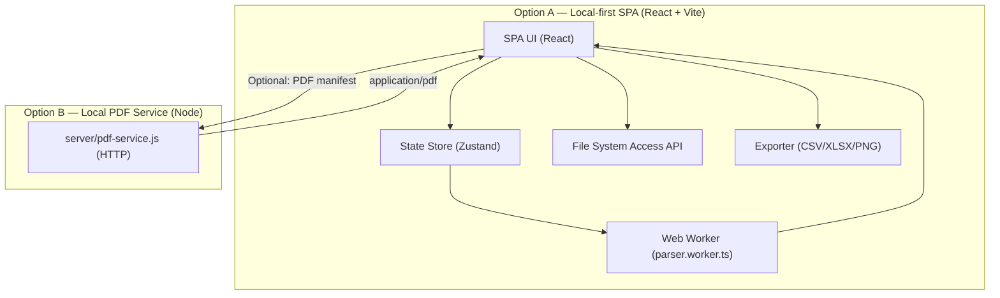
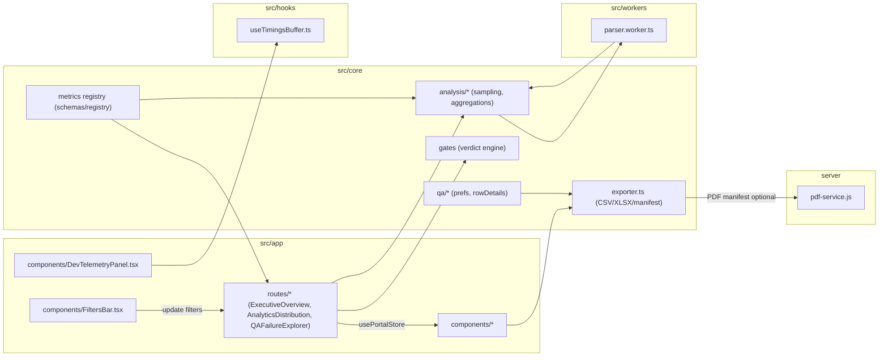

## 1. Architecture Overview

```mermaid
%% High-Level Architecture (Option A/B)
flowchart TD
  subgraph Browser["Option A — Local-first SPA (React + Vite)"]
    UI["SPA UI (React)"]
    Store["State Store (Zustand)"]
    Worker["Web Worker (parser.worker.ts)"]
    FS["File System Access API"]
    Export["Exporter (CSV/XLSX/PNG)"]
    UI --> Store
    Store --> Worker
    UI --> FS
    Worker --> UI
    UI --> Export
  end
  subgraph Server["Option B — Local PDF Service (Node)"]
    PDFSvc["server/pdf-service.js (HTTP)"]
  end
  UI -- Optional: PDF manifest --> PDFSvc
  PDFSvc -- application/pdf --> UI
```

## 2. Module Dependency Diagram

```mermaid
%% Module Dependency Overview
flowchart LR
  subgraph app["src/app"]
    Routes["routes/* (ExecutiveOverview, AnalyticsDistribution, QAFailureExplorer)"]
    Components["components/*"]
    Filters["components/FiltersBar.tsx"]
    DevPanel["components/DevTelemetryPanel.tsx"]
  end
  subgraph core["src/core"]
    Metrics["metrics registry (schemas/registry)"]
    Analysis["analysis/* (sampling, aggregations)"]
    Gates["gates (verdict engine)"]
    Exporter["exporter.ts (CSV/XLSX/manifest)"]
    QA["qa/* (prefs, rowDetails)"]
  end
  subgraph hooks["src/hooks"]
    Timings["useTimingsBuffer.ts"]
  end
  subgraph workers["src/workers"]
    Parser["parser.worker.ts"]
  end
  subgraph server["server"]
    PDF["pdf-service.js"]
  end
  Routes -->|usePortalStore| Components
  Routes --> Analysis
  Routes --> Gates
  Filters -->|update filters| Routes
  DevPanel --> Timings
  Components --> Exporter
  Analysis --> Parser
  Parser --> Analysis
  Metrics --> Analysis
  Metrics --> Routes
  QA --> Exporter
  Exporter -->|PDF manifest optional| PDF
```
