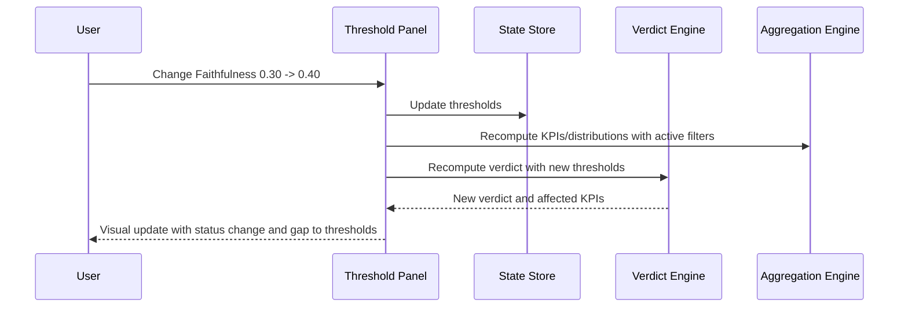
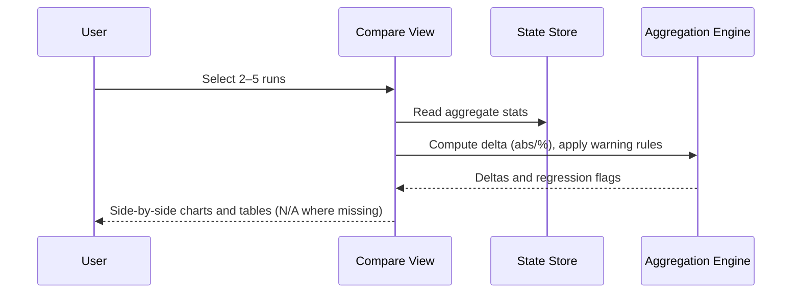
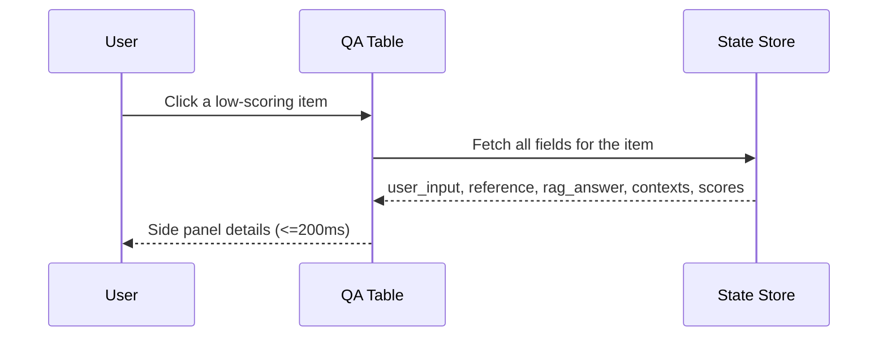
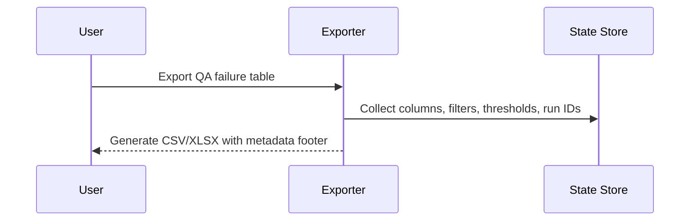

# LLM RAG Evaluation Insights Portal — Technical Design

This document consolidates technical architecture, data flow, sequence diagrams, and implementation considerations for a local-first single-page app that reads existing outputs under `eval-pipeline/outputs/**`. It provides role-oriented dashboards, configurable thresholds and verdicts, interactive filtering, failure exploration, multi-run comparison, and rule-based insights.

---

## 1. Architecture Overview

- Architecture option (v1 recommended)
  - Option A — Local-first SPA (React + Vite + TypeScript)
    - Charts: ECharts
    - Table: TanStack Table (virtualized rows)
    - State: Zustand (global store) + URL params (sharing/replay)
    - Parsing/validation: PapaParse (Worker mode) + Zod (or JSON Schema)
    - File I/O: File System Access API (user chooses directory)
    - Background compute: Web Workers (offload heavy work)
  - Option B — Minimal local service (optional)
    - Static SPA with a lightweight local node/py service for large CSV preprocessing, PDF export, shared team settings. Not needed for v1.

- High-level components
  - Loader & Parser: read and parse run data (JSON/CSV); validate and normalize
  - Metrics Registry: dynamically register/extend new metrics and presentation
  - Gates & Verdict Engine: threshold rules, severity, final verdict
  - Aggregation & Filter Engine: interactive filtering, cohorts, KPI recomputation
  - Dashboards (BS/PM, QA, DA): role-aligned views
  - Failure Explorer: list and detail panel (question, reference, answer, contexts, scores)
  - Multi-run Comparator: analyze 2–5 runs side by side
  - Insights Engine: rules-based insights; optional LLM add-on (disabled by default)
  - Exporter: CSV/XLSX/PDF/PNG exports with metadata
  - Profile & Session: Persona/Threshold profiles; save/load sessions (filters, runs, locale)

---

## 2. Sequence Diagrams

### 2.1 Run Load
```mermaid
sequenceDiagram
  participant U as User
  participant UI as SPA UI
  participant FS as File System Access API
  participant W as Parser Worker
  participant S as State Store
  participant V as Verdict Engine

  U->>UI: Select base directory
  UI->>FS: Read eval-pipeline/outputs/** structure
  FS-->>UI: File list (JSON/CSV/config.yaml)
  UI->>W: Send file paths in batches
  W-->>UI: Progress updates; normalized data
  UI->>S: Write runs, items, metrics, artifacts
  UI->>V: Apply thresholds (profiles/UI settings)
  V-->>UI: Verdict (Ready/At Risk/Blocked) + triggered rule
  UI-->>U: Executive Overview shows KPIs, verdict, and alerts
```

### 2.2 Threshold Update


### 2.3 Multi-run Compare


### 2.4 Failure Drill-down


### 2.5 Export


---

## 3. Data Flow

1) Discover: Use FS Access API to traverse the chosen directory, find run subfolders and supported files (`ragas_enhanced_evaluation_results_*.json`, `config.yaml`, optional CSV).
2) Parse: Use Worker + PapaParse for JSON/CSV (chunked), validate with Zod/Schema, normalize fields (unified metric names, units/decimals).
3) Register: Metrics Registry registers known/unknown metrics and generates default KPI cards and chart setups.
4) Aggregate: Aggregation Engine computes KPIs, distributions, grouped stats, and pass/fail by thresholds according to filters.
5) Verdict: Verdict Engine loads profile thresholds (e.g., `profiles/thresholds.standard.json`) and rules, computes Ready/At Risk/Blocked and triggered rules.
6) Present: Based on Persona (e.g., `profiles/persona.default.json`), render role dashboards.
7) Export: Exporter produces reports with run, filters, timestamp, thresholds metadata.

---

## 4. Interfaces & Data Models (TypeScript)

- Run & Artifacts
```ts
interface RunId { id: string; label: string; createdAt?: string }
interface ArtifactRefs {
  summaryJson?: string;          // ragas_enhanced_evaluation_results_*.json
  detailedJson?: string;         // optional
  csv?: string;                  // optional
  configYaml?: string;           // thresholds/weights (optional)
}
interface RunMeta {
  run: RunId;
  artifacts: ArtifactRefs;
  counts: { items: number; fields: string[] };
  metricsPresent: string[];      // e.g., ["ContextPrecision","Faithfulness",...]
  latencyStats?: { p50?: number; p90?: number; p99?: number };
}
```

- Evaluation item and metrics
```ts
interface EvaluationItem {
  id: string;
  language?: string;
  user_input: string;
  reference_answer?: string;
  rag_answer?: string;
  reference_contexts?: string[];
  rag_contexts?: string[];
  latencyMs?: number;
  metrics: Record<string, number | null>;
  flags?: { success?: boolean; [key: string]: boolean | undefined };
  extra?: Record<string, unknown>;
}
```

- Thresholds, rules, verdict
```ts
interface ThresholdLevel { warning: number; critical: number }
interface ThresholdProfile {
  id: string; name: string;
  gates: Record<string, ThresholdLevel>;
  verdictRules: Array<{ id: string; when: string; verdict: 'Ready'|'At Risk'|'Blocked' }>
}
interface VerdictResult { verdict: 'Ready'|'At Risk'|'Blocked'; triggeredRuleId: string; failingMetrics: string[] }
```

- Persona & Session
```ts
interface PersonaProfile {
  id: string; name: string; locale: 'zh-TW'|'en-US'; dashboards: string[];
  defaults: { filters: Record<string, unknown>; thresholdTemplate?: string }
}
interface SessionState {
  selectedRuns: string[];
  activePersona: string;
  locale: 'zh-TW'|'en-US';
  filters: Record<string, unknown>;
  thresholds: ThresholdProfile;
  uiState?: Record<string, unknown>;
}
```

- Worker protocol (excerpt)
```ts
type WorkerIn =
 | { type: 'parse-run'; files: ArtifactRefs; options?: { sampleLimit?: number } }
 | { type: 'aggregate'; items: EvaluationItem[]; filters: Record<string, unknown> };

type WorkerOut =
 | { type: 'progress'; current: number; total: number; phase: string }
 | { type: 'parsed'; run: RunMeta; items: EvaluationItem[] }
 | { type: 'aggregated'; kpis: Record<string, number>; distributions: Record<string, number[]> };
```

- Metrics Registry (extensibility)
```ts
interface MetricDefinition {
  key: string;
  label: string;
  defaultChart: 'kpi'|'hist'|'scatter'|'table';
  accessor: (item: EvaluationItem) => number | null;
  formatter?: (v: number|null, locale: string) => string;
}
```

---

## 5. Error Handling & Resilience

- Missing/invalid files:
  - Show filename, error type, and remediation (JSON line/offset if available).
  - Without `detailed_results_file`, keep KPIs/overview; mark drill-down unavailable.
- Missing metrics:
  - Show N/A; registry renders unknown metrics generically.
- Config validation:
  - Threshold inputs (non-numeric/out-of-range) blocked with inline hints.
- Memory pressure:
  - Detect heavy rendering/memory usage and suggest limiting rows or disabling heavy charts.
- Offline & privacy:
  - No network by default; any remote endpoints require explicit consent and visible destination.

---

## 6. Performance & Responsiveness

- TTDD ≤ 2s (≤5k items); filters update KPIs ≤300ms (≤5k) / ≤1s (≤20k)
- Techniques:
  - Workers for parse/aggregate/distributions; UI only renders.
  - Virtualized tables + lazy loading.
  - ECharts DataTransform: pre-aggregate hist/box in Worker.
  - Sampling/pagination: for >20k, default to sampling or batch loading, with full-mode switch.
  - Standardize decimals/formatters to avoid churn.

---

## 7. Testing Strategy

- Unit (Vitest):
  - Parser: formats/missing fields/bad files; line/offset reporting
  - Gates & Verdict: edge thresholds, combo rules, profile switching
  - Aggregation & Filters: language/success/numeric ranges; empty sets
  - Registry: unknown metric injection and default visualization
- Integration (React Testing Library):
  - Run loading and progress bar
  - Threshold edits with live recompute and warnings
  - Multi-run comparison with N/A rendering
- E2E (Playwright):
  - QA failures table and <=200ms details
  - Export content with metadata (runs, filters, timestamp, thresholds)
- Performance baselines:
  - 5k/20k/100k end-to-end timings; Worker compute; render FPS

---

## 8. i18n & a11y

- Locales: zh-TW and en-US via i18next; localized numbers/dates.
- Personas: default `profiles/persona.default.json`; remember user choices (localStorage).
- Accessibility: semantic structure, keyboard navigation, contrast, and alt text for charts.

---

## 9. Security & Privacy

- Offline by default; no external resources.
- Exports generated locally; any upload requires explicit confirmation and target display.
- Embed CSP with minimal third-party scripts.

---

## 10. Build & Deploy

- Dev: Vite + React + TS; ESLint + Prettier; strict types.
- Release: Static files; serve via any static server or local files.
- Optional: Electron/Tauri for desktop packaging (not required for v1).

---

## 11. Suggested Directory Structure

```
insights-portal/
  src/
    app/
      routes/ (executive_overview, qa_failure_explorer, analytics_distribution, compare)
      store/ (zustand stores)
      i18n/
    components/
      charts/  tables/  panels/  filters/
    core/
      loader/ (fs, parser, zod)
      metrics/ (registry, adapters)
      gates/ (verdict-engine)
      analysis/ (aggregations, correlations)
      insights/ (rules, optional-llm)
      export/
      workers/
    assets/
  public/
  profiles/ (symlink or use repo profiles)
```

> Reuse `profiles/thresholds.standard.json` and `profiles/persona.default.json` as initial templates.

---

## 12. Insights & Actions Engine

- Rules-based (default):
  - Example: ContextPrecision/Recall high but Faithfulness low → hallucination risk; recommend stronger grounding/retrieval quality.
  - Example: ContextualKeywordMean low with high variance → adjust keyword strategy (query classification, lemmatization).
- Output: Top 3 insights with evidence (metrics, distributions, sample size, sample links); heuristic confidence score (sample size, effect size).
- Optional LLM add-on:
  - Strictly disabled by default; if enabled, show citations to charts/tables and rules.

---

## 13. Risks & Mitigations

- Large datasets (>100k): incremental load + paging; disable high-cost charts; sampling with on-demand recompute.
- File diversity: tolerant parsing via Zod/Schema + normalization dictionary; extend adapters gradually.
- Threshold mistakes: provide reset to profile/config.yaml; show deltas from defaults.
- Visual noise: condensed view, KPI pinning, and panel memory.

---

## 14. Requirements Coverage

- Run discovery/selection: Sections 2, 3; Sequence 2.1
- Executive Overview: Dashboards + Verdict Engine; Sequence 2.1
- Adjustable thresholds: Verdict Engine + Threshold Panel; Sequence 2.2
- Role views: Dashboards and Persona Profiles
- Dynamic filters/cohorts: Aggregation & Filter Engine
- Multi-run compare: Compare View; Sequence 2.3
- Insights and actions: Insights Engine (rules-based + optional LLM)
- Failure explorer: Failure Explorer; Sequence 2.4
- Metric extensibility: Metrics Registry (schema-driven)
- Export reports: Exporter; Sequence 2.5
- Performance: Workers + virtual table + backpressure strategies
- i18n/a11y: i18next + accessibility guidelines
- Reliability & errors: Section 5
- Privacy/offline: Section 9
- Session reproducibility: SessionState + import/export JSON

---

## 15. Implementation Notes

- Schema-first: enforce typing/normalization from input (JSON/CSV) to UI, reduce implicit coupling.
- Worker protocol: stable message contract; testable and swappable (e.g., WASM).
- Registry design: any new metric key maps to a default card; devs can add label/formatter/chart type.
- Verdict DSL: Evaluate expressions like `any(metric < critical)` using a safe parser (e.g., expr-eval); whitelist variables.
- Export metadata: include run IDs, filters, timestamp, thresholds, and profile version (`profiles/*`).

---

## 16. Recommendations & Next Steps

- v1 scope:
  - Local-first SPA; Executive/QA/Analytics views; adjustable thresholds + verdict; Filters; Compare; Export (CSV/XLSX)
  - Rules-based Top 3 insights (no LLM)
- v1.1:
  - PDF/PNG snapshots; stronger correlation/regression; Session JSON import/export
- v2:
  - Optional LLM explanations; team collaboration (local/remote); historical trends

---

Notes on default Profiles:
- Thresholds: `profiles/thresholds.standard.json` (verdict rules)
- Persona: `profiles/persona.default.json` (default locale=zh-TW, dashboard order)

This design aims to land v1 quickly while keeping extensibility, aligning with EARS on "extensible metrics, configurable thresholds, role-based, interactive analysis, offline privacy, performance guarantees".
