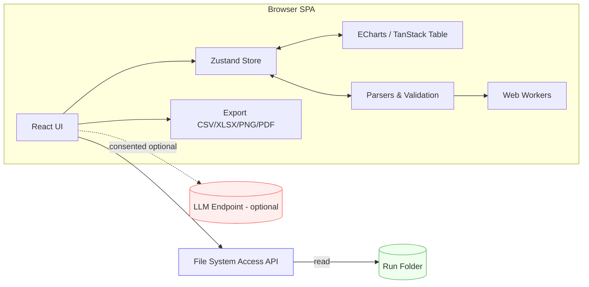
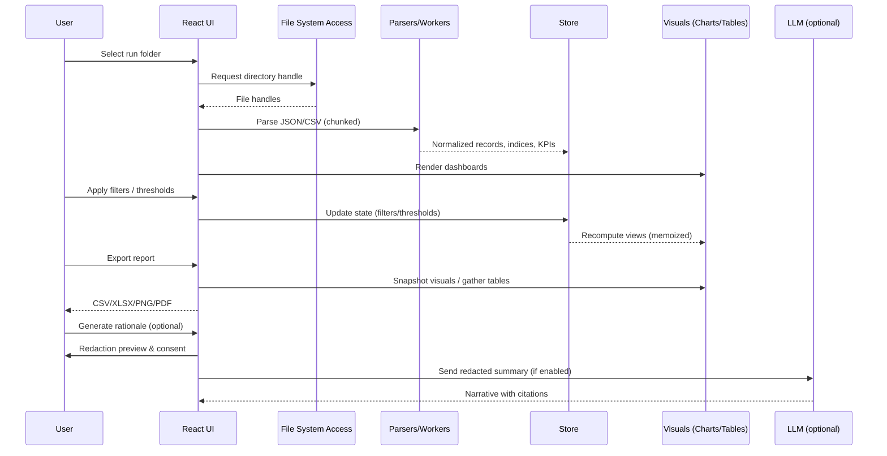
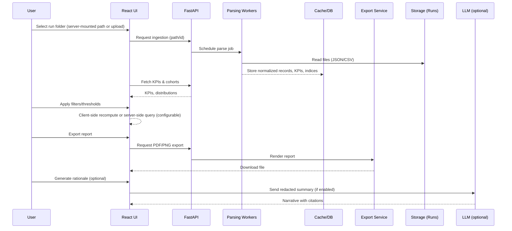

# LLM RAG Evaluation Insights Portal — Requirements (EARS)

This document defines user stories and acceptance criteria using EARS (Easy Approach to Requirements Syntax) to build a web-based portal that democratizes LLM RAG evaluation results for non-technical stakeholders.

## Goals and scope
- Provide role-based dashboards, explanations, and actionable insights from evaluation artifacts (JSON/CSV) already generated by the eval pipeline.
- Support dynamic, interactive analysis based on user-selected inputs (runs, filters, personas).
- Enable release-readiness decisions with clear, configurable rules and traceability to raw examples.

## Personas (primary to advanced)
- Business stakeholder (BS)
- Project/Product Manager (PM)
- Test/QA Engineer (QA)
- Data/AI Analyst or Advanced User (DA)
- System Admin (Admin) [optional]

## Inputs, metrics, and artifacts
- Inputs: run folders under `eval-pipeline/outputs/**` containing:
  - `ragas_enhanced_evaluation_results_*.json` (ContextPrecision, ContextRecall, Faithfulness, AnswerRelevancy)
  - `ragas_enhanced_detailed_calculations_*.json` (per-item granularity)
  - `enhanced_contextual_summary_*.json` and `enhanced_contextual_detailed_*.json` (Contextual Keyword metrics; e.g., mean ~0.51, std ~0.19 in sample)
  - `testset_with_rag_responses_*.csv` (user_input, reference, rag_answer, contexts, timings, success flags)
  - Optional: `config.yaml` thresholds and weights
- Metrics (initial): ContextPrecision, ContextRecall, Faithfulness, AnswerRelevancy, AnswerSimilarity (fallback), Enhanced Contextual Keyword Score, pass/fail counts, latency distributions.

## Assumptions
- The portal reads files from a user-selected local directory (no cloud dependency by default).
- Thresholds may come from `config.yaml` or be set in-UI; defaults provided.
- Datasets up to ~5k items per run are common; multi-run comparison is required.

## Out of scope (v1)
- Model inference or running evaluations; portal is read-only on artifacts.
- Multi-tenant auth; v1 may use simple local access.

---

## User stories with EARS acceptance criteria

### 1) Run discovery and selection
As a PM/QA, I want to load a run folder so that I can analyze its results.
- Ubiquitous: The system shall allow a user to select a base directory containing evaluation run folders.
- Event-driven: When a user selects a run directory, the system shall parse supported files and confirm the number of items and metrics found.
- Unwanted behavior: If a required file is missing or malformed, the system shall display a non-blocking error with the file name and a remediation hint.
- State-driven: While parsing is in progress, the system shall show a loading state with progress feedback.

Acceptance criteria (EARS):
- When a run folder is selected, the system shall list the detected artifacts (summary JSON, detailed JSON, CSV) and counts.
- If no supported artifacts exist, the system shall display “No compatible files found” and a link to supported formats.

### 2) Executive overview (business-facing)
As a BS/PM, I want a one-screen summary so that I can judge release readiness quickly.
- Ubiquitous: The system shall present KPIs: ContextPrecision, ContextRecall, Faithfulness, AnswerRelevancy, pass/fail counts, mean/Std of contextual keyword score, and latency percentiles.
- Event-driven: When thresholds are configured, the system shall compute a release-readiness verdict and highlight failing KPIs.
- State-driven: While a KPI panel is collapsed/expanded, the system shall preserve its state across navigation until the run changes.

Acceptance criteria (EARS):
- Given default thresholds, when the run is loaded, the system shall show a verdict banner (e.g., Ready/At Risk/Blocked) with the rule that triggered it.
- When a KPI is below threshold, the system shall color it with warning/error semantics and show the gap to target.

### 3) Configurable release gates
As a PM, I want to set release rules so that the portal consistently judges readiness.
- Ubiquitous: The system shall allow users to view and edit per-metric thresholds.
- Event-driven: When thresholds are changed, the system shall recompute the verdict and update affected visuals.
- Unwanted behavior: If a threshold is invalid (e.g., non-numeric), the system shall reject it with inline validation.

Acceptance criteria (EARS):
- When a user edits Faithfulness threshold from 0.30 to 0.40, the system shall refresh the verdict and note any status change.
- When thresholds are reset, the system shall revert to defaults or config.yaml values if present.

### 4) Persona-tailored dashboards
As a user, I want dashboards tailored to my role so that I see relevant insights.
- Ubiquitous: The system shall provide views for BS/PM (summary, decision), QA (failure explorer), DA (distribution, correlation).
- Event-driven: When a persona view is selected, the system shall persist the selection within the session.

Acceptance criteria (EARS):
- When the QA view is active, the system shall show sortable tables of low-scoring items with drill-down links.
- When the DA view is active, the system shall show distributions and correlations among metrics (e.g., Faithfulness vs AnswerRelevancy).

### 5) Dynamic filtering and cohorting
As a PM/QA/DA, I want to filter by attributes so that insights are contextual.
- Ubiquitous: The system shall provide filters (e.g., language, success flag, metric ranges, response time ranges).
- Event-driven: When filters are applied, the system shall update all charts, KPIs, and tables consistently.
- State-driven: While filters are active, the system shall show active-filter chips and allow one-click clear.

Acceptance criteria (EARS):
- When filter language=Chinese is applied, the system shall recompute KPIs and counts on the filtered subset.
- When a metric range slider is adjusted, the system shall redraw histograms within 300ms for datasets ≤5k rows.

### 6) Multi-run comparison and trend analysis
As a PM, I want to compare runs so that I can see regression or improvement.
- Ubiquitous: The system shall support selecting 2–5 runs for side-by-side comparison.
- Event-driven: When runs are selected, the system shall compute deltas for KPIs and highlight significant changes.

Acceptance criteria (EARS):
- When two runs are compared, the system shall show per-metric delta (absolute and %) and mark regressions > configurable threshold.
- When a run lacks a metric present in another, the system shall display N/A and not break the layout.

### 7) Insight generation with reasoning and actions
As a BS/PM, I want plain-language insights with reasons and actions so that I know what to do next.
- Ubiquitous: The system shall generate insights that reference concrete evidence (metrics, distributions, cohorts, example items).
- Event-driven: When a user clicks “Explain,” the system shall display how the insight was derived (rules, thresholds, sample sizes).
- Optional features: Where LLM explanation is enabled, the system shall include rationales with citations to charts/tables.

Acceptance criteria (EARS):
- When Faithfulness is below target in a specific cohort, the system shall propose targeted actions (e.g., retrieval quality checks; grounding augmentation; prompt constraints).
- When ContextPrecision and Recall are high but Faithfulness is low, the system shall highlight likely hallucination risk and suggest mitigation.

### 8) Failure explorer and item drill-down
As a QA/DA, I want to inspect low-scoring items so that I can diagnose issues.
- Ubiquitous: The system shall provide a searchable table of items with per-metric scores and flags.
- Event-driven: When an item is opened, the system shall display user_input, reference, rag_answer, reference_contexts, rag_contexts, and scores.
- Unwanted behavior: If image or link references exist, the system shall render a safe preview or a clickable link; if not resolvable, it shall display a placeholder.

Acceptance criteria (EARS):
- When the user clicks an item row, the system shall open a detail panel in ≤200ms (for local artifacts) with all fields available.
- When the user marks an item for follow-up, the system shall add it to a session checklist exportable as CSV.

### 9) Metric extensibility
As a DA, I want to plug in new metrics so that the portal evolves with evaluation practices.
- Ubiquitous: The system shall visualize any metric present in the summary JSON as KPIs and distributions.
- Event-driven: When a new metric key appears (e.g., AnswerSimilarity), the system shall render it without code changes by using a schema-driven registry.

Acceptance criteria (EARS):
- When a summary contains an unseen metric, the system shall display it with a default chart and allow threshold configuration.

### 10) Data export and reporting
As a PM/QA, I want to export views so that I can share with stakeholders.
- Ubiquitous: The system shall export filtered tables to CSV/XLSX and snapshot dashboards to PDF/PNG.
- Event-driven: When export is triggered, the system shall include a metadata footer (run IDs, filters, timestamp, thresholds).

Acceptance criteria (EARS):
- When the user exports the QA failure table, the system shall include all visible columns, applied filters, and a row count.
- When the user exports the executive overview, the system shall embed the verdict and threshold table.

### 11) Performance and responsiveness
As any user, I want responsive interactions so that analysis feels fluid.
- Ubiquitous: The system shall keep time-to-first-dashboard under 2s for runs ≤5k items on a typical laptop.
- State-driven: While heavy computations run, the system shall use worker threads to keep the UI responsive.

Acceptance criteria (EARS):
- When filters are applied, the system shall update KPIs and charts within 300ms (≤5k items) and within 1s (≤20k items).

### 12) Internationalization and accessibility
As a BS/PM in Chinese/English locales, I want localized content so that I can understand the insights.
- Ubiquitous: The system shall support zh-TW and en-US for UI strings and generated insights.
- Optional features: Where available, the system shall localize number/date formats based on locale.

Acceptance criteria (EARS):
- When locale=zh-TW, the system shall render UI strings, tooltips, and insight text in Traditional Chinese.
- When locale is switched, the system shall persist the choice across sessions.

### 13) Reliability and error handling
As any user, I want clear errors so that I can self-serve fixes.
- Unwanted behavior: If a JSON parse error occurs, the system shall show the filename, line/offset (if available), and guidance.
- Event-driven: When a required field is missing, the system shall degrade gracefully and indicate what is unavailable.

Acceptance criteria (EARS):
- When `detailed_results_file` is referenced but missing, the system shall still load KPIs from the summary and mark drill-down as unavailable.

### 14) Privacy and security (local-first)
As an Admin/PM, I want no unintended data exfiltration so that sensitive content remains local.
- Ubiquitous: The system shall operate fully offline with local artifacts by default.
- Optional features: Where a remote endpoint is configured, the system shall request explicit consent and display the destination.

Acceptance criteria (EARS):
- When network calls are disabled, the system shall not attempt to fetch external resources except user-approved links.

### 15) Session management and reproducibility
As a DA/QA, I want reproducible sessions so that others can validate findings.
- Ubiquitous: The system shall allow saving/loading a session (selected runs, filters, thresholds) to a small JSON.
- Event-driven: When a session file is loaded, the system shall restore the UI state deterministically.

Acceptance criteria (EARS):
- When a saved session is reopened, the system shall reproduce the same KPIs, filters, and verdicts.

---

## Non-functional requirements (EARS)
- Ubiquitous: The system shall run on modern browsers (Chromium/Edge) without installing backend services for local-mode.
- Ubiquitous: The system shall handle up to 100k total items across multiple runs loaded into memory with progressive rendering.
- Ubiquitous: The system shall persist user preferences (locale, theme, last directory) locally.
- Unwanted behavior: If memory pressure is detected, the system shall warn and offer to limit rows or disable heavy charts.

## Data mapping and traceability
- Ubiquitous: The system shall map each insight and KPI to the source files, run IDs, and subsets used to compute them.
- Event-driven: When a user clicks a metric, the system shall reveal the contributing sample size and formula.

## Release-readiness rule examples (configurable)
- Example defaults: ContextPrecision ≥ 0.95; ContextRecall ≥ 0.95; Faithfulness ≥ 0.35; AnswerRelevancy ≥ 0.70; mean Contextual Keyword Score ≥ 0.55.
- Event-driven: When any rule fails, the system shall set verdict to “At Risk” or “Blocked” based on severity levels.

## Architecture notes (non-binding recommendations)

This section clarifies when to choose each option, the core components, data flow, performance patterns, and deployment paths.

### Option A — Local-first SPA (recommended for v1)
Stack: React + Vite + TypeScript
- Charts: ECharts (primary) or Plotly (alternative)
- Tables: TanStack Table (virtualized rows; column pin/freeze)
- State: Zustand (global), URL params for shareable state
- Parsing/validation: Papaparse (worker mode, chunked CSV), Zod/JSON Schema for metric registry
- File I/O: File System Access API (directory open, sandboxed)

When to choose
- Single-user desktop use, offline-first, zero backend.
- Rapid interactive analytics (≤5k rows typical; up to 100k with progressive rendering and sampling).

Data flow
1) User picks run directory → loaders parse:
  - ragas_enhanced_evaluation_results_*.json
  - enhanced_contextual_summary_*.json / detailed JSON
  - testset_with_rag_responses_*.csv
2) Normalize to in-memory store; derive KPIs/threshold pass-fail; build indices for filters/cohorts.
3) Render persona dashboards; recompute on filter/threshold changes.

Performance patterns
- Web Workers for parsing/aggregations; Comlink for messaging.
- Incremental summaries (pre-aggregate histograms, percentile bins).
- Virtualized tables; debounced filters; memoized selectors.
- Targets: TTFD ≤ 2s (≤5k rows), filter redraw ≤ 300ms (≤5k), ≤ 1s (≤20k).

Exports
- CSV/XLSX via SheetJS; PNG/PDF via html2canvas (client-side). Provide “Print to PDF” for consistent pagination.

Packaging/deployment
- Pure static hosting (local machine or internal server) or PWA.
- Optional Electron wrap for native file dialogs and single-file installer.

Pros
- Simplest ops, best privacy/offline, fastest iteration.
Cons
- Heavy exports (high-fidelity PDF) and long-running tasks are browser-limited.
- Multi-user/server features require later add-ons.

### Option B — Python app (FastAPI + React, or Streamlit/Dash)
Recommended when you need server-side exports, larger datasets, or team access.

Two flavors
- FastAPI + React: maximum control; REST endpoints for parsing, caching, exporting (wkhtmltopdf/WeasyPrint); future SSO ready.
- Streamlit/Dash: fastest to prototype; good for internal pilots; easier server rendering.

When to choose
- Team-shared deployments, scheduled batch parsing, heavy exports, or pre-compute metrics for >100k rows.

Server responsibilities
- Ingestion/parsing of run folders (watch jobs, caching layer).
- KPI pre-aggregation, cohort summaries, regression vs baseline.
- Export services (PDF/PNG server rendering), large-file streaming.
- Optional: auth gateway, org profiles, multi-user sessions.

Deployment
- Single Docker image; mount runs volume read-only.
- Local-only mode (no egress); reverse proxy when needed.

Pros
- Strong exports, scalability, and multi-user features.
Cons
- Higher operational overhead; requires server resources.

### Optional LLM (pluggable, off by default; local-first policy)
Abstraction
- Provider interface: { id, name, endpoint, model, auth, headers }.
- Redaction pipeline: samples → de-identification/redaction → preview → consent → provider call.
- Rate/quote guard: token estimates, per-session caps; offline mode disables controls.

Local-first controls
- If no endpoint configured: disable “Generate rationale” with tooltip.
- If endpoint configured: display consent banner and redaction preview; outputs include citations (chart/table IDs, sample sizes).

Security/telemetry
- No unsolicited network calls; no payload logging by default; any remote analytics requires explicit opt-in.

### Decision guide (quick)
- Mostly local/offline, single analyst or PM → Option A (SPA).
- Need server exports, >100k rows, or team access → Option B (FastAPI + React).
- Need quickest internal demo with a Python-first team → Option B (Streamlit/Dash).

### Migration path
- Start Option A for MVP; design parsers and registry as shared modules.
- If a server is introduced, lift-and-shift parsers to FastAPI workers; keep React UI with the same JSON schema.

### Component diagram (Option A — Local-first SPA)



### Data flow (sequence)



### Component diagram (Option B — FastAPI + React)

```mermaid
graph LR
  subgraph Browser[Browser]
    UI[React UI]
    State[Client Store]
    Charts[ECharts / Tables]
  end

  subgraph Server[FastAPI Server]
    API[REST API]
    Ingest[Ingestion & Parsing Workers]
    Cache[(Cache/DB)]
    Export[Export Service (PDF/PNG)]
  end

  Storage[(Runs Volume - read-only)]:::data

  UI --> API
  API --> Ingest
  Ingest --> Cache
  Cache --> API
  API --> Export
  API --> UI
  Ingest -- read --> Storage

  LLM[(LLM Endpoint - optional)]:::svc
  UI -. consented optional .-> LLM

  classDef data fill:#efe,stroke:#5a5,stroke-width:1px;
  classDef svc fill:#fee,stroke:#f55,stroke-width:1px;
```

### Data flow (sequence) — Option B



## Development & deployment quickstart (Option A/B)

Prerequisites
- Windows with PowerShell 5.1+
- Node.js LTS (for SPA UI)
- Python 3.10+ (for FastAPI/Streamlit, Option B)
- Docker (optional, for containerized deploy)

### Option A — Local-first SPA (React + Vite)
Dev (first run)

```powershell
# Create project (if starting fresh)
npx create-vite@latest rag-insights -- --template react-ts
cd rag-insights

# Install deps and start dev server
npm install
npm run dev
# Browse the printed local URL (e.g., http://localhost:5173)
```

Add core libs

```powershell
npm install echarts @tanstack/react-table zustand papaparse zod
```

Build and preview

```powershell
npm run build
npm run preview
```

Deploy
- Static hosting: serve the `dist/` folder via any static server (IIS/NGINX/internal web).
- PWA (optional): add a manifest and service worker for offline; rebuild and deploy `dist/`.
- Electron (optional): wrap the SPA if you need a single-file installer and native dialogs.

File access
- Use the File System Access API in the browser to pick a local run folder and parse artifacts on-device.

### Option B — Python app

#### B1) FastAPI + React
Backend (venv)

```powershell
python -m venv .venv
.\.venv\Scripts\Activate.ps1
pip install fastapi "uvicorn[standard]" pydantic ujson pandas numpy
```

Minimal server (api/main.py)

```python
from fastapi import FastAPI
app = FastAPI()

@app.get("/health")
def health():
  return {"ok": True}
```

Run server

```powershell
uvicorn api.main:app --reload --host 0.0.0.0 --port 8000
```

Frontend
- Use the same SPA steps as Option A in a separate `web/` folder.
- Configure API base URL (e.g., http://localhost:8000) via `.env` or runtime config.

Packaging/deploy
- Docker (optional) for the API; serve the React build (`web/dist`) via a static server or CDN.
- Mount the runs volume read-only so the server can ingest parsable artifacts.

#### B2) Streamlit/Dash (rapid prototype)

```powershell
python -m venv .venv
.\.venv\Scripts\Activate.ps1
pip install streamlit pandas plotly
streamlit run app.py
```

Notes
- Streamlit/Dash renders UI server-side, good for quick internal pilots and export features.
- For larger teams or advanced exports, prefer FastAPI + React.


## Acceptance test inventory (samples)
- When two runs are selected, the system shall show per-metric deltas and highlight regressions.
- When filters isolate Chinese questions, the system shall recompute KPIs and update the verdict accordingly.
- When a detailed item is opened, the system shall display user_input, reference, rag_answer, and contexts with per-metric scores.
- When thresholds are edited, the verdict and KPI highlights shall update immediately.

## Definitions
- EARS patterns used: Ubiquitous (The system shall…), Event-driven (When…), State-driven (While/When in state…), Optional features (Where…), Unwanted behavior (If… then…).

---

## Open questions
- Should persona configurations be organization-specific and importable as JSON?
- What are the final default thresholds and severity mapping for verdicts?
- Do we need SSO or simple local auth for shared deployments?

---

## Decisions (resolving open questions)

### Persona configurations
- Decision: Support layered persona/analysis profiles with import/export.
  - Formats: JSON (primary) and YAML (optional) with a stable schema.
  - Layers (precedence high → low): Session overrides > User profile > Org profile > System defaults.
  - EARS — Ubiquitous: The system shall allow importing a persona profile JSON that defines visible dashboards, default filters, and KPI thresholds.
  - EARS — Event-driven: When a persona profile is applied, the system shall immediately update visible views and thresholds without reload.
  - EARS — Unwanted behavior: If a profile fails schema validation, the system shall show errors by path and reject applying it.
  - EARS — Acceptance: When exporting the current analysis profile, the system shall include version, locale, thresholds, and active filters.

### Thresholds and severity mapping (advanced configurable)
- Decision: Provide default templates and an advanced editor; thresholds are dynamic and cohort-aware.
  - Defaults (may be adjusted): ContextPrecision ≥ 0.95; ContextRecall ≥ 0.95; Faithfulness ≥ 0.35; AnswerRelevancy ≥ 0.70; mean Contextual Keyword ≥ 0.55.
  - Severity mapping (configurable rules engine):
    - Ready: All gates met and no critical regression (> -2% vs baseline) on critical metrics.
    - At Risk: Any non-critical gate fails OR regression on any metric ≤ -10% but > -2%.
    - Blocked: Any critical gate fails (ContextPrecision < 0.90 OR ContextRecall < 0.90 OR Faithfulness < 0.30) OR ≥2 gates fail.
  - Cohort-aware gates: thresholds may be defined per language or tag; cohort verdicts roll up to global with weights.
  - EARS — Event-driven: When an advanced user edits thresholds or toggles a template, the verdict and KPI highlights shall update immediately.
  - EARS — Optional features: Where baseline run is selected, the system shall compute regression deltas against the baseline.

### Authentication
- Decision: No SSO or auth in v1; local/offline by default.
  - EARS — Ubiquitous: The system shall operate without login in local mode.
  - EARS — Optional features: Where a remote deployment is configured in the future, the system shall support pluggable auth without impacting local mode.

### Tech stack selection and LLM-assisted narratives
- Decision: Local-first SPA (React + Vite + TypeScript) for v1.
  - Charts: ECharts (or Plotly as alternative), Tables: TanStack Table, State: Zustand, Parsing: Papaparse, FS: File System Access API.
  - Exports: client-rendered PNG/PDF (html2canvas/puppeteer optional), CSV/XLSX (SheetJS).
  - LLM narratives: Off by default. Pluggable adapter supports a user-configured endpoint; show consent banner and redaction preview before sending data.
  - EARS — Unwanted behavior: If no endpoint is configured, the “Generate rationale” action shall be disabled with a tooltip.
  - EARS — Event-driven: When LLM narration is enabled, the system shall include citations (chart/table references and sample counts) in the generated text.

### Internationalization (i18n)
- Decision: Default locale zh-TW; en-US also available. Insight text supports dual-language toggle.
  - EARS — Ubiquitous: The system shall load UI strings from locale JSON and switch on demand without reload.
  - EARS — Event-driven: When dual-language is enabled, the insight panel shall display zh-TW and en-US paragraphs side-by-side.

### MVP prototype with sample runs
- Decision: Use the provided run `outputs/run_20250709_160725_85a5ba54` as the primary sample.
  - Required files: `ragas_enhanced_evaluation_results_*.json`, `enhanced_contextual_summary_*.json`, `testset_with_rag_responses_*.csv`.
  - Screens (scope):
    1) Executive Overview: show KPIs (ContextPrecision ≈0.97, ContextRecall ≈0.97, Faithfulness ≈0.29, AnswerRelevancy ≈0.66), Contextual Keyword mean ≈0.51, std ≈0.19; compute verdict per thresholds above.
    2) QA Failure View: table of items sorted by low Faithfulness/AnswerRelevancy; filters for language, success flag, and response time; row drill-down to show user_input/reference/rag_answer/contexts.
  - Performance gates: time-to-dashboard ≤ 2s; filter interactions ≤ 300ms for ≤ 5k rows.
  - EARS — Acceptance: Given the sample run, when the dashboard loads, the verdict banner shall render and each KPI shall display value and pass/fail status with threshold tooltips.
  - EARS — Acceptance: When the user opens a low-scoring item, the detail panel shall render all fields (including images/links as safe previews or placeholders) in ≤200ms locally.
